# Preshing Blog Notes

> Reading in 2020/5 & 2020/7
> 
> Digest of [Preshing on Programming](https://preshing.com/archives) blog

[TOC]

## Lock-Based

### Locks Aren’t Slow; Lock Contention Is [🔗](https://preshing.com/20111118/locks-arent-slow-lock-contention-is)

[align-center]

[](https://preshing.com/images/lock-competition-thumbnail.png)

- Back in 1986, Matthew Dillon wrote, “Most people have the **misconception** that locks are **slow**.”
- It’s true that locking is **slow on some platforms**, **or** when the lock is **highly contended**.
- But that doesn’t mean all locks are slow.

### Always Use a Lightweight Mutex [🔗](https://preshing.com/20111124/always-use-a-lightweight-mutex)

[align-center]

[](https://preshing.com/images/lightweight-mutex.png)

- The Windows Critical Section is what we call a **lightweight mutex**.
- As Larry Osterman explains,
  - the Windows Mutex **enters the kernel** every time you use it,
  - while the Critical Section does not.
- MacOS POSIX Threads API is a **lightweight mutex** which **doesn’t enter the kernel** unless there’s contention.
- Linux POSIX Threads API is a **lightweight mutex** based on [futex](https://en.wikipedia.org/wiki/Futex).
- Benchmark on 1.86 GHz Core 2 Duo:

| | Platform | lock/unlock time |
|-|---|---|
| Windows Mutex **(heavy)** | Windows | 1480 ns |
| Critical Section | Windows | 58.7 ns |
| POSIX Threads API | Ubuntu 11.10 | 66 ns |
| POSIX Threads API | MacOS 10.6.6 | 92 ns |

### Roll Your Own Lightweight Mutex [🔗](https://preshing.com/20120226/roll-your-own-lightweight-mutex)

[align-center]

[](https://preshing.com/images/rmw-turnstile.png)

- Some platforms (like BeOS) **didn’t provide** a lightweight mutex in the native API.
- **User space** lock/mutex solutions:
  - [Spin locks](https://en.wikipedia.org/wiki/Spinlock)
  - [Peterson’s algorithm](https://en.wikipedia.org/wiki/Peterson%27s_algorithm)
  - Charles Bloom’s [long writeup describing various mutex implementations](https://cbloomrants.blogspot.com/2011/07/07-15-11-review-of-many-mutex.html)
- As far back as 1996, when some engineers referred to it as the [Benaphore](https://www.haiku-os.org/legacy-docs/benewsletter/Issue1-26.html#Engineering1-26).
- Implementation on x86 CPU architecture:

``` cpp
LONG m_counter = 0;
HANDLE m_semaphore = CreateSemaphore(NULL, 0, 1, NULL);

void Lock() {
   // x86/64 guarantees acquire semantics
  if (_InterlockedIncrement(&m_counter) > 1) {
    WaitForSingleObject(m_semaphore, INFINITE);
  }
}

void Unlock() {
  // x86/64 guarantees release semantics
  if (_InterlockedDecrement(&m_counter) > 0) {
    ReleaseSemaphore(m_semaphore, 1, NULL);
  }
}

bool TryLock() {
  return _InterlockedCompareExchange(&m_counter, 1, 0) == 0;
}
```

- Benchmark on 1.86 GHz Core 2 Duo:

| | Platform | lock/unlock time |
|-|---|---|
| Benaphore ([intrinsic](https://en.wikipedia.org/wiki/Intrinsic_function)) | Windows | 30.5 ns |
| Benaphore (non-intrinsic) | Windows | 49.8 ns |
| Critical Section | Windows | 58.7 ns |

- Under very **high contention**, a Windows Critical Section still performs much better.
- You could even **share** this Benaphore **between processes** – something Critical Section isn’t capable of:
  - put m_counter in shared memory,
  - and use a named semaphore.
- On another platform, be aware that it may introduce the possibility of [priority inversion](https://en.wikipedia.org/wiki/Priority_inversion).

### Implementing a Recursive Mutex [🔗](https://preshing.com/20120305/implementing-a-recursive-mutex)

[align-center]

[](https://preshing.com/images/recursive-mutex.png)

- This won’t save you from **shooting yourself in the foot**, but it may help reduce the number of times, so you can walk away with a few toes remaining.
- Extend Win32 implementation of the Benaphore:

``` cpp
DWORD m_owner = 0;
DWORD m_recursion = 0;

void Lock() {
  // x86/64 guarantees acquire semantics
  if (_InterlockedIncrement(&m_counter) > 1) {
    if (m_owner != GetCurrentThreadId())
      WaitForSingleObject(m_semaphore, INFINITE);
  }
  //--- We are now inside the Lock ---
  m_owner = GetCurrentThreadId();
  m_recursion++;
}

void Unlock() {
  ASSERT(m_owner == GetCurrentThreadId());
  DWORD recursion = --m_recursion;  // NOTE: local copy
  if (recursion == 0)
    m_owner = 0;  // NOTE: reset before unlock

  // x86/64 guarantees release semantics
  if (_InterlockedDecrement(&m_counter) > 0) {
    if (recursion == 0)
      ReleaseSemaphore(m_semaphore, 1, NULL);
  }
  //--- We are now outside the Lock ---
}

bool TryLock() {
  if (m_owner == GetCurrentThreadId()) {  // NOTE: guaranteed on x86/64
    // Already inside the lock
    _InterlockedIncrement(&m_counter);
  } else {
    if (_InterlockedCompareExchange(&m_counter, 1, 0) != 0)
      return false;

    //--- We are now inside the Lock ---
    m_owner = GetCurrentThreadId();
  }
  m_recursion++;
  return true;
}
```

### Semaphores are Surprisingly Versatile [🔗](https://preshing.com/20150316/semaphores-are-surprisingly-versatile)

- I used to think semaphores were **strange** and **old-fashioned**:
  - They were invented by _Edsger Dijkstra_ back in the early _1960s_.
  - Related: [Semaphores vs. mutexes](https://en.wikipedia.org/wiki/Semaphore_%28programming%29#Semaphores_vs._mutexes) on Wikipedia
- **A Semaphore Is Like a Bouncer**:
  - `P` operation: When a thread calls the semaphore’s `wait` operation, it **enters the lineup**.
  - `V` operation: Any running thread can call `signal` at any time, and when it does, the bouncer **releases exactly one waiting** thread from the queue. (**Not** necessarily in the **same order** they arrived.)
  - Semaphores maintain an **integer counter**: `signal` **increments** the counter, and `wait` **decrements** it.

[align-center]

[](https://preshing.com/images/sema-intro.png)

- If `signal` is called, say, 3 times on an **empty lineup**, the bouncer will let the **next** 3 threads to arrive **pass directly through**.

[align-center]

[](https://preshing.com/images/sema-count.png)

-  If `wait` is called some number of times, and `signal` is called some number of times, the **outcome** is always the **same**. (**Regardless** of the **order** in which those `wait` and `signal` calls occurred.)

[align-center]

[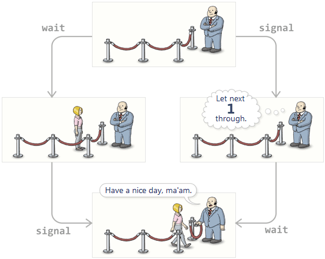](https://preshing.com/images/sema-order.png)

- **Usage 1. A Lightweight Mutex**:
  - The **box office** must somehow **keep track of** its own **previous decisions**.
  - The **behavior** of the mutex is **completely determined** by the decisions made at the **box office**.
  - **After visiting** the **box office**, they may operate on the **semaphore** in an **unpredictable order**.

``` cpp
std::atomic<int> m_contention;  // The "box office"
Semaphore m_semaphore;          // The "bouncer"
```

[align-center]

[](https://preshing.com/images/sema-box-office.png)

``` cpp
void Lock() {
  // Visit the box office
  if (m_contention.fetch_add(1, std::memory_order_acquire) > 0) {
    // Enter the wait queue
    m_semaphore.wait();
  }
}
```

[align-center]

[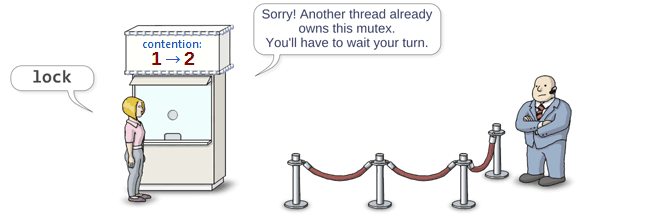](https://preshing.com/images/sema-mutex-1.png)

``` cpp
void unlock() {
  // Visit the box office
  if (m_contention.fetch_sub(1, std::memory_order_release) > 1) {
    // Release a waiting thread from the queue
    m_semaphore.signal();
  }
}
```

[align-center]

[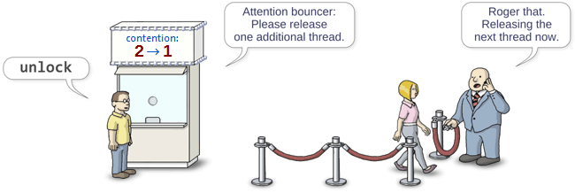](https://preshing.com/images/sema-mutex-2.png)

- **Usage 2. A Lightweight Auto-Reset Event Object**:
  - They’re used to **notify a single other thread** (possibly sleeping) of available work.
  - When `signal` is **called multiple** times, the event object’s signal count will **never exceed** `1`.
  - All of the autoreset event logic can be **implemented** at the **box office** using atomic operations, and the box office will **invoke** the semaphore **only** when it’s absolutely **necessary** for threads to wait.
  - Note that because the initial load from `m_status` is relaxed (may be reordered before calling `signal`), it’s important for the code to call `compare_exchange_weak` even if `m_status` already equals `1`. (See: [lost-wakeups on Github](https://github.com/preshing/cpp11-on-multicore/tree/master/tests/lostwakeup))

[align-center]

[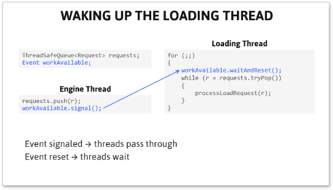](https://preshing.com/images/cppcon-event-slide.png)

``` cpp
// m_status == 1: Event object is signaled.
// m_status == 0: Event object is reset and no threads are waiting.
// m_status == -N: Event object is reset and N threads are waiting.
std::atomic<int> m_status;
Semaphore m_sema;

void signal() {
  int oldStatus = m_status.load(std::memory_order_relaxed);
  for (;;) {  // Increment m_status atomically via CAS loop.
    assert(oldStatus <= 1);
    int newStatus = oldStatus < 1 ? oldStatus + 1 : 1;
    if (m_status.compare_exchange_weak(oldStatus, newStatus,
                                       std::memory_order_release,
                                       std::memory_order_relaxed))
      break;
    // The compare-exchange failed, likely because another thread changed
    // m_status. oldStatus has been updated. Retry the CAS loop.
  }
  if (oldStatus < 0)
    m_sema.signal();  // Release one waiting thread.
}
```

[align-center]

[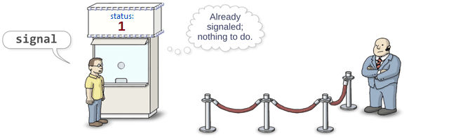](https://preshing.com/images/sema-event.png)

- **Usage 3. A Lightweight [Read-Write Lock](https://en.wikipedia.org/wiki/Readers%E2%80%93writer_lock)**:
  - It requires **two semaphores**: one for **waiting readers**, and another for **waiting writers**.
  - It uses **atomic bitfield** for `readers`, `waitToRead` and `writers`.
  - Code [on Github](https://github.com/preshing/cpp11-on-multicore/blob/master/common/rwlock.h)

[align-center]

[](https://preshing.com/images/sema-rwlock.png)

- **Usage 4. Another Solution to the [Dining Philosophers Problem](https://en.wikipedia.org/wiki/Dining_philosophers_problem)**:
  - The **box office** keeps track of which philosophers are **eating**, which ones have **requested to eat**, and the **order** in which those requests arrived.
  - Code [on Github](https://github.com/preshing/cpp11-on-multicore/blob/master/common/diningphilosophers.h)

[align-center]

[](https://preshing.com/images/sema-philosophers.png)

- **Usage 5. A Lightweight Semaphore with Partial Spinning**:
  - It becomes extremely **cheap** when the **lineup is empty** and the signal count climbs above zero.
  - You can make threads wait in a [spin loop](https://en.wikipedia.org/wiki/Spinlock) for a short period of time **before invoking** the underlying semaphore.
  - Code [on Github](https://github.com/preshing/cpp11-on-multicore/blob/master/common/sema.h)

[align-center]

[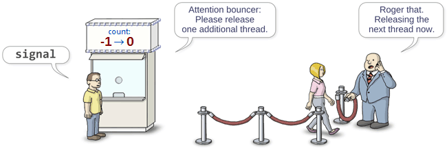](https://preshing.com/images/sema-lwsema1.png)

[align-center]

[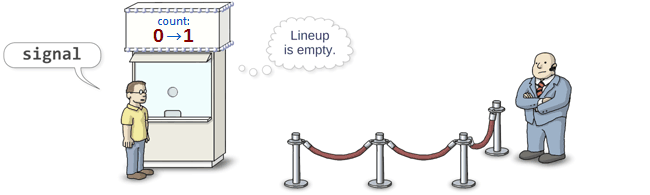](https://preshing.com/images/sema-lwsema2.png)

[align-center]

[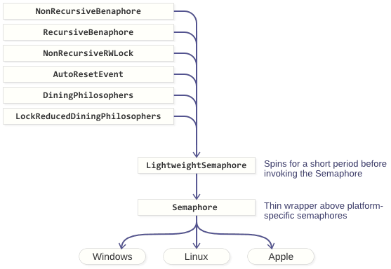](https://preshing.com/images/semaphore-class-diagram.png)

|        | LightweightSemaphore | Semaphore |
|------------------------|--------|---------|
| testBenaphore          | 375 ms | 5503 ms |
| testRecursiveBenaphore | 393 ms |  404 ms |
| testAutoResetEvent     | 593 ms | 4665 ms |
| testRWLock             | 598 ms | 7126 ms |
| testDiningPhilosophers | 309 ms |  580 ms |

- **Comparison With Condition Variables**:
  - From the library **maintainers’ point of view**, conventional semaphore techniques are just too **error prone**, and **preference** for **mutexes and condition variables**. ([WG21/N2043: Simplifying And Extending Mutex and Scoped Lock Types For C++ Multi-Threading Library](http://www.open-std.org/jtc1/sc22/wg21/docs/papers/2006/n2043.html#SemaphoreTypes) by _Ion Gaztañaga_)
  - We can optimize `AutoResetEventCondVar` in two steps (into `AutoResetEvent`):
    - Pull each condition variable **outside** of its **critical section** and convert it to a **semaphore**.
    - Make the box office **lock-free** by converting all operations to **CAS loops**.

[align-center]

[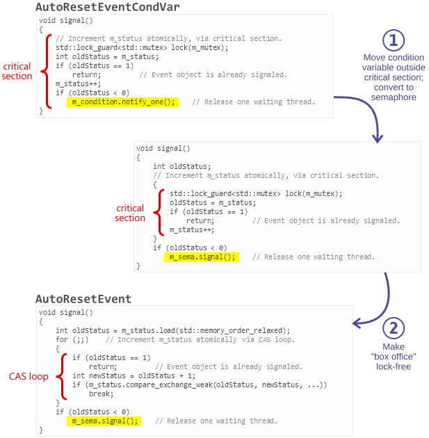](https://preshing.com/images/sema-condvar.png)

## Lock-free Basics

### An Introduction to Lock-Free Programming [🔗](https://preshing.com/20120612/an-introduction-to-lock-free-programming)

- [Lockless Programming Considerations for Xbox 360 and Microsoft Windows](https://docs.microsoft.com/zh-cn/windows/win32/dxtecharts/lockless-programming) by _Bruce Dawson_
- What is it:

[align-center]

[](https://preshing.com/images/its-lock-free.png)

- Definition of lock-free (see [slide 150](https://docs.google.com/viewer?a=v&q=cache:HaWgz4g5e7QJ:www.elsevierdirect.com/companions/9780123705914/Lecture%2520Slides/05~Chapter_05.ppt+&hl=en&gl=ca&pid=bl&srcid=ADGEESghbD6JBTSkCnlPP8ZjPwxS2kM6bbvEGUJaHozCN1CGYW0hnR0WkwmG7LvVj5BUOYZTfTXUClM7uXmr-nXPYlOvZulPJMgYXHaXqqo_m9qkn38gw8qMn01tFoxTmTkvjalHzQOB&sig=AHIEtbRChU00kpYARLAr5Cv5Z5aB2NLo5w)): In an **infinite execution**, **infinitely** often some method call **finishes**.
- If you **suspend** a single thread, it will **never prevent** other threads from **making progress**, as a group. (Useful in **interrupt handlers** and **real-time systems**.)
- **Operations** that are designed to **block** **do not disqualify** the algorithm.
  - For example, a **queue**’s `pop` operation may intentionally block when the queue is `empty`.
  - The **remaining** codepaths can **still** be considered **lock-free**.
- Techniques:

[align-center]

[](https://preshing.com/images/techniques.png)

- Atomic operations: **No thread** can **observe** the operation **half-complete**. (On **modern processors**, lots of operations are **already** atomic.)
- [Read-modify-write](https://en.wikipedia.org/wiki/Read-modify-write) (RMW) operations: Support **multiple writers** to effectively **line up** in a row and execute those operations **one-at-a-time**. (For example, `_InterlockedIncrement` on Win32.)

[align-center]

[](https://preshing.com/images/rmw-turnstile-2.png)

- C++11 **atomic** standard does **not guarantee** that the implementation will be **lock-free** on every platform. (See `std::atomic<>::is_lock_free`.)
- Processors, such as **PowerPC** and **ARM**, expose [load-link/store-conditional](https://en.wikipedia.org/wiki/Load-link/store-conditional) instructions to support RMW.
- [Compare-and-swap](https://en.wikipedia.org/wiki/Compare-and-swap) (CAS) is a kind of RMW. (For example, `_InterlockedCompareExchange` on Win32.) And special care must be taken to avoid the [ABA problem](https://en.wikipedia.org/wiki/ABA_problem).
- [Sequential consistency](https://en.wikipedia.org/wiki/Sequential_consistency) means that **all threads** agree on the order in which memory operations occurred, and that **order** is **consistent with** the order of operations in the **program source code**. (For example, Java `volatile` and C++11 `std::atomic<>`)
- A **simple** (but obviously **impractical**) way to achieve **sequential consistency** is to:
  - **disable** **compiler optimizations**,
  - and force **all threads** to run on a **single processor**.
- For **multicore** (or any [symmetric multiprocessor](https://en.wikipedia.org/wiki/Symmetric_multiprocessing)) systems, the environment does **not guarantee** sequential consistency.
- **Different CPU families** have **different habits** when it comes to memory reordering.
- **C++11** offering us a standard way to write **portable** lock-free code.
- It’s been common **in the past** to write lock-free code which **works on x86/64**, but [fails on other processors](https://www.drdobbs.com/parallel/lock-free-queues/208801974).
- Appendix C of [Is Parallel Programming Hard](https://kernel.org/pub/linux/kernel/people/paulmck/perfbook/perfbook.2011.01.02a.pdf) shows the **hardware** details of **how and why** processors perform memory **reordering**.
- Optimization:
  - After **profiling**, a locking section shows up as a bottleneck.
  - We **first** try to **reduce data sharing**,
  - but when that's **not possible**, we might apply a **lock-free** technique.

### Atomic vs. Non-Atomic Operations [🔗](https://preshing.com/20130618/atomic-vs-non-atomic-operations)

- When an **atomic store** is performed on a shared variable, **no other** thread can **observe** the modification **half-complete**.
- When an **atomic load** is performed on a shared variable, it reads the **entire value** as it appeared at a single moment in time.
- **Non-atomic** loads and stores do **not make** those **guarantees**.

[align-center]

[](https://preshing.com/images/nonatomic.png)

- Any time **two threads** operate on a shared variable concurrently, and **one** of those operations **performs a write**, **both threads must** use **atomic** operations.
- C++11 **data race** results in **torn reads** and **torn writes**, and is **different from Java’s** concept of a data race or the more [general race condition](https://en.wikipedia.org/wiki/Race_condition).
- **Non-Atomic Due to Multiple CPU Instructions**: One **64-bit value** is turned into **two 32-bit values** on _x86_.
- **Non-Atomic CPU Instructions**: `strd r0, r1, [r2]` stores the contents of **two 32-bit** source registers to a single **64-bit value** in memory on _ARMv7_.
- **All C/C++ Operations Are Presumed Non-Atomic**: On all modern _x86, x64, Itanium, SPARC, ARM and PowerPC_ processors, plain **32-bit integer assignment** is **atomic as long as** the target variable is naturally **aligned**.

### You Can Do Any Kind of Atomic Read-Modify-Write Operation [🔗](https://preshing.com/20150402/you-can-do-any-kind-of-atomic-read-modify-write-operation)

- They let you **read** from a variable in shared memory and **simultaneously write** a different value in its place – all in one **indivisible** step.
- You can accomplish the same thing using a **mutex**,
  - but a mutex-based version **wouldn’t be lock-free**.
  - However, it’s a **atomic** transaction.
- **Every other** RMW operation can **be implemented** using a **compare-and-swap** operation:
  - This function **attempts to store** the `desired` value to `shared`, but **only if** the current value of `shared` **matches** `expected`.
  - It returns `true` if **successful**.
  - If it **fails**, it **loads** the current value of `shared` **back into** `expected`, which despite its name, is an **in/out parameter**.

``` cpp
shared.compare_exchange_weak(T& expected, T desired, ...);
```

[align-center]

[](https://preshing.com/images/compare-exchange.png)

- This is known as a **compare-and-swap loop**, or **CAS loop**.
  - The function **repeatedly tries** to exchange `oldValue` with `oldValue * multiplier` **until** it **succeeds**.
  - If **no concurrent modifications** happen in other threads, it will usually **succeed** on the **first** try.
  - Otherwise, `oldValue` will be **updated with** the most **recent value** of `shared`, and the loop will **try again**.
  - One CAS loop may take an **indeterminate number** of **tries**.
  - But it’s **lock-free** because **if** a single iteration of the CAS loop **fails**, it’s usually because **some other** thread modified `shared` **successfully**, the system always **making progress**.

``` cpp
uint32_t oldValue = shared.load();
while (!shared.compare_exchange_weak(oldValue, oldValue * multiplier)) ;
return oldValue;
```

[align-center]

[](https://preshing.com/images/fetch-multiply-timeline.png)

- The `compare_exchange_weak` is allowed to **fail spuriously** on certain platforms, that is, act as if `*this != expected` **even if** they are **equal**.
- In general, the C++11 standard does **not guarantee** that **atomic** operations will be **lock-free**. (See `std::atomic<>::is_lock_free`.)
- Some **real-world examples** where we **pack several values** into an **atomic bitfield** include:
  - Implementing **tagged pointers** as a [workaround for the ABA problem](https://en.wikipedia.org/wiki/ABA_problem#Tagged_state_reference).
  - Implementing a **lightweight read-write lock** together with **semaphores**.

### Memory Ordering at Compile Time [🔗](https://preshing.com/20120625/memory-ordering-at-compile-time)

- Changes to memory ordering are made both by the **compiler (at compile time)** and by the **processor (at run time)**.
- The **cardinal rule** of memory reordering: Thou shalt **not modify** the **behavior** of a **single-threaded** program. (See: [the as-if rule](https://en.cppreference.com/w/cpp/language/as_if))
- Only when memory is **shared** between threads **without** any kind of **mutual exclusion**, the **effects** of memory reordering can be plainly observed. (**Otherwise**, it’s **unnoticed**.)
- To write lock-free code **without** the **hassles** of memory reordering, one can take advantage of **sequentially consistent** types, possibly at the **price of** a little **performance**.
- `asm volatile("" ::: "memory")` **prevents** compiler reordering.
  - Every function **containing** a compiler barrier must **act as** a compiler barrier **itself**, **even when** the function is **inlined**.
  - The majority of **function calls** **act as** compiler barriers, **excluding** inline functions, functions declared with the [`pure` attribute](https://lwn.net/Articles/285332/), and cases where link-time code generation is used.
  - `asm volatile("mfence" ::: "memory")` also **implies** a **compiler barrier**.
  - `volatile` data types in C are [not usually necessary in correctly-written multithreaded code](https://github.com/torvalds/linux/blob/master/Documentation/process/volatile-considered-harmful.rst).
- **Before C++11** was standardized,
  - there was technically **no rule preventing** the compiler reordering,
  - and there may be **“out-of-thin-air” stores** [in gcc](https://gcc.gnu.org/legacy-ml/gcc/2007-10/msg00493.html).
  - [WG21/N2338: Concurrency memory model compiler consequences](http://www.open-std.org/jtc1/sc22/wg21/docs/papers/2007/n2338.html) by _Hans Boehm_
  - [Threads Cannot be Implemented as a Library](https://www.hpl.hp.com/techreports/2004/HPL-2004-209.pdf) by _Hans Boehm_

### Memory Barriers Are Like Source Control Operations [🔗](https://preshing.com/20120710/memory-barriers-are-like-source-control-operations)

- Processor reordering is **invisible** to a **single-threaded** program, and it’s only **visible** in **multicore and multiprocessor** systems:

[align-center]

[](https://preshing.com/images/cpu-diagram.png)

- A multicore system is like a group of programmers **collaborating on a project**:

[align-center]

[](https://preshing.com/images/source-control-analogy.png)

- Each programmer has a complete **working copy** of the **shared central repository** on his **local machine**.
  - Defered Write: **Local modifications** on working copies will **leak to** the central repository **immediately or later**.
  - Reordered Write: **Local modifications** after **might** leak into the respository **before the previous ones**.
  - Defered/Reordered Read: There’s **no guarantee** about the **timing** or the **order** in which other’s changes leak _back_ from the repository into _his_ working copy.
- Other’s **leaks** or **existence** will be unaware, if **each** programmer works on **completely separate** parts of the repository.
- `X` and `Y` are global variables, both initially `0`:
  - Larry **writes** `1` to his **working copy** of `X` and Sergey writes `1` to his working copy of `Y` **at roughly the same time**.
  - If **neither** modification has time to **leak to** the repository and **back** **before** each programmer **looks up** his working copy of the other file, they’ll end up with both `r1 = 0` and `r2 = 0`.

[align-center]

[](https://preshing.com/images/marked-example2-2.png)

[align-center]

[](https://preshing.com/images/iriw-state.png)

- There are four types of **memory barrier**, and four different **fence instructions**:

[align-center]

[](https://preshing.com/images/barrier-types.png)

- Most of the time, a **real CPU instruction** acts as some **combination** of the above **barrier types**, possibly in addition to **other effects**.
- [The JSR-133 Cookbook for Compiler Writers](http://gee.cs.oswego.edu/dl/jmm/cookbook.html) by _Doug Lea_
- The `#LoadLoad` fence instruction is basically equivalent to a **pull** from the central repository:
  - If there are any **merge conflicts** with his local changes, let’s just say they’re **resolved randomly**.
  - There’s **no guarantee** that it will pull the **latest version**, as long as that revision is **at least as new as** the newest value which **has leaked** from the central repository **into his local machine**.

[align-center]

[](https://preshing.com/images/loadload.png)

- **Once** the **leaked flag** `IsPublished` has been **observed**, he issues a `LOADLOAD_FENCE()` fence to **prevent reading** some value of `Value` which is **older than the flag** itself:

``` cpp
if (IsPublished) {   // Load and check shared flag
  LOADLOAD_FENCE();  // Prevent reordering of loads
  return Value;      // Load published value
}
```

- The `#StoreStore` fence instruction corresponds to a **push** to the central repository:
  - **Not instant**: They’re performed in a **delayed**, **asynchronous** manner.
  - We **can’t make any assumptions** about **when** all his previous **stores** finally become **visible** in the central repository.

[align-center]

[](https://preshing.com/images/storestore.png)

- Larry needs only to **publish** some **data** to shared memory, **issue** a `#StoreStore` **barrier**, then **set** the shared **flag** to true:
  - **After some time**, the value of `IsPublished` **leaks** from Larry’s working copy over to Sergey’s.
  - **Once** Sergey **detects** that, he can be **confident** he’ll see the **correct** value of `Value`.
  - `Value` does **not even need** to be an **atomic** type.

``` cpp
Value = x;         // Publish some data
STORESTORE_FENCE();
IsPublished = 1;   // Set shared flag to indicate availability of data
```

- The `#LoadStore` barrier typically acts as **at least one of** `#LoadLoad` and `#StoreStore` barrier **between** the **load** and the **store**.
  - Whenever he **encounters a load**, he **looks ahead at any stores** that are coming up after that;
    - If the **stores** are **completely unrelated** to the **current load**, then he’s allowed to
    - **skip the load** ahead,
    - **do the stores** first,
    - then come **back afterwards to the load**.
  - This kind of **reordering** might happen if
    - there is a **cache miss** on the **load**
    - followed by a **cache hit** on the **store**.

[align-center]

[](https://preshing.com/images/get-back-to-later.png)

- The `#StoreLoad` barrier acts as a **sync** action:
  - **Waiting for** the **push** operation to **complete**, and then **pulling** the absolute **latest** head revision of the repository.
  - It’s a **full memory fence** and **more expensive** than other barriers on most processors.

[align-center]

[](https://preshing.com/images/storeload.png)

- Note that a `#StoreLoad` is **different from** a `#StoreStore` **followed by** a `#LoadLoad`.
  - The PowerPC’s `lwsync` instruction acts as **all three** `#LoadLoad`, `#LoadStore` and `#StoreStore` memory barriers,
  - but **not** `#StoreLoad`,
  - and is **insufficient to prevent** the `r1 = r2 = 0` case.
- I **haven’t written** about **every** type of **memory barrier** yet. For instance, there are also **data dependency barriers**.

### Memory Reordering Caught in the Act [🔗](https://preshing.com/20120515/memory-reordering-caught-in-the-act)

- Two integers `X` and `Y` somewhere in memory, both initially `0`. Two processors, running in parallel, execute the following machine code:

[align-center]

[](https://preshing.com/images/marked-example2.png)

- We **should** end up with either `r1 = 1`, `r2 = 1`, or perhaps both. **But** it’s legal for both `r1` and `r2` to equal `0` at the end:

[align-center]

[](https://preshing.com/images/reordered.png)

- Intel x86/64 processors are allowed to **reorder** the instructions, as long it **never changes** the execution of a **single-threaded** program.
- Directive `asm volatile("" ::: "memory")` [tells the GCC **compiler** not to rearrange the store and the load](https://en.wikipedia.org/wiki/Memory_ordering#Compiler_memory_barrier) **when generating** machine code:

``` cpp
X = 1;
asm volatile("" ::: "memory");  // Prevent compiler reordering
r1 = Y;
```

- The assembly code:

``` x86asm
mov    DWORD PTR _X, 1

mov    eax, DWORD PTR _Y
mov    DWORD PTR _r1, eax
```

- One way is to set **thread affinities** so that both worker threads **run exclusively** on the **same CPU core**.
- Another way is to introduce a **StoreLoad** CPU **barrier** between the two instructions (The `mfence` instruction is a **full memory barrier**, which **prevents memory reordering** of any kind.):

``` cpp
X = 1;
asm volatile("mfence" ::: "memory");  // Prevent memory reordering
r1 = Y;
```

- The assembly code:

``` x86asm
mov    DWORD PTR _X, 1
mfence
mov    eax, DWORD PTR _Y
mov    DWORD PTR _r1, eax
```

- Any **locked instruction**, such as `xchg`, also acts as a **full memory barrier** on x86/64.
- To make the code more **portable**, the **Linux kernel** has wrapped it in a macro named `smp_mb`. (For example, on PowerPC, `smp_mb` is implemented as `sync`.)
- [WG21/N2427: C++11 atomic library](http://www.open-std.org/JTC1/sc22/wg21/docs/papers/2007/n2427.html) standard was recently introduced.

### Weak vs. Strong Memory Models [🔗](https://preshing.com/20120930/weak-vs-strong-memory-models)

[align-center]

[](https://preshing.com/images/weak-strong-table.png)

- A **software memory model** tells what types of **memory reordering** to expect at runtime relative to a **given source code** listing.
- A **hardware memory model** tells what kind of **memory ordering** to expect at runtime relative to an **assembly (or machine) code** listing.

[align-center]

[](https://preshing.com/images/hardware-matters.png)

- **Weak Memory Models**:
  - If you write `A` to `B` in C/C++, you are **not guaranteed** to load a value of `B` which is **at least as new as** the value of `A`.
  - It’s _weakly-ordered_, has _weak ordering_ or has a _relaxed_ memory model.
  - For example, _DEC Alpha_.
- **Weak With Data Dependency Ordering**:
  - If you write `A` to `B` in C/C++, you are **always guaranteed** to load a value of `B` which is **at least as new as** the value of `A`.
  - The [Linux RCU mechanism](https://lwn.net/Articles/262464/) **relies on** it heavily.
  - For example, _ARM_ on smartphones, _PowerPC_ on Xbox 360 and _Itanium_.
- **Strong Memory Models**:
  - Every machine **instruction** comes **implicitly** with **acquire and release semantics**.
  - When **one CPU** performs a sequence of **writes**, every **other CPU** sees those values change in **the same order** that they were written.
  - A refinement of the source control analogy
    - where all modifications are **committed** to shared memory **in-order** (**no StoreStore** reordering),
    - **pulled** from shared memory **in-order** (**no LoadLoad** reordering),
    - and **instructions** are always **executed in-order** (**no LoadStore** reordering).
    - **StoreLoad** reordering, however, still **remains** possible.
  - **x86/64**:
    - A processor can [execute instructions out-of-order](https://en.wikipedia.org/wiki/Out-of-order_execution),
    - but it still keeps its **memory interactions in-order**.
  - **SPARC**:
    - When running in **TSO** _(total store order)_ mode,
    - there is always a **single, global order** of **writes** to shared memory from **all cores**.

[align-center]

[](https://preshing.com/images/strong-hardware.png)

- **Sequential Consistency**:
  - There is **no memory reordering**.
  - It’s as if the **entire program** execution is reduced to a **sequential interleaving** of instructions from each thread.
  - For example, _386-based_ Compaq SystemPro (it **wasn’t advanced enough** to perform any memory reordering at runtime).
- [Relaxed-Memory Concurrency](https://www.cl.cam.ac.uk/~pes20/weakmemory/) by _the University of Cambridge_
- [Validating Memory Barriers and Atomic Instructions](https://lwn.net/Articles/470681/) by _Paul McKenney_

## Lock-free Ordering

### The Happens-Before Relation [🔗](https://preshing.com/20130702/the-happens-before-relation)

- Definition in [C++11](https://en.cppreference.com/w/cpp/atomic/memory_order#Happens-before), [Java](https://docs.oracle.com/javase/specs/jls/se7/html/jls-17.html#jls-17.4.5), [Go](https://golang.org/ref/mem#tmp_1) and even [LLVM](https://llvm.org/docs/LangRef.html#memory-model-for-concurrent-operations): If A **happens-before** B, then the **memory effects** of A effectively become **visible to the thread** performing B **before** B is performed.
- If operations are performed by the **same thread**, and A’s statement comes before B’s statement **in program order**, then A **happens-before** B.
- **Happens-before** is a **formal relation** between operations and is **different from** the concept of **time**.
- **Happens-Before Does Not Imply Happening Before**:
  - After **compiler instruction reordering**, (1) **doesn’t** actually **happen before** (2).
  - According to the definition, the memory effects of (1) must effectively be **visible before** (2) is performed.
  - But the store to `A` **doesn’t** actually **influence** the store to `B`.
  - So, (2) still **behaves the same** as it would have even if the effects of (1) had been visible.
  - Therefore, this **doesn’t** count as a **violation** of the **happens-before rule**.

``` cpp
int A = 0, B = 0;

A = B + 1;  // (1)
B = 1;      // (2)
```

[align-center]

[](https://preshing.com/images/foo-debugger.png)

- **Happening Before Does Not Imply Happens-Before**:
  - Because of **program ordering**, there is a **happens-before** relation _between (1) and (2)_, and another **happens-before** relation _between (3) and (4)_.
  - Because there is **no happens-before** relation _between (2) and (3)_, there is **no happens-before** relation _between (1) and (4)_, either.
  - Therefore, the _memory interactions of (1) and (4)_ can be **reordered**, either due to **compiler instruction reordering** or **processor memory reordering**.
  - Such that _(4) ends up printing “0”_, even though _(3) reads 1_.

``` cpp
int isReady = 0, answer = 0;

// Thread 1
answer = 42;               // (1)
isReady = 1;               // (2)

// Thread 2
if (isReady)               // (3) <-- Let's suppose this line reads 1
  printf("%d\n", answer);  // (4)
```

- Different from _Java, Go and LLVM_, **happens-before** is **not always transitive** in C++11.
  - For example, assume that operation `A` is _dependency-ordered-before_ `B`, which means that `A` _inter-thread happens-before_ `B`.
  - Further assume that `B` is _sequenced-before_ `C`.
  - Then `A` _happens-before_ `B`, `B` _happens-before_ `C`, but `A` is **NOT** required to _happen-before_ `C` by the standard.
- However, **inter-thread happens-before**, **simply-happens-before** and **strongly-happens-before** are always **transitive**:
  - They include **sequenced-before** and **synchronizes-with** cases (**excluding consume** operations).
  - Mistake: [Overall Summary in Memory model synchronization modes](https://gcc.gnu.org/wiki/Atomic/GCCMM/AtomicSync#Overall_Summary) by _GCC Wiki_

### The Synchronizes-With Relation [🔗](https://preshing.com/20130823/the-synchronizes-with-relation)

- Purpose: To safely **propagate modifications** from one thread to another once they’re complete **without** causing unwelcome surprises **memory reordering**.
- Definition: An atomic operation `A` that performs a **release operation** on an atomic object `M`
  - **synchronizes-with** an atomic operation `B` that performs an **acquire operation** on `M`
  - and **takes its value** from **any side effect** in the **release sequence headed** by `A`.
- In every **synchronizes-with** relationship, there are two key ingredients, which are the **guard variable** and the **payload**.
  - The **guard variable** must be manipulated using **atomic operations**.
  - The **payload** is the set of **data being propagated** between threads.
  - The **guard variable** **protects access** to the **payload**.

[align-center]

[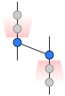](https://preshing.com/images/mini-cones.png)

- **A Write-Release Can Synchronize-With a Read-Acquire**:
  - _Atomic operation `A`_ is the **write-release** performed in `SendTestMessage`.
  - _Atomic object `M`_ is the **guard variable**, `g_guard`.
  - _Atomic operation `B`_ is the **read-acquire** performed in `TryReceiveMessage`.
  - All the **modifications** to `g_payload` are **visible** by the time the other thread reads them.

``` cpp
Message g_payload;
std::atomic<int> g_guard(0);

void SendTestMessage(void* param) {
  // Copy to shared memory using non-atomic stores.
  g_payload.tick  = clock();
  g_payload.str   = "TestMessage";
  g_payload.param = param;

  // Perform an atomic write-release to indicate that the message is ready.
  g_guard.store(1, std::memory_order_release);
}

bool TryReceiveMessage(Message& result) {
  // Perform an atomic read-acquire to check whether the message is ready.
  if (g_guard.load(std::memory_order_acquire) != 0) {
    // Copy from shared memory using non-atomic loads.
    result.tick  = g_payload.tick;
    result.str   = g_payload.str;
    result.param = g_payload.param;
    return true;  // Yes.
  }
  return false;   // No.
}
```

[align-center]

[](https://preshing.com/images/two-cones.png)

- It all **depends on** whether the read-acquire **sees the value written** by the write-release, or not.
  - If `TryReceiveMessage` is called **too early** – **before** Thread 1’s store to `g_guard` is **visible** – there will be **no synchronizes-with relationship** whatsoever.
  - That’s what the C++11 standard means when it says that atomic operation `B` **must “take its value”** from atomic operation `A`.

[align-center]

[](https://preshing.com/images/no-cones.png)

- In fact, **compiler vendors** fulfill this promise using the **same old tricks** which programmers technically had to use long **before C++11** came along:
  - An _ARMv7_ compiler implements these operations using a pair of `dmb` instructions.
  - A _PowerPC_ compiler could implement them using `lwsync`.
  - An _x86_ compiler could simply use a **compiler barrier** due to x86’s relatively **strong hardware memory model**.
- In **Java 5+**,
  - every **store** to a `volatile` variable is a **write-release**,
  - while every **load** from a `volatile` variable is a **read-acquire**.
  - Therefore, any `volatile` variable in Java can act as a **guard variable**.
  - Same as C++11 `memory_order_seq_cst`, it enforces
    - both **acquire-release** semantics
    - and **sequential consistency** on all access to `volatile` variables.

[align-center]

[](https://preshing.com/images/java-volatile.png)

- **Unlocking** a mutex always **synchronizes-with** a subsequent **lock** of that mutex:
  - You can consider the **mutex** itself to be the **guard**,
  - and the **protected variables** as the **payload**.

[align-center]

[](https://preshing.com/images/jsr133.png)

- The **bottom line** is that the **synchronizes-with** relationship **only exists** where the **language and API specifications** say it exists.
- Summary of **happens-before**, **synchronizes-with** and **acquire-release**:

[align-center]

[](https://preshing.com/images/org-chart.png)

### Acquire and Release Semantics [🔗](https://preshing.com/20120913/acquire-and-release-semantics)

- Two ways to **manipulate shared memory**:
  - **compete** with each other for a resource,
  - or **pass information** co-operatively from one thread to another.
- Acquire and release semantics pertains to lock-free programming **without sequential consistency**.
- **Acquire semantics**:
  - only apply to **read-modify-write** operations or **plain loads**,
  - **prevent** memory reordering of the **read-acquire** with **any read or write** operation that **follows** it in **program order**.

[align-center]

[](https://preshing.com/images/read-acquire.png)

- **Release semantics**:
  - only apply to **read-modify-write** operations or **plain stores**,
  - **prevent** memory reordering of the **write-release** with **any read or write** operation that **precedes** it in **program order**.

[align-center]

[](https://preshing.com/images/write-release.png)

- The barriers must (somehow) be placed
  - **after** the **read-acquire** operation,
  - but **before** the **write-release**.
- `#StoreLoad` barrier is more expensive:
  - On PowerPC, the `lwsync` (short for “**lightweight sync**”) instruction acts as all three `#LoadLoad`, `#LoadStore` and `#StoreStore`,
  - yet `sync` instruction includes a `#StoreLoad` barrier.

[align-center]

[](https://preshing.com/images/acq-rel-barriers.png)

- The **store** to `Ready` turns into a **write-release** in Thread 1, and the **load** from `Ready` becomes a **read-acquire** in Thread 2:
  - If we find that `r1 == 1`, we are guaranteed that `r2 == 42`.
  - The acquire and release semantics must apply to **the same variable** (In this case, `Ready`),
  - and both the **load and store** must be **atomic** operations. (The **operations** on **aligned** `int` are **already atomic** on PowerPC, and on every **modern CPU** that exists today.)

[align-center]

[](https://preshing.com/images/platform-fences.png)

- **With Fences in Portable C++11**:
  - The `memory_order_relaxed` arguments mean “**ensure** these operations are **atomic**, but **don’t impose** any **ordering constraints**/**memory barriers** that aren’t already there.”
  - A memory fence **doesn’t prevent** memory operations **moving down** below **itself**, but **prevents** previous memory operations from **moving past subsequent stores**.

[align-center]

[](https://preshing.com/images/cpp11-fences.png)

- **Without Fences in Portable C++11**:
  - It’s **not exactly the same** as the version using **standalone fences**;
  - technically, it’s **less strict** (shown later).
  - On Itanium, each operation can be easily implemented as a single instruction: `ld.acq` and `st.rel`.

[align-center]

[](https://preshing.com/images/cpp11-no-fences.png)

- `#LoadStore` becomes **essential** when implementing a **(mutex) lock**:
  - It ensures that all **modifications** made **while holding** the lock
  - will **propagate** fully to the **next thread** that obtains the lock.

[align-center]

[](https://preshing.com/images/acq-rel-lock.png)

### Acquire and Release Fences [🔗](https://preshing.com/20130922/acquire-and-release-fences)

- An **acquire fence**
  - **prevents** the memory **reordering**
  - of any **read** which **precedes** it in program order
  - with any **read or write** which **follows** it in program order.
- A **release fence**
  - **prevents** the memory **reordering**
  - of any **read or write** which **precedes** it in program order
  - with any **write** which **follows** it in program order.

[align-center]

[](https://preshing.com/images/org-chart-fences.png)

- Definition:
  - A release fence `A` **synchronizes-with** an acquire fence `B`
  - if there exist atomic operations `X` and `Y`,
  - both operating on some atomic object `M`,
  - such that `A` is sequenced before `X`,
  - `X` modifies `M`,
  - `Y` is sequenced before `B`,
  - and `Y` reads
    - the value written by `X`
    - or a value written by any side effect in the hypothetical release sequence `X` would head if it were a release operation.
- The fences **synchronize-with** _each other_:
  - _Release fence `A`_ is the **release fence** issued in `SendTestMessage`.
  - _Atomic operation `X`_ is the **relaxed atomic store** performed in `SendTestMessage`.
  - _Atomic object `M`_ is the **guard variable**, `g_guard`.
  - _Atomic operation `Y`_ is the **relaxed atomic load** performed in `TryReceiveMessage`.
  - _Acquire fence `B`_ is the **acquire fence** issued in `TryReceiveMessage`.
  - The atomic **write** is now **relaxed**, and a **release fence** has been placed **immediately before** it.
  - The atomic **read** has been **relaxed**, and an **acquire fence** has been placed **slightly after** it.
  - The **acquire fence** does **not occur immediately after** the **read**; we **first check** whether `ready != 0`, since that’s the **only** case where the fence is **really needed**.

``` cpp
void SendTestMessage(void* param) {
  // Copy to shared memory using non-atomic stores.
  g_payload.tick  = clock();
  g_payload.str   = "TestMessage";
  g_payload.param = param;

  // Release fence.
  std::atomic_thread_fence(std::memory_order_release);

  // Perform an atomic write to indicate that the message is ready.
  g_guard.store(1, std::memory_order_relaxed);
}

bool TryReceiveMessage(Message& result) {
  // Perform an atomic read to check whether the message is ready.
  if (g_guard.load(std::memory_order_relaxed) != 0) {
    // Acquire fence.
    std::atomic_thread_fence(std::memory_order_acquire);

    // Copy from shared memory using non-atomic loads.
    result.tick  = g_payload.tick;
    result.str   = g_payload.str;
    result.param = g_payload.param;
    return true;  // Yes.
  }
  return false;   // No.
}
```

[align-center]

[](https://preshing.com/images/two-cones-fences.png)

- Note that **acquire and release fences** may **not translate directly** into native **CPU instructions**, and it can generate the [same machine code](https://godbolt.org/g/ZDW5wy) as **acquire and release operations** on _x86_.

### Acquire and Release Fences Don’t Work the Way You’d Expect [🔗](https://preshing.com/20131125/acquire-and-release-fences-dont-work-the-way-youd-expect)

- Right: A **release fence** actually **prevents** all **preceding memory operations** from being reordered **past subsequent writes**.
- Wrong: **Preceding memory operations** are **prevented** from being reordered **past the fence**.
- A **memory fence** is neither a load nor a store, so obviously, it **can’t be** an **acquire or release operation**.
- A **release operation** can **never take the place** of a **release fence**:
  - The store to `m_instance` is now free to be **reordered before** the store to `g_dummy`,
  - and possibly **before** any stores performed by the `Singleton` **constructor**.
  - The fox is in the henhouse, and mayhem ensues!
  - Related: [WG21/N2633: Improved support for bidirectional fences](http://www.open-std.org/jtc1/sc22/wg21/docs/papers/2008/n2633.html) by _Peter Dimov_

``` cpp
Singleton* tmp = new Singleton;
g_dummy.store(0, std::memory_order_release);
m_instance.store(tmp, std::memory_order_relaxed);
```

### The Purpose of memory_order_consume in C++11 [🔗](https://preshing.com/20140709/the-purpose-of-memory_order_consume-in-cpp11)

- An operation that uses `memory_order_consume` is said to have **consume semantics**.
  - We call such operations **consume operations**.
  - There is **no consume fence**.

[align-center]

[](https://preshing.com/images/consume-devices.jpg)

- You can always safely **replace** it with `memory_order_acquire`, which is **stronger**, and get served the **same purpose**:
  - There is **no** `memory_order_produce` which relates to `memory_order_release`.

[align-center]

[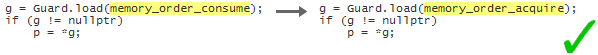](https://preshing.com/images/consume-to-acquire.png)

- **Acquire-release example**:

``` cpp
atomic<int> Guard(0);
int Payload = 0;

g = Guard.load(memory_order_acquire);
if (g != 0)
  p = Payload;

Payload = 42;
Guard.store(1, memory_order_release);
```

[align-center]

[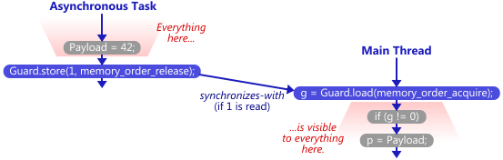](https://preshing.com/images/synchronizes-with-guard.png)

- On _Intel x86-64_, the _Clang_ compiler generates **compact machine code** – one machine instruction per line of C++ source code, and **doesn’t need** to emit special **memory barrier instructions** to implement the read-acquire:

[align-center]

[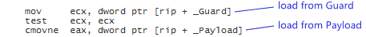](https://preshing.com/images/acquire-intel.png)

- On _PowerPC_, the compiler **must** emit **memory barrier instructions** (`cmp;bne;isync` is [recommended](http://www.rdrop.com/users/paulmck/scalability/paper/N2745r.2011.03.04a.html), or `lwsync` also works) to guarantee acquire semantics on multicore systems:

[align-center]

[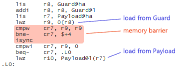](https://preshing.com/images/acquire-powerpc.png)

- On _ARMv7_, `dmb ish` is the best available **memory barrier instruction**:

[align-center]

[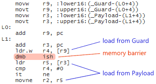](https://preshing.com/images/acquire-armv7.png)

- On _PowerPC_ and _ARMv7_, the **memory barrier** instructions impose a **performance penalty**, **but** they are **necessary** for this example to work:

[align-center]

[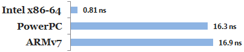](https://preshing.com/images/acquire-timings.png)

- Two machine **instructions**, executed in the **same thread**,
  - are **data-dependent** whenever the **first** instruction **outputs** a value and the **second** instruction uses that value as **input**,
  - and will be **performed in-order**.
- When **multiple** instructions are data-dependent on **each other**, we call it a **data dependency chain**:
  - Data dependency ordering **guarantees** that all memory accesses performed along a **single chain** will be performed **in-order**.
  - On the other hand, **no guarantees** are made about **independent chains**!
  - So, the first **blue** load could still effectively **happen after** any of the **green** loads.

[align-center]

[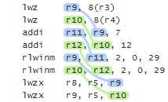](https://preshing.com/images/data-dependency-3.png)

- If another CPU core is **modifying** memory **concurrently**, and the second instruction’s **cache line** (of `r9`/`r31` below) is **not as up-to-date as** the first, that would **result in memory reordering**:
  - On _x86_/_x86-64_/_SPARC (in TSO mode)_ and _PowerPC_/_ARMv7_/_Itanium_/_PA-RISC_/_SPARC (in RMO mode)_/_zSeries_, the processor families **avoid** that, keeping each **cache line fresh** enough to ensure **data dependency ordering** is always **preserved**. (The second instruction uses `r9`/`r31` of the first.)
  - But it **doesn’t** on [DEC Alpha](https://www.cs.umd.edu/~pugh/java/memoryModel/AlphaReordering.html).

[align-center]

[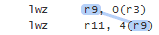](https://preshing.com/images/data-dependency-1.png)

[align-center]

[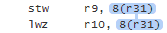](https://preshing.com/images/data-dependency-2.png)

- At the **source code** level, a **dependency chain** is a sequence of expressions whose evaluations all **carry-a-dependency** to **each another**:

[align-center]

[](https://preshing.com/images/source-code-machine-dep-levels.png)

- **Consume-release example**:
  - We load `p` **indirectly** via the pointer obtained by `g`, **rather than** reading **directly** from `Payload`.
  - The first line of code **carries-a-dependency** to the third line.
  - As to the **if-statement**, C++ makes **no guarantees** about memory ordering when it comes to **control dependencies**. (It **only** makes guarantees about **data dependencies**.)

``` cpp
atomic<int*> Guard(nullptr);
int Payload = 0;

g = Guard.load(memory_order_consume);
if (g != nullptr)
  p = *g;

Payload = 42;
Guard.store(&Payload, memory_order_release);
```

- We have a **dependency-ordered-before** relationship, **rather than synchronizes-with** relationship:
  - There’s a dependency **chain starting at** the **consume operation**,
  - and all memory operations performed **before** the **write-release** are guaranteed to be **visible to** that **chain**.

[align-center]

[](https://preshing.com/images/dependency-ordered-guard.png)

- On _Intel x86-64_, the machine code loads `Guard` into register `rcx`, then, if `rcx` is not null, uses `rcx` to load the payload:
  - It guarantees that loads are performed **in-order**, **even if** there **isn’t** a **data dependency**.

[align-center]

[](https://preshing.com/images/consume-intel.png)

- On _PowerPC_, the machine code loads `Guard` into register `r9`, then uses `r9` to load the payload:
  - The **data dependency** lets us completely **avoid** the `cmp;bne;isync` sequence of instructions of memory barrier,
  - while **still ensuring** that the two loads are performed **in-order**.

[align-center]

[](https://preshing.com/images/consume-powerpc.png)

- On _ARMv7_, the machine code loads `Guard` into register `r4`, then uses `r4` to load the payload:
  - It **ensures** that the two loads are performed **in-order** **without** the `dmb ish` instruction.

[align-center]

[](https://preshing.com/images/consume-armv7.png)

- Consume semantics make **little difference** on _Intel x86-64_, but they make a **huge difference** on _PowerPC_ and a **significant difference** on _ARMv7_:

[align-center]

[](https://preshing.com/images/consume-timings.png)

- Linux provides an implementation of [read-copy-update (RCU)](https://lwn.net/Articles/262464/),
  - which is suitable for building data structures that are **read frequently** from **multiple threads**, but **modified infrequently**.
  - Indeed, it served as **motivation** for **adding consume semantics** to **C++11** in the first place.
  - Related: [WG21/N2664: C++ Data-Dependency Ordering: Atomics and Memory Model](http://www.open-std.org/jtc1/sc22/wg21/docs/papers/2008/n2664.htm) by _Paul McKenney_, _Hans Boehm_ and _Lawrence Crowl_
- Today’s **compiler support** is **lacking**: the above code of _PowerPC_ and _ARMv7_ were **fabricated**.
- Compilers have a choice of **two strategies** for implementing `memory_order_consume` on **weakly-ordered processors**:
  - Hard: The **efficient strategy** is the one described in this post.
  - Easy: In the **heavy strategy**, the compiler simply **treats** `memory_order_consume` **as if** it were `memory_order_acquire`, and **ignores dependency chains** altogether.
  - Related: [WG21/N4036: Towards Implementation and Use of `memory_order_consume`](http://www.open-std.org/jtc1/sc22/wg21/docs/papers/2014/n4036.pdf) by _Paul McKenney_, _Torvald Riegel_, and _Jeff Preshing_
  - Related: [Fixing GCC’s Implementation of `memory_order_consume`](https://preshing.com/20141124/fixing-gccs-implementation-of-memory_order_consume) by _Jeff Preshing_ ([Bug 59448 - Code generation doesn't respect C11 address-dependency](https://gcc.gnu.org/bugzilla/show_bug.cgi?id=59448) by _algrant_)
- Mind you, the **performance gains** would **only** be realized on **specific processor families**, and are likely to be **negligible if** the load-consume is **performed fewer** than, say, 100000 times per second.

### Can Reordering of Release/Acquire Operations Introduce Deadlock? [🔗](https://preshing.com/20170612/can-reordering-of-release-acquire-operations-introduce-deadlock)

- `A` and `B` are **spinlocks**:

``` cpp
void Thread1() {
  int expected = 0;
  // Lock A
  while (!A.compare_exchange_weak(expected, 1, std::memory_order_acquire))
    expected = 0;
  // Unlock A
  A.store(0, std::memory_order_release);
  // Lock B
  while (!B.compare_exchange_weak(expected, 1, std::memory_order_acquire))
    expected = 0;
  // Unlock B
  B.store(0, std::memory_order_release);
}
void Thread2() {
  int expected = 0;
  // Lock B
  while (!B.compare_exchange_weak(expected, 1, std::memory_order_acquire))
    expected = 0;
  // Lock A
  while (!A.compare_exchange_weak(expected, 1, std::memory_order_acquire))
    expected = 0;
  // Unlock A
  A.store(0, std::memory_order_release);
  // Unlock B
  B.store(0, std::memory_order_release);
}
```

- In Thread1, it’s **a write-release followed by a read-acquire**:
  - The **compiler** is **free to reorder** those statements. (OK to reorder **for CPU**, too)
  - This introduces a **potential deadlock**.

``` cpp
void Thread1() {
  int expected = 0;
  // Lock A
  while (!A.compare_exchange_weak(expected, 1, std::memory_order_acquire))
    expected = 0;
  // Lock B
  while (!B.compare_exchange_weak(expected, 1, std::memory_order_acquire))
    expected = 0;
  // Unlock A
  A.store(0, std::memory_order_release);
  // Unlock B
  B.store(0, std::memory_order_release);
}
```

- In [`[intro.progress]`](https://eel.is/c++draft/intro.progress#18):
  - An implementation should ensure that
  - the last value (in **modification order**) assigned by an atomic or synchronization operation
  - will become **visible** to all **other threads** in a **finite** period of **time**.
- Back to Thread 1’s original code:
  - Once **execution reaches** the `while` loop (`Lock B`), the **last value** assigned to `A` is `0` (`Unlock A`).
  - If the loop is **always finite** and **known in advance**, the assignment to `A` (`Unlock A`) can be **reordered after** the loop (`Lock B`).
  - But if the **compiler can’t rule out** that the `while` loop is **infinite**, then it **shouldn’t reorder** the lines.
  - In order **not to violate** the standard, the **compiler shouldn’t reorder** those statements, and **deadlock** is **not possible**.
  - [None of the three major C++ compilers reorder](https://godbolt.org/g/DW6fuV) those statements when optimizations are enabled.
  - Note that **CPU reordering** at **runtime** would **not cause deadlock**.
- Example by _Anthony Williams_: The **compiler** is **not allowed to reorder** the two lines in `thread1`:
  - If it does, **neither** thread will **terminate**.
  - If it does, it would be as if the **abstract machine didn’t issue** the **store** at all.

``` cpp
void thread1() {
  A.store(1, std::memory_order_release);
  while (B.load(std::memory_order_acquire) == 0) ;
}
void thread2() {
  while (A.load(std::memory_order_acquire) == 0) ;
  B.store(1, std::memory_order_release);
}
```

- Part of the reason why this question is **murky**, at least for me, is that the standard’s **wording is weak**:
  - §4.7.2:18 says that implementations **“should” ensure** that stores become visible, **not** that they **must**.
  - It’s a **recommendation**, **not** a **requirement**.

## Lock-free Application

### Lightweight In-Memory Logging [🔗](https://preshing.com/20120522/lightweight-in-memory-logging)

- When debugging multithreaded code, it’s not always easy to **determine** which **codepath** was taken.
- You can’t always reproduce the bug while stepping through the **debugger**, nor can you always sprinkle `printf`s throughout the code.
- The events are logged to a **circular buffer in memory**:

``` cpp
Event g_events[BUFFER_SIZE];  // |BUFFER_SIZE| must be a power of 2
LONG g_pos = -1;

void Log() {
  // Get next event index
  LONG index = _InterlockedIncrement(&g_pos);
  // Write an event at this index
  Event* e = g_events + (index & (BUFFER_SIZE - 1));  // Wrap to buffer size
  // ... Write log into |e| ...
}
```

- There are **no readers**. You can **inspect** the process **in the debugger**.
- Resemble Microsoft’s [Event Tracing for Windows (ETW)](https://docs.microsoft.com/zh-cn/windows/win32/etw/event-tracing-portal) framework, and its [support for user-mode provider events](https://randomascii.wordpress.com/2011/08/18/xperf-basics-recording-a-trace/).

### Double-Checked Locking is Fixed In C++11 [🔗](https://preshing.com/20130930/double-checked-locking-is-fixed-in-cpp11)

- **Up until 2004**, there was **no safe way** to implement the **double-checked locking pattern** _(DCLP)_ in Java. **Before C++11**, there was **no safe way** to implement it in portable C++.
- [Double-Checked Locking Is Broken](https://www.cs.umd.edu/~pugh/java/memoryModel/DoubleCheckedLocking.html) by a group of high-profile Java developers in 2000
- [C++ and the Perils of Double-Checked Locking](https://www.aristeia.com/Papers/DDJ_Jul_Aug_2004_revised.pdf) by _Scott Meyers and Andrei Alexandrescu_ in 2004
- What is DCLP:
  - We ensure **mutual exclusivity** of **singleton creation** by adding a **lock**.
  - But **once** the singleton is **created**, there **isn’t** really any **need** for the **lock** anymore.
  - So we **only** take a **lock when** the singleton pointer `m_instance` is **null**, which serializes the first group of threads that happen to see that value.
  - Once **inside the lock**, `m_instance` is **checked a second time**, so that **only the first** thread will **create** the singleton.
- **Without** any **synchronizes-with** relationship:
  - there was **no guarantee** that all the **writes** performed by the **first thread** – in particular, those performed in the `Singleton` constructor – were **visible** to the **second thread**, even if the `m_instance` pointer itself was visible!
  - Some **other thread** could have a possibility to read a **non-null pointer** to `Singleton` which has **not been constructed** yet.
- **Using C++11 Acquire and Release Fences**:
  - The memory fences establish a **synchronizes-with** relationship between the thread that **creates** the singleton **and** any subsequent thread that **skips** the lock.
  - `Singleton::m_instance` acts as the **guard variable**, and the contents of the singleton itself are the **payload**.

``` cpp
std::atomic<Singleton*> Singleton::m_instance;
std::mutex Singleton::m_mutex;

Singleton* Singleton::getInstance() {
  Singleton* tmp = m_instance.load(std::memory_order_relaxed);
  std::atomic_thread_fence(std::memory_order_acquire);
  if (tmp == nullptr) {
    std::lock_guard<std::mutex> lock(m_mutex);
    tmp = m_instance.load(std::memory_order_relaxed);
    if (tmp == nullptr) {
      tmp = new Singleton;
      std::atomic_thread_fence(std::memory_order_release);
      m_instance.store(tmp, std::memory_order_relaxed);
    }
  }
  return tmp;
}
```

[align-center]

[](https://preshing.com/images/two-cones-dclp.png)

- **Using C++11 Low-Level Ordering Constraints**:
  - This form of lock-free synchronization is **less strict** than the form using standalone fences;
    - These **operations** are only meant to **prevent** memory reordering **around themselves**,
    - as opposed to **standalone fences**, which are meant to **prevent** certain kinds of memory reordering **around neighboring operations**.
  - On the _x86/64_, _ARMv6/v7_, and _PowerPC_ architectures, the best possible **machine code** is the **same** for both forms,
  - but it may be **different** on _Itanium_ (`ld.acq`/`st.rel`) and _ARMv8_ (`ldar`/`stlr` **instead of** `dmb`).

``` cpp
Singleton* Singleton::getInstance() {
  Singleton* tmp = m_instance.load(std::memory_order_acquire);
  if (tmp == nullptr) {
    std::lock_guard<std::mutex> lock(m_mutex);
    tmp = m_instance.load(std::memory_order_relaxed);
    if (tmp == nullptr) {
      tmp = new Singleton;
      m_instance.store(tmp, std::memory_order_release);
    }
  }
  return tmp;
}
```

- **Using C++11 Sequentially Consistent Atomics**:
  - The **store** to `m_instance` has been implemented using an `xchg` instruction, which acts as a **full memory fence** on _x64_.
  - A plain `mov` instruction would have done the job.

``` cpp
Singleton* Singleton::getInstance() {
  Singleton* tmp = m_instance.load();
  if (tmp == nullptr) {
    std::lock_guard<std::mutex> lock(m_mutex);
    tmp = m_instance.load();
    if (tmp == nullptr) {
      tmp = new Singleton;
      m_instance.store(tmp);
    }
  }
  return tmp;
}
```

- **Using C++11 Data-Dependency Ordering**:
  - The **payload** is considered a **data dependency of** the **guard** pointer.
  - A **read-acquire** operation is actually **overkill**!
  - It’s **sufficient** to perform a **consume operation** instead.

``` cpp
Singleton* Singleton::getInstance() {
  Singleton* tmp = m_instance.load(std::memory_order_consume);
  // ...
}
```

- **Using a C++11 Static Initializer**:
  - The threadsafety of the initialization: If control enters the declaration concurrently while the variable is **being initialized**, the concurrent execution shall **wait for completion** of the initialization.
  - Since the `Singleton` is **constructed** at a **fixed address**, the compiler has introduced a **separate guard variable** for synchronization purposes.

``` cpp
Singleton& Singleton::getInstance() {
  static Singleton instance;
  return instance;
}
```

[align-center]

[](https://preshing.com/images/clang-arm-static-init.png)

### A Lock-Free… Linear Search? [🔗](https://preshing.com/20130529/a-lock-free-linear-search)

TODO

### The World’s Simplest Lock-Free Hash Table [🔗](https://preshing.com/20130605/the-worlds-simplest-lock-free-hash-table)

TODO

### Safe Bitfields in C++ [🔗](https://preshing.com/20150324/safe-bitfields-in-cpp)

TODO

### New Concurrent Hash Maps for C++ [🔗](https://preshing.com/20160201/new-concurrent-hash-maps-for-cpp)

TODO

### A Resizable Concurrent Map [🔗](https://preshing.com/20160222/a-resizable-concurrent-map)

TODO

### Leapfrog Probing [🔗](https://preshing.com/20160314/leapfrog-probing)

TODO

### Using Quiescent States to Reclaim Memory [🔗](https://preshing.com/20160726/using-quiescent-states-to-reclaim-memory)

TODO
