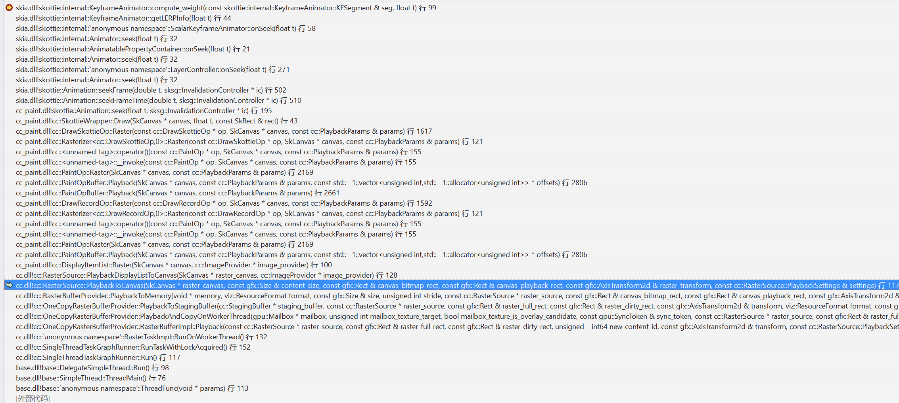
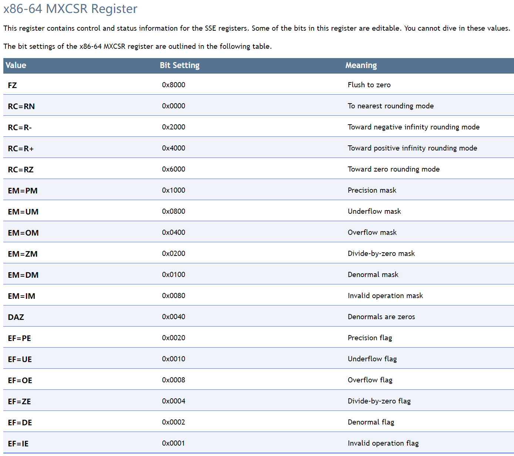
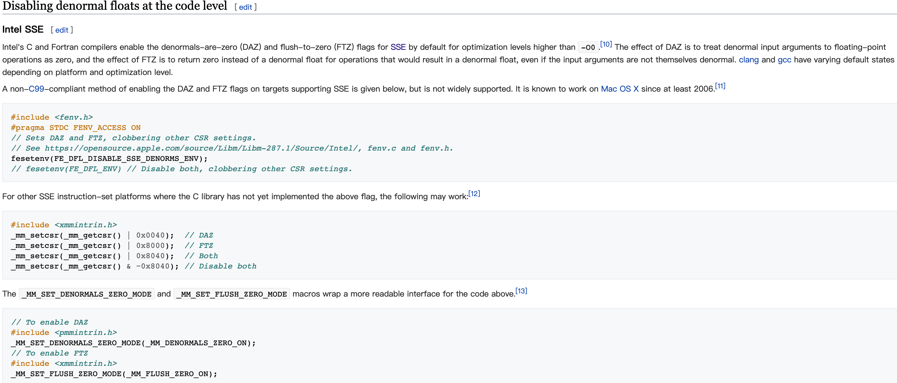
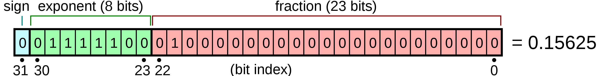
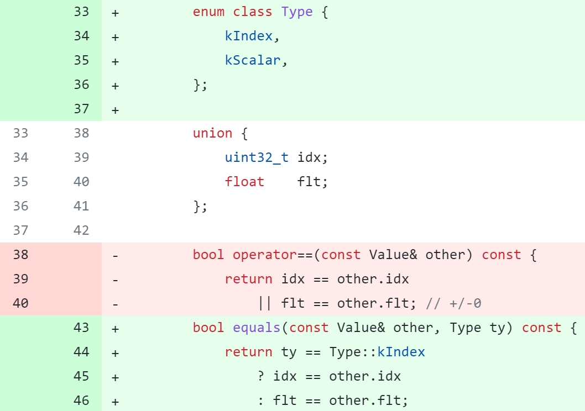

# 一次 Chromium 性能优化的“撞车”事故经历

> 2021/6/22
> 
> 也来聊聊浮点数的性能优化。作者：刘俊

**编者注**：本文作者是刘俊，主要从 Chromium/Skia 源码、C++ 语言底层、反汇编、操作系统等角度，分析一个浮点数优化导致的错误。

## 背景 TL;DR [no-toc]

Chromium 项目提供了基于 Skia 的 Lottie 动画播放组件（Skottie 组件），在使用该组件播放一个 Lottie 动画时，触发了一个 Skia 的断言，进而导致程序发生崩溃。更换其他 Lottie 文件进行测试并没什么问题，而出问题的 Lottie 文件在其他平台也可以正常播放。

确认用法和 Lottie 文件都没问题后，只能从 Chromium 的代码入手分析了 ——

[TOC]

## 问题分析

### 从源码入手

虽然对 Lottie 动画的原理有些了解，但并没有阅读过它实现相关的源码，问题有点棘手，不过也只能先从代码下手了，先来看调用栈：



从调用栈初步判断，断言发生在绘制 Lottie 动画时 Skia 对动画关键帧相关计算的函数中。来看 [`KeyframeAnimator::compute_weight()`](https://source.chromium.org/chromium/chromium/src/+/134c5f7f690b0b8a7ad5d0288762f79fdd2d7ec5:third_party/skia/modules/skottie/src/animator/KeyframeAnimator.cpp;l=73) 函数实现：

``` cpp
float KeyframeAnimator::compute_weight(const KFSegment &seg, float t) const {
    SkASSERT(seg.contains(t));

    // Linear weight.
    auto w = (t - seg.kf0->t) / (seg.kf1->t - seg.kf0->t);

    // Optional cubic mapper.
    if (seg.kf0->mapping >= Keyframe::kCubicIndexOffset) {
        SkASSERT(seg.kf0->v != seg.kf1->v);  // !!!!!!!! 命中断言 !!!!!!!!
        const auto mapper_index = SkToSizeT(seg.kf0->mapping - Keyframe::kCubicIndexOffset);
        w = fCMs[mapper_index].computeYFromX(w);
    }

    return w;
}
```

断言发生在两个关键帧相关字段的比较逻辑上：`seg.kf0->v` 和 `seg.kf1->v` 本不应该相等，此时却相等了！

`seg` 的 `kf0` 和 `kf1` 应该是记录了两个关键帧有关信息，[来看这两个数据成员的类型定义](https://source.chromium.org/chromium/chromium/src/+/134c5f7f690b0b8a7ad5d0288762f79fdd2d7ec5:third_party/skia/modules/skottie/src/animator/KeyframeAnimator.h;l=29)：

``` cpp
struct Keyframe {
    // We can store scalar values inline; other types are stored externally,
    // and we track them by index.
    struct Value {
        union {
            uint32_t idx;
            float    flt;
        };

        bool operator==(const Value& other) const {
            return idx == other.idx
                || flt == other.flt; // +/-0
        }
    };

    Value    v;

    // ...
};
```

其中 `v` 成员变量的类型是一个结构体类型，这个结构体并没有成员变量，内部只嵌套了一个 `union` 类型定义、和重载了两个比较操作符的成员函数。由上述代码大概推测：

- `v` 在某些情况下用来存储一个整型的索引值 `idx`，而在另外一些场景使用 `flt` 存储浮点数据；
- 等于操作符重载函数很好理解，因为比较的目标对象是 `union`， 本身只有一个存储空间，只要解析出的其中一个类型，判断其是否相等即可（其实事情并不是这么简单，看后面分析）。

看样子问题不会太复杂，我们只要调试跟踪一下 `seg.kf0->v` 和 `seg.kf1->v` 的赋值，看看什么地方赋值导致相等应该容易追踪问题的原因。顺着这个思路，找到两处对 `v` 成员变量的赋值代码：

- [`third_party/skia/modules/skottie/src/animator/TextKeyframeAnimator.cpp`](https://source.chromium.org/chromium/chromium/src/+/134c5f7f690b0b8a7ad5d0288762f79fdd2d7ec5:third_party/skia/modules/skottie/src/animator/TextKeyframeAnimator.cpp;l=73)

``` cpp
bool parseKFValue(const AnimationBuilder& abuilder,
                  const skjson::ObjectValue&,
                  const skjson::Value& jv,
                  Keyframe::Value* v) override {
    TextValue val;
    if (!Parse(jv, abuilder, &val)) {
        return false;
    }

    if (fValues.empty() || val != fValues.back()) {
        fValues.push_back(std::move(val));
    }

    v->idx = SkToU32(fValues.size() - 1);  // 产生断言的 kf0->v 和 kf1->v
                                           // 都是通过这里赋值的
    return true;
}
```

- [`third_party/skia/modules/skottie/src/animator/ScalarKeyframeAnimator.cpp`](https://source.chromium.org/chromium/chromium/src/+/134c5f7f690b0b8a7ad5d0288762f79fdd2d7ec5:third_party/skia/modules/skottie/src/animator/ScalarKeyframeAnimator.cpp;l=91)

``` cpp
bool parseKFValue(const AnimationBuilder&,
                  const skjson::ObjectValue&,
                  const skjson::Value& jv,
                  Keyframe::Value* v) override {
    return Parse(jv, &v->flt);
}
```

其中，`TextKeyframeAnimator` 和 `ScalarKeyframeAnimator` 两个类型的关键帧动画 一个使用了 `idx` ，另一个使用 `flt`，这与前面的猜测一致。不过调试代码发现，发生断言的两个 `v` 的使用都发生在 `ScalarKeyframeAnimator` 中，也就说 `v` 都是作为整型类型用来存储索引值的（从代码中可以看是以容器大小作为索引进行赋值的）。

两次连续调用发现，`seg.kf0->v` 和 `seg.kf1->v` 分别被赋值为 `0` 和 `1`。这就有点奇怪了，既然是 `0` 和 `1` ，怎么会相等呢？！

回头再看比较函数：

``` cpp
bool operator==(const Value& other) const {
    return idx == other.idx
        || flt == other.flt; // +/-0
}
```

两个判断是“或”的关系， 实践证明前面 `idx` 的比较一定不会相等，因此后面的判断会被执行。如果将 `0` 和 `1` 解析为浮点数，那么 `0` 会被解析为 `+0`，而 `1` 则被解析成一个非常小、趋近于 `0` 的浮点数。不过即便很小，那也一定不会相等，问题到底出在哪里呢？

### 写 Demo 尝试复现

调试 Chromium 源码太费劲了，于是我建了一个独立测试程序，把 `Keyframe::Value` 的代码粘出来，手动赋值 `0` 和 `1` 来还原问题：

``` cpp
struct Value {
  union {
    int idx;
    float flt;
  };

  bool operator==(const Value& other) const {
    return idx == other.idx
        || flt == other.flt; // +/-0
  }
};

int main() {
  Value v, x;

  x.idx = 0;
  v.idx = 1;

  if (x == v) {
    std::cout << "==" << std::endl;
  } else {
    std::cout << "!=" << std::endl;
  }
}
```

奇怪，测试代码输出了 `!=`，也就说这里的执行结果是和 Chromium/Skia 里的不同！

这个现象让我立刻想到一定是某些编译器参数设置导致了这样的结果，赶紧翻看了所有相关的工程配置，然而并没有什么发现。

### 反汇编分析

这让我陷入了困惑，同事建议我查看一下反汇编代码。难道两种场景下生成的汇编代码不一样吗？

``` asm
    bool operator==(const Value& other) const {
068C6330  push        ebp  
068C6331  mov         ebp,esp  
068C6333  push        esi  
068C6334  sub         esp,0Ch  
068C6337  mov         eax,dword ptr [ebp+8]  
068C633A  mov         dword ptr [ebp-8],ecx  
068C633D  mov         ecx,dword ptr [ebp-8]  
    return idx == other.idx || flt == other.flt;  // +/-0
068C6340  mov         edx,dword ptr [ecx]  
068C6342  mov         esi,dword ptr [other]  
068C6345  cmp         edx,dword ptr [esi]  
068C6347  mov         dl,1  
068C6349  mov         dword ptr [ebp-0Ch],ecx  
068C634C  mov         byte ptr [ebp-0Dh],dl  
068C634F  je          iron::Value::operator==+3Dh (068C636Dh)  
068C6355  mov         eax,dword ptr [ebp-0Ch]  
068C6358  movss       xmm0,dword ptr [eax]  
068C635C  mov         ecx,dword ptr [other]  
068C635F  ucomiss     xmm0,dword ptr [ecx]  
068C6362  sete        cl  ; 独立测试程序中 cl 为 0， 但在 Skia 中为 1
068C6365  setnp       dl  
068C6368  and         cl,dl  
068C636A  mov         byte ptr [ebp-0Dh],cl  
068C636D  mov         al,byte ptr [ebp-0Dh]  
068C6370  and         al,1  
068C6372  movzx       eax,al  
068C6375  add         esp,0Ch  
068C6378  pop         esi  
068C6379  pop         ebp  
068C637A  ret         4  
```

但结果令人失望，反汇编的代码并没什么不同。

不过调试跟踪汇编代码发现：在 Skia 中，比较指令 `ucomiss` 执行后 `cl` 寄存器的值为 `1`（`cl` 存放的是标志寄存器 `zf` 的值，这个值为 `1` 时，代表两个比较操作数相等）；而在独立测试代码中，`cl` 却为 `0`。

对比执行后的标志寄存器：

| 场景 | 独立测试程序 | Chromium/Skia 中 |
|---|---|---|
| 执行 `ucomiss` 前 | `EFL = 00200202` | `EFL = 00000202` |
| 执行 `ucomiss` 后 | `EFL = 00200202` | `EFL = 00000242` |

感觉是代码中某个东西导致了这种差异，更近一步推测，当 `1` 被解析为浮点数时，由于是一个很小的浮点数，被约等于 `0` 了？之前并没有相关知识储备，直觉告诉我，很可能就是这个原因，查询了一番资料，找到一个叫 [MXCSR 的寄存器](https://docs.unity3d.com/Packages/com.unity.burst@1.4/api/Unity.Burst.Intrinsics.X86.MXCSRBits.html)：

| Name | Description |
|------|-------------|
| FlushToZero | Bit 15 (FTZ) of the MXCSR register enables the flush-to-zero mode, which controls the masked response to a SIMD floating-point underflow condition. |
| DenormalsAreZeroes | Bit 6 (DAZ) of the MXCSR register enables the denormals-are-zeros mode, which controls the processor’s response to a SIMD floating-point denormal operand condition. |



看起来，MXCSR 寄存器专门用来对浮点数进行各种舍入设置的（MXCSR 只针对 x86/x64 的 CPU 架构），第 15 位和第 6 位看上去都会让结果舍入到 `0`，这基本能说明，之所以出现这样的结果，大概率是因为某些代码设置了这些标志位。

再来看看 denormal 是什么，在 [Wikipedia](https://en.wikipedia.org/wiki/Denormal_number) 上已经有很详细的描述了，称之为非正规数（也叫次正规数 subnormal），先大致可理解为极小的接近于 `0` 的浮点数。

因为 CPU 运算单元处理这些数据非常耗费性能，所以不同平台都提供了通过设置 MXCSR 来让 CPU 忽略对这些数的处理，直接舍入为 `0`，下面介绍了设置 MXCSR 指令的相关接口：



### 再回到源码

回到 Chromium 工程中查询，果然找到了 `__mm_setcsr` 的调用，一个 RAII 的封装类 [`ScopedSubnormalFloatDisabler`](https://source.chromium.org/chromium/chromium/src/+/a9563a849fc62ce0be68cb60fe740d48eff397a3:cc/base/math_util.cc;l=812)：

``` cpp
ScopedSubnormalFloatDisabler::ScopedSubnormalFloatDisabler() {
#if defined(ARCH_CPU_X86_FAMILY)
  // Turn on "subnormals are zero" and "flush to zero" CSR flags.
  orig_state_ = _mm_getcsr();
  _mm_setcsr(orig_state_ | 0x8040);
#endif
}

ScopedSubnormalFloatDisabler::~ScopedSubnormalFloatDisabler() {
#if defined(ARCH_CPU_X86_FAMILY)
  _mm_setcsr(orig_state_);
#endif
}
```

它的命名已经告诉了我们：“次正规浮点数禁用器”。紧接着，我在发生断言的调用栈中果然找到了 `ScopedSubnormalFloatDisabler` 的身影：


—— 在 [`RasterSource::PlaybackToCanvas`](https://source.chromium.org/chromium/chromium/src/+/d3e33c732a7386ab3b1b93a8b47cc72793eaa1c9:cc/raster/raster_source.cc;l=67) 函数中定义了 `ScopedSubnormalFloatDisabler` 对象；即在 `PlaybackToCanvas` 整个函数执行阶段内，Chrominum 都开启了这一项优化。下面代码中的注释也说明了这一点：“将所有次正规数都处理为 `0` 以提高性能”。

``` cpp
void RasterSource::PlaybackToCanvas(
    SkCanvas* raster_canvas,
    const gfx::Size& content_size,
    const gfx::Rect& canvas_bitmap_rect,
    const gfx::Rect& canvas_playback_rect,
    const gfx::AxisTransform2d& raster_transform,
    const PlaybackSettings& settings) const {
  SkIRect raster_bounds = gfx::RectToSkIRect(canvas_bitmap_rect);
  if (!canvas_playback_rect.IsEmpty() &&
      !raster_bounds.intersect(gfx::RectToSkIRect(canvas_playback_rect)))
    return;
  // Treat all subnormal values as zero for performance.
  ScopedSubnormalFloatDisabler disabler;

  // ...
}
```

因为 Skia 坐标系采用了浮点数类型而不是整数类型作为标量，这就使运算过程中难免出现“次正规数”，在 UI 渲染过程中，存在大量的坐标数值计算，这将导致可观的性能开销。而这些“次正规数”对于程序来说多数情况下没有意义，最终都会被舍为 `0`。通过设置 MXCSR 寄存器让 CPU 来执行舍入操作，能够有效提高渲染性能。

分析至此，问题的原因已全部揭晓。

## 关于 +/-0 的迷思

显然不能轻易关掉 MXCSR 优化，我们重新回到 `Keyframe::Value` 的比较操作符函数来看：

``` cpp
bool operator==(const Value& other) const {
    return idx == other.idx
        || flt == other.flt; // +/-0
}
```

问题出在 `flt == other.flt` 这一句，既然 `||` 后面的判断出现了问题，如果把 `||` 改为 `&&` 会怎样？改成 `&&` 的关系后，`idx == other.idx` 就可以保证结果是正确的；而且，如果值是以 `flt` 存储的，那么 `idx == other.idx` 仍能确保即使在开启了次正规数优化的情况下，也能首先判断出不想等的情况直接返回 `false`。嗯，看起来 `||` 应该是 `&&` 才对，这是开发者的笔误吧？事情果真这么简单吗？

在上述比较函数中，`flt == other.flt` 后面的 `+/-0` 的注释被忽视了，`0` 还有正负之分？这条语句跟后面的注释到底是什么关系？这里暗含了什么？

### IEEE 754

要想知道 `+/-0` 的秘密，就必须要搞清楚 `float` 类型的存储协议了。我们知道，对于整数而言，在计算机中的存储非常直接，逐位存储，存多少是多少，不需要额外的转换运算；但对于小数，按照数位顺序存储的方式（称之为定点存储）因小数位长度以及小数点位置的不确定性，会导致存储空间的浪费且处理又太过复杂，因此现代计算机的处理器基本都是基于浮点表示法来存储与处理小数的，即 [IEEE 754 标准](https://en.wikipedia.org/wiki/IEEE_754)：用连续的 4 字节或 8 字节来表示一个小数，这个小数也被称之为浮点数，以下我们只讨论单精度浮点数，其存储格式为：`1bit 符号位 + 8bit 指数位 + 23bit 有效数字位` 来构成一个数据存储，为了提高性能，浮点数运算还有专门的处理器 FPU 来处理。



- 符号位 S（Sign）决定数是正数（`0`）还是负数（`1`），而对于数值 `0` 的符号位解释则作为特殊情况处理。
- 有效数字位 M（Significand）是二进制小数，它的取值范围为 `1~2-ε`，或者为 `0~1-ε`。它也被称为尾数位（Mantissa）、系数位（Coefficient），甚至还被称作“小数”。
- 指数位 E（Exponent）是 `2` 的幂（可能是负数），它的作用是对浮点数加权。

通过 IEEE 754 可以看到，正是因为符号位的存在，才有了 `+/-0`，当符号位为 `1`、其余位为 `0` 的时候，就表示为 `-0`。当然这只是存储结构带来的结果，从语义上来说，并不存在 `+/-0`，当程序解析时应该忽略符号位，把它们视为相等，因此，浮点类型也会将 `+0` 与 `-0` 视为相等。

回到本文的问题：如果在 `Keyframe::Value` 中通过 `flt` 存入 `-0`，但通过 `idx` 来解析，得出的结果为 `2147483648`，这显然不是正确答案，因为使用整型来解析浮点数的存储，`+/-0` 的符号位并不被忽略。由此来看，之所以有 `||` 这一句代码，就是为了将 `+/-0.0` 视为相等，以期保证语义的正确性。

有了以上对 `+/-0` 的认识，重新审视前文的修复方案：当以 `flt` 存储数据时，如果存在 `-0` 的情况，改为 `&&` 后结果，就会将 `+/-0` 的情况视为不相等，看来这种改法有严重漏洞。

### float 性能优化

事实上，包含了一个 `int` 类型和一个 `float` 类型的 `union`，是一个浮点数的惯用法，常被用于浮点数比较优化，了解到这一点，`+/-0` 的注释也就不那么费解了。

先来了解一下什么是 [Type punning（类型双关惯用法）](https://en.wikipedia.org/wiki/Type_punning)：

- 不同编程语言中都有使用类型双关的场景，在 C/C++ 中，我们常常会将一个类型强转为另一个类型来使用，这可以称之为类型双关。
- 强转操作本质是对同一个数据存储做不同的类型解析，利用这个特性，我们可以对某些场景下的浮点数的比较操作进行性能优化。

**编者注**：根据 [@farter yang](https://www.zhihu.com/people/farter-yang) 反馈，以下代码未考虑 `NaN` 等情况，不建议在实际项目中使用。

#### 1) 判断是否为正负 [no-toc]

判断一个浮点数是否为负数时，直接通过强转为 `int` 类型来判断符号位是否为 `1` 即可，因为不涉及浮点数指令，速度要比直接通过比较是否小于 `0.0` 要快很多：

``` cpp
float a;
bool is_negative = a < 0.0;  // 直接比较
bool is_negative =
    (reinterpret_cast<int>(a) << 1 | 0) &&    // 先过滤正负零
    (reinterpret_cast<int>(a) & 0x80000000);  // 再判断符号位不为 0
```

#### 2) 判断是否相等 [no-toc]

在比较两个浮点数是否相等时，通过将目标数据转换为整数进行比较：

``` cpp
bool operator==(float a, float b) {
  return a == b;
}

// 优化为：

bool operator==(float a, float b) {
  return reinterpret_cast<int>(a) == reinterpret_cast<int>(b)
         || a == b;  // 判断 +/- 0 的场景，确保当 a,b 互为 +/-0 时是相等的
}
```

我们还可以通过 `union` 这个神奇的数据结构来避免显示类型强制转换达到同样的目的，上述等于比较函数可以等价实现为：

``` cpp
bool compare(float a, float b) {
  union {
    int i;
    float f;
  } ua{ .f = a }, ub{ .f = b };
  return ua.i == ub.i ||
      a == b;  // 判断 +/- 0 的场景，确保当 a,b 互为 +/-0 时是相等的
}
```

上面使用 `union` 来实现类型双关的方式是不是很眼熟？没错，正是本文问题中的 `Keyframe::Value` 采用的方式！也就说，在 Skia 中，`Keyframe::Value` 的比较函数也使用了 `float` 类型双关的优化惯用法。

### 再看 denormal/subnormal 优化

> 非正规数（denormal）和 次正规数（subnormal）其实是同一个概念，起初叫非正规数，后来更习惯称为次正规数，二者并无区别。

了解了浮点数的存储格式，我们再来看看次正规数，根据浮点数的存储格式现在就可以准确判断何为一个次正规数了：当一个浮点数的指数位全部为 `0` 时，这个数就是一个次正规数，因此 CPU 也很容易据此来确定一个数是否为次正规数了。

次正规数在绝大多数情况下对程序的正确性并没有任何影响，但在极端情况下能够导致上百倍的性能损耗，在 Chromium 渲染中，涉及了大量的浮点数运算，在这种背景下，`//cc` 模块开启次正规数优化就非常有必要。

## 问题修复

### 问题总结

`union` 在 `Keyframe` 的定义中扮演了 2 种角色：

- 应用 `union` 标准语义 —— `Keyframe::Value` 被 `TextKeyframeAnimator` 类型引用时，是使用 `idx` 用作索引，而被 `ScalarKeyframeAnimator` 类型引用时，又被用作存储 `Scalar` 值。
- 施行 `float` 优化 —— 但当 `Keyframe::Value` 被用作存储 `float` 类型的值时，这个 `union` 结构又充当了优化 `float` 比较的惯用法，`union` 在这里扮演了两种角色！

当 `//cc` 模块中开启了 `subnormal` 优化 ，Skia 开启了 `float` 比较优化 ，两个模块在互不知情的情况下完美“撞车”！—— 真是大水冲了龙王庙，自家人不识自家人呐。

### 如何修复

个人认为 Skia 使用 `union` 的方式违反了单一职责原则，`float` 优化没错，但不应该同时保留 `union` 语义了，二者只能选其一，最好采用另外的方式来完成 `idx` 和 `flt` 语义上的表达，或者比较优化改为其他方式。

不过作为第三方库的使用者，以最小修改为原则，相信 Chromium 团队会很快发现并解决（**编者注**：已修复）该问题。因此这里采用只在比较的地方把 subnormal 优化关掉，比较完之后再将其恢复。

修复方案：定义 `ScopedSubnormalFloatEnabler`，同样利用 RAII 的方式，在限定作用域内关闭次正规数优化，以确保浮点数比较不被干扰，在比较操作函数中，定义该类型的变量 `enabler`，代码如下：

``` cpp
class ScopedSubnormalFloatEnabler {
public:
#if defined(_M_X64) || defined(__x86_64__) || defined(_M_IX86) || defined(__i386__)
    ScopedSubnormalFloatEnabler() {
        // Turn off "subnormals are zero".
        orig_state_ = _mm_getcsr();
        if ((orig_state_ & 0x8040) == 0x8040) {
            _mm_setcsr(orig_state_ & ~0x8040);
        }
    }

    ~ScopedSubnormalFloatEnabler() {
        if ((orig_state_ & 0x8040) == 0x8040) {
            _mm_setcsr(orig_state_);
        }
    }

private:
    unsigned int orig_state_;
#endif
};

struct Keyframe {
    bool operator==(const Value& other) const {
        ScopedSubnormalFloatEnabler enabler;  // 关闭 subnormal 优化
        return idx == other.idx
            || flt == other.flt; // +/-0
    }  // 恢复开启 subnormal 优化
};
```

**编者注**：Skia 在后续迭代中修复了该问题，[增加了 `Value::Type` 用于区分 `union` 数据的实际类型](https://github.com/google/skia/commit/6a2a637746497227f6164a7cfbc159303f4fb5aa)：



## 后记 [no-toc]

开发 SDK 的同学或许有过这样的经历：对自己提供的 API 的质量非常自信，但由于调用侧复杂的上下文环境，有时会导致 API 本身明明看起来没问题，但在当下的环境中却出现异常，比如涉及多线程相关的 API 的封装，一个间接调用因为有同步锁的存在，可能会导致跟被调用方的锁发生死锁，这种情况并不少见。

本文讲述的问题也很像类似场景，单一看某一优化并没有什么问题，但当出现在不同的上下文中时，结果就不一定正确了。此类问题并没有好的法则来避免，但值得我们注意的是，我们写的代码的正确性是否需要有前置条件来做保障，要搞清楚，并做好说明。

感谢关注，希望本文能对你有帮助。如果有什么问题，**欢迎交流**。😄

Delivered under MIT License &copy; 2021, BOT Man
