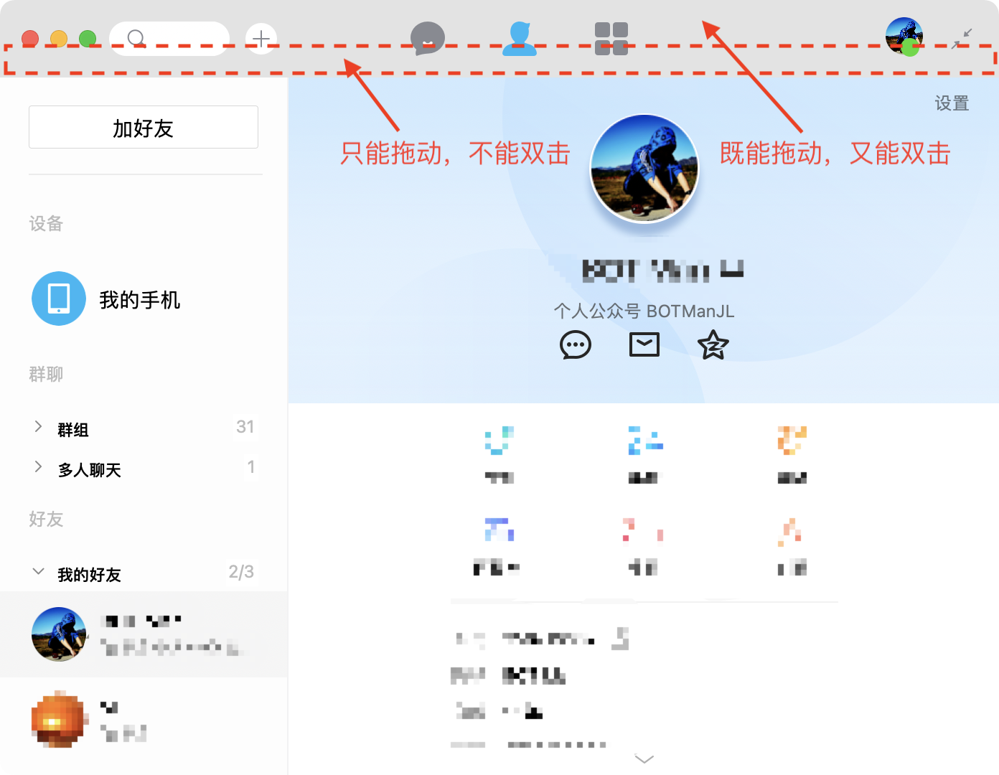
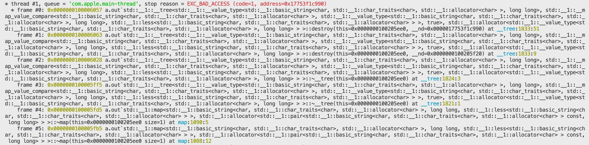
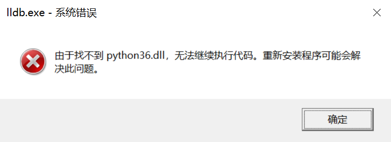
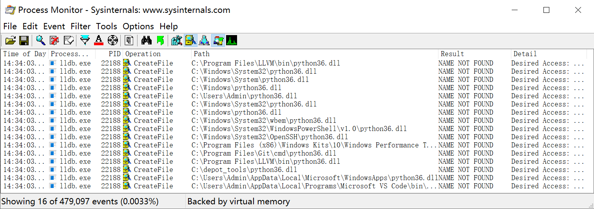
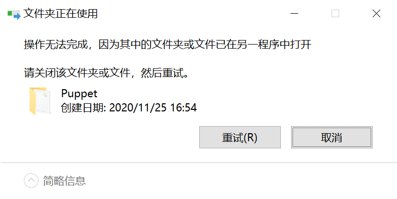
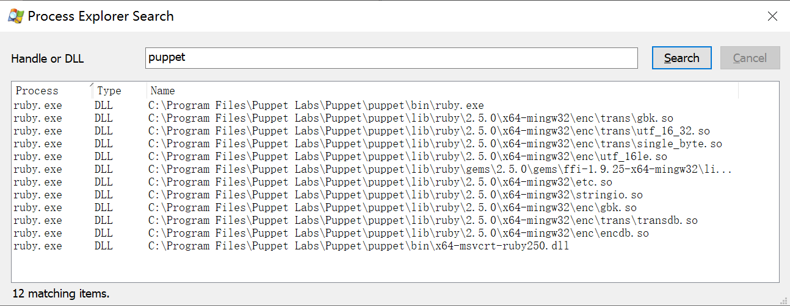

# 一切皆可调试

> 2021/1/10 -> 2021/2/12
> 
> Debugging is twice as hard as writing the code in the first place. —— Kernighan’s Law

## 写在前面 TL;DR [no-toc]

> 在一次学校社团的技术分享中，两位 “黑客” 同学分享了：如何用 **一个下午的时间** 破解某英语学习客户端 —— 学生无需学习课程，即可自动完成考试。
> 
> 令我印象最深刻的是：原本用于调整音量的滑块，被魔改用来输入考试得分 —— 利用动态规划，模拟答错一些题目，最后提交符合预期总分的答案（毕竟不能全是满分 😶）。
> 
> 当时，我 “幼小的心灵” 受到了 巨大的震撼 —— 只要学会了 **逆向和调试**，就可以 “随心所欲” 了（当然也得 “不逾矩” 🙂）。于是，我开始向他们学习！

现在，我逐渐学会了 “在调试器里看世界”，也提高了排查问题的速度。本文先分享两个故事，再总结一些心得和技巧：

[TOC]

## 关于逆向的客场作战

> 💡 由于拿不到被调试对象的 符号和源码，一般需要借助专业知识，通过逆向技术，根据程序行为，顺藤摸瓜，推敲逻辑。

### 糟糕的用户体验

由于公司配了 MacBook Pro，不得不用它 ~~（痛苦的 😭）~~ 进行日常工作。~~当然，作为音响还是很不错的。。。（不过就是有点贵 😶）~~

然而 macOS 上的很多软件（尤其是国产软件）都没有经过仔细打磨 —— 要么是功能缺失（这让我回忆起用 Windows Phone 的三年时光），要么是用起来硌硬（很多明显的 bug 都没人修）。

其中有很多软件都存在一个问题：他们的整个标题栏都能拖动，但只有上半部分支持双击放缩，下半部分却只能拖动 ——



如果不小心双击了下半部分，总以为是程序卡住了；但是把鼠标往上移一些再双击，又可以放缩了 —— 感觉受到了欺骗 😡。

作为多年 Windows 用户，实在忍无可忍，于是，先从最常用的 QQ 下手 ——

### 不说别的，上调试器

恰好 macOS 上预装有 lldb（终端里直接敲 lldb 即可安装 👍），这次就没有用 gdb（当然，WinDbg 不支持 macOS 🙃）。

> 💡 如果不知道如何使用调试器，推荐阅读 [LLDB 教程](https://lldb.llvm.org/use/tutorial.html)；如果不熟悉 lldb 命令，可以参考 [GDB/LLDB 命令映射表](https://lldb.llvm.org/use/map.html)。

由于 QQ 的二进制文件（本文使用的是最新的 [6.7.3 版本](https://dldir1.qq.com/qqfile/QQforMac/QQ_6.7.3.dmg)）使用了签名，[调试前需要先去掉签名](https://reverseengineering.stackexchange.com/questions/13622/remove-code-signature-from-a-mac-binary)：

```
codesign --remove-signature /Applications/QQ.app/Contents/MacOS/QQ
```

> 💡 磨刀不误砍柴工 —— 背景调研，非常关键。

拿到一个新问题后，需要先简单了解一些相关知识：

- [根据网友的回答](https://apple.stackexchange.com/questions/95681/how-can-i-change-os-x-double-click-on-title-bar-to-be-like-windows/232153#232153)，我们知道：
  - 双击的英文是 double click
  - 标题栏的英文是 title bar（后边发现应该是 titlebar 🙃）
  - 放缩窗口的英文是 zoom window
  - 而这个功能是从 macOS Catalina 10.15 开始支持的
- macOS 基于 [Cocoa UI 框架](https://developer.apple.com/library/archive/documentation/MacOSX/Conceptual/OSX_Technology_Overview/CocoaApplicationLayer/CocoaApplicationLayer.html)，用的是 [Objective-C 语言](https://developer.apple.com/library/archive/documentation/Cocoa/Conceptual/ProgrammingWithObjectiveC/Introduction/Introduction.html)（我惊喜的发现 —— 即使不会，也不影响调试 🙂），核心模块是 [AppKit](https://developer.apple.com/documentation/appkit?language=objc) 框架
- [根据鼠标相关的文档](https://developer.apple.com/library/archive/documentation/Cocoa/Conceptual/EventOverview/HandlingMouseEvents/HandlingMouseEvents.html#//apple_ref/doc/uid/10000060i-CH6-SW17)，我们知道：
  - 鼠标点击事件分为 [`mouseDown:`](https://developer.apple.com/documentation/appkit/nsresponder/1524634-mousedown) 和 [`mouseUp:`](https://developer.apple.com/documentation/appkit/nsresponder/1535349-mouseup)（注意结尾的冒号 `:`）
  - 鼠标事件的类型是 [`NSEvent`](https://developer.apple.com/documentation/appkit/nsevent)，而可以通过 [`clickCount`](https://developer.apple.com/documentation/appkit/nsevent/1528200-clickcount) 判断单击还是双击（结尾没有冒号 `:`）
  - 有无结尾的冒号 `:` 会被认为是 **两个不同的符号**（下断点的时候需要注意 😶）
- [根据窗口相关的文档](https://developer.apple.com/documentation/appkit/nswindow)，我们知道：
  - Cocoa 程序的窗口是 [`NSWindow`](https://developer.apple.com/documentation/appkit/nswindow) 类
  - 窗口最大化 需要调用 [`performZoom:`](https://developer.apple.com/documentation/appkit/nswindow/1419450-performzoom) 方法
  - 窗口全屏 则是调用 [`toggleFullScreen:`](https://developer.apple.com/documentation/appkit/nswindow/1419527-togglefullscreen) 方法
  - 全屏和最大化是 **两个不同的操作**（目前用的还不太习惯 😶）

> 💡 为了提高效率，可以配置 `.lldbinit`/`.gdbinit` 文件，加载个人习惯的配置。

使用 lldb 的 **附加进程** 功能，挂载 QQ 进程上（另外，个人习惯把汇编指令设置为 Intel 风格 😶）：

```
lldb --attach-name QQ
(lldb) settings set target.x86-disassembly-flavor intel
```

> 💡 如果一开始没有思路，可以从 **特殊函数的调用** 尝试切入 —— 一般的系统函数、库接口都是 **导出函数**，可以直接搜到 —— 所以背景调研的时候，尽量查询英文资料。

首先，通过 **搜索符号** `performZoom:`，找到函数的入口：

```
(lldb) im lookup -r -n 'performZoom'
2 matches found in /System/Library/Frameworks/AppKit.framework/Versions/C/AppKit:
        Address: AppKit[0x00007fff22f53cc9] (AppKit.__TEXT.__text + 3586761)
        Summary: AppKit`-[NSWindow performZoom:]
        Address: AppKit[0x00007fff231caccf] (AppKit.__TEXT.__text + 6171343)
        Summary: AppKit`-[NSDrawerWindow performZoom:]
```

非常幸运，找到啦～ 而且只有两个结果。

> 💡 通过 **设置断点+反复操作**，尝试定位切入点。如果结果都不匹配，可以搜索其他符号（比如 `DoubleClick`/`Titlebar`），并多设置一些断点。如果还是不匹配，可以再查查资料，寻找新的关键词。

接着，先在可能性最大的 `-[NSWindow performZoom:]` **设置断点**：

```
(lldb) b AppKit`-[NSWindow performZoom:]
Breakpoint 1: where = AppKit`-[NSWindow performZoom:], address = 0x00007fff22fb8cc9
```

这时候，尝试 **双击标题栏上半部分**，非常幸运，发现每次窗口放缩时，都会 **经过这个函数**：

```
Process 46732 stopped
* thread #1, queue = 'com.apple.main-thread', stop reason = breakpoint 1.1
    frame #0: 0x00007fff22fb8cc9 AppKit`-[NSWindow performZoom:]
AppKit`-[NSWindow performZoom:]:
->  0x7fff22fb8cc9 <+0>: push   rbp
    0x7fff22fb8cca <+1>: mov    rbp, rsp
    0x7fff22fb8ccd <+4>: push   r14
    0x7fff22fb8ccf <+6>: push   rbx
Target 0: (QQ) stopped.
```

再尝试 **双击标题栏下半部分**，如我所料，发现窗口不会进入放缩逻辑，也 **不经过这个函数**。另外，**进入、退出全屏模式** 也不会进入这个函数。

> 💡 找到切入点后，根据 **调用关系**，寻找 **可疑函数**。如果没有找到明显特征，可以观察函数 在不同操作下的调用关系，寻找 **调用栈的共同部分**。

接着，通过 **查看调用栈**，发现 `AppKit` 的符号都很全，而且函数几乎都能顾名思义 👍。这里看起来是 `NSThemeFrame` 处理了 `mouseUp:` 事件：

```
(lldb) bt
* thread #1, queue = 'com.apple.main-thread', stop reason = breakpoint 4.1
  * frame #0: 0x00007fff22fb8cc9 AppKit`-[NSWindow performZoom:]
    frame #1: 0x00007fff22f1e4b0 AppKit`-[NSTitledFrame _handlePossibleDoubleClickForEvent:] + 216
    frame #2: 0x00007fff22f1df5c AppKit`-[NSThemeFrame mouseUp:] + 278
    ...
```

还可以注意到 `_handlePossibleDoubleClickForEvent:` 包含了关键词 `DoubleClick`，看似用于控制 “双击标题栏 放缩窗口” 的处理逻辑。

> 💡 反复 **切换栈帧**，结合 **反汇编** 结果，推断函数的 **调用逻辑和关系**，猜测函数的 **执行流程和意图**。（当然，如果能拿到符号，一定要先 **加载符号**；如果能拿到源码，一定要 **配置源码路径** —— 不必硬着头皮 读汇编代码 🙃）

于是，先 **切换栈帧**，再 **查看反汇编**：

<p><details>
<summary> 👉 代码有点长（慎点 😑）👈 </summary>
<pre><code>
(lldb) up
frame #1: 0x00007fff22f1e4b0 AppKit`-[NSTitledFrame _handlePossibleDoubleClickForEvent:] + 216
AppKit`-[NSTitledFrame _handlePossibleDoubleClickForEvent:]:
->  0x7fff22f1e4b0 <+216>: mov    al, 0x1
    0x7fff22f1e4b2 <+218>: jmp    0x7fff22f1e44c            ; <+116>
(lldb) d
AppKit`-[NSTitledFrame _handlePossibleDoubleClickForEvent:]:
    0x7fff22f1e3d8 <+0>:   push   rbp
    0x7fff22f1e3d9 <+1>:   mov    rbp, rsp
    0x7fff22f1e3dc <+4>:   push   r15
    0x7fff22f1e3de <+6>:   push   r14
    0x7fff22f1e3e0 <+8>:   push   rbx
    0x7fff22f1e3e1 <+9>:   push   rax
    0x7fff22f1e3e2 <+10>:  mov    rbx, rdx
    0x7fff22f1e3e5 <+13>:  mov    r14, rdi
    0x7fff22f1e3e8 <+16>:  mov    rsi, qword ptr [rip + 0x65b8a1f1] ; "clickCount"
    0x7fff22f1e3ef <+23>:  mov    rdi, rdx
    0x7fff22f1e3f2 <+26>:  call   qword ptr [rip + 0x5d65c5f8] ; (void *)0x00007fff20211d00: objc_msgSend
    0x7fff22f1e3f8 <+32>:  cmp    rax, 0x2
    0x7fff22f1e3fc <+36>:  jne    0x7fff22f1e44a            ; <+114>
    0x7fff22f1e3fe <+38>:  mov    rsi, qword ptr [rip + 0x65ba89d3] ; "_eventInTitlebar:"
    0x7fff22f1e405 <+45>:  mov    rdi, r14
    0x7fff22f1e408 <+48>:  mov    rdx, rbx
    0x7fff22f1e40b <+51>:  call   qword ptr [rip + 0x5d65c5df] ; (void *)0x00007fff20211d00: objc_msgSend
    0x7fff22f1e411 <+57>:  test   al, al
    0x7fff22f1e413 <+59>:  je     0x7fff22f1e44a            ; <+114>
    0x7fff22f1e415 <+61>:  mov    rsi, qword ptr [rip + 0x65b840ac] ; "modifierFlags"
    0x7fff22f1e41c <+68>:  mov    rdi, rbx
    0x7fff22f1e41f <+71>:  call   qword ptr [rip + 0x5d65c5cb] ; (void *)0x00007fff20211d00: objc_msgSend
    0x7fff22f1e425 <+77>:  bt     eax, 0x12
    0x7fff22f1e429 <+81>:  jb     0x7fff22f1e44a            ; <+114>
    0x7fff22f1e42b <+83>:  lea    rax, [rip + 0x65bccd4e]   ; NSView._window
    0x7fff22f1e432 <+90>:  mov    r15, qword ptr [rax]
    0x7fff22f1e435 <+93>:  mov    rdi, qword ptr [r14 + r15]
    0x7fff22f1e439 <+97>:  mov    rsi, qword ptr [rip + 0x65b840f8] ; "_isInHiddenWindowTab"
    0x7fff22f1e440 <+104>: call   qword ptr [rip + 0x5d65c5aa] ; (void *)0x00007fff20211d00: objc_msgSend
    0x7fff22f1e446 <+110>: test   al, al
    0x7fff22f1e448 <+112>: je     0x7fff22f1e45a            ; <+130>
    0x7fff22f1e44a <+114>: xor    eax, eax
    0x7fff22f1e44c <+116>: movzx  eax, al
    0x7fff22f1e44f <+119>: add    rsp, 0x8
    0x7fff22f1e453 <+123>: pop    rbx
    0x7fff22f1e454 <+124>: pop    r14
    0x7fff22f1e456 <+126>: pop    r15
    0x7fff22f1e458 <+128>: pop    rbp
    0x7fff22f1e459 <+129>: ret    
    0x7fff22f1e45a <+130>: mov    rdi, qword ptr [r14 + r15]
    0x7fff22f1e45e <+134>: call   0x7fff237e1b4c            ; symbol stub for: objc_opt_class
    0x7fff22f1e463 <+139>: mov    rsi, qword ptr [rip + 0x65ba8976] ; "_shouldZoomOnDoubleClick"
    0x7fff22f1e46a <+146>: mov    rdi, rax
    0x7fff22f1e46d <+149>: call   qword ptr [rip + 0x5d65c57d] ; (void *)0x00007fff20211d00: objc_msgSend
    0x7fff22f1e473 <+155>: test   al, al
    0x7fff22f1e475 <+157>: je     0x7fff22f1e480            ; <+168>
    0x7fff22f1e477 <+159>: mov    rsi, qword ptr [rip + 0x65ba896a] ; "_zoomWindowWithDoubleClick:"
    0x7fff22f1e47e <+166>: jmp    0x7fff22f1e4a4            ; <+204>
    0x7fff22f1e480 <+168>: mov    rdi, qword ptr [r14 + r15]
    0x7fff22f1e484 <+172>: call   0x7fff237e1b4c            ; symbol stub for: objc_opt_class
    0x7fff22f1e489 <+177>: mov    rsi, qword ptr [rip + 0x65ba8960] ; "_shouldMiniaturizeOnDoubleClick"
    0x7fff22f1e490 <+184>: mov    rdi, rax
    0x7fff22f1e493 <+187>: call   qword ptr [rip + 0x5d65c557] ; (void *)0x00007fff20211d00: objc_msgSend
    0x7fff22f1e499 <+193>: test   al, al
    0x7fff22f1e49b <+195>: je     0x7fff22f1e44a            ; <+114>
    0x7fff22f1e49d <+197>: mov    rsi, qword ptr [rip + 0x65ba8954] ; "_minimizeWindowWithDoubleClick:"
    0x7fff22f1e4a4 <+204>: mov    rdi, r14
    0x7fff22f1e4a7 <+207>: mov    rdx, rbx
    0x7fff22f1e4aa <+210>: call   qword ptr [rip + 0x5d65c540] ; (void *)0x00007fff20211d00: objc_msgSend
->  0x7fff22f1e4b0 <+216>: mov    al, 0x1
    0x7fff22f1e4b2 <+218>: jmp    0x7fff22f1e44c            ; <+116>
</code></pre>
</details></p>

根据反汇编知识，猜想：

- `objc_msgSend` 用于调用 Objective-C 对象方法
  - 方法名通过 `$rsi` 传递
  - 对象指针通过 `$rdi` 传递
- `_handlePossibleDoubleClickForEvent:` 的前半部分判断
  - `(NSEvent*)event.clickCount == 2`
  - `[self _eventInTitlebar:event] == YES`
  - `(NSEvent*)event.modifierFlags & 0x12`
  - `[self._window _isInHiddenWindowTab] == NO`
  - 如果不满足上述 4 个条件，直接 `jmp 0x7fff22f1e44a`，跳过后续逻辑
  - 只有满足了上述 4 个条件，才能 `jmp 0x7fff22f1e45a`，进入后续逻辑
- `_handlePossibleDoubleClickForEvent:` 的后半部分，根据系统设置，选择 **放缩窗口** 或 **最小化窗口**（再次 [参考网友的回答](https://apple.stackexchange.com/questions/95681/how-can-i-change-os-x-double-click-on-title-bar-to-be-like-windows/232153#232153)）
  - **旧版 macOS 系统** 双击标题栏的交互逻辑是 **最小化窗口**（让 Windows 用户抓狂 😫）
  - **新版 macOS 系统** 支持上述两种行为（默认是 **放缩窗口**）

大家可能会问：调用栈上为什么没有出现 `_zoomWindowWithDoubleClick:`？看上去是直接调用了 `performZoom:` 函数。这是因为：

- `_zoomWindowWithDoubleClick:` 内部使用了 **栈帧指针省略** _(frame pointer omission, FPO)_ 优化
- 直接用 `jmp` 指令代替 `call` 指令调用 `performZoom:` 函数，不会构造新的栈帧

> 💡 通过 **单步调试** 跟踪调用流程，找到出现 **执行路径分歧** 的位置。还可以 **单步进入函数**，跟踪子函数的执行过程，分析出现 **分歧的原因**。

为了验证猜想，可以再次 **设置断点**：

```
(lldb) b AppKit`-[NSTitledFrame _handlePossibleDoubleClickForEvent:]
Breakpoint 2: where = AppKit`-[NSTitledFrame _handlePossibleDoubleClickForEvent:], address = 0x00007fff22f1e3d8
```

然后，尝试 **点击标题栏任意部分**（包括单击、双击），非常幸运，发现无论窗口是否放缩，都会 **经过这个函数**。另外，点击界面上的其他区域，不会进入这个函数。

接着，利用 **单步调试**，可以发现：在双击（即 `event.clickCount == 2`）的情况下，调用 `_eventInTitlebar:` 后，在 `0x7fff22f1e411` 检查返回值 `$al`，出现了分歧：

- 双击标题栏上半部分，`$al` 为 `0x01`，进入放缩逻辑
- 双击标题栏下半部分，`$al` 为 `0x00`，跳过放缩逻辑

> 💡 利用 **断点命令** 输出日志、非侵入式的修改运行状态，再结合 **反复操作**，观察状态变化的异同点，**验证** 之前的猜想。

为了进一步验证猜想，使用 **断点命令** 打印 `_eventInTitlebar:` 的返回值 `$al`，并立即 **继续执行**：

```
(lldb) br disable 1 2
2 breakpoints disabled.
(lldb) b 0x7fff22f1e411
Breakpoint 3: where = AppKit`-[NSTitledFrame _handlePossibleDoubleClickForEvent:] + 57, address = 0x00007fff22f1e411
(lldb) br command add 3
Enter your debugger command(s).  Type 'DONE' to end.
> re r al 
> c 
> DONE
```

经过反复观察，可以发现：在双击标题栏的上半部分和下半部分时，`_eventInTitlebar:` 分别返回 `0x01` 和 `0x00`，符合预期。

最后，可以重新设置 **断点命令**，让 `_eventInTitlebar:` 总是返回 `0x01`，这样就 **临时解决** 了这个烦人的问题：

```
(lldb) br command add 3
Enter your debugger command(s).  Type 'DONE' to end.
> re w al 0x01 
> c 
> DONE
```

由于进程使用了 **地址空间布局随机化** _(address space layout randomization, ASLR)_，同一模块里的同一指令 在内存中的 **实际地址**（例如这次是 `0x7fff22f1e411`）在不同进程中 **可能不同**（每次运行都是不同进程），但相对于函数的 **偏移量是不变的**（例如此处是 `+ 57`）。

所以，针对双击标题栏无法放缩的问题，不论是 QQ 还是其他软件，都可以 “借助 **指令偏移量** 设置断点、添加 **断点命令**、再 **继续执行**” 的方法解决：

```
(lldb) br set -n '-[NSTitledFrame _handlePossibleDoubleClickForEvent:]' -R 57 -C 're w al 0x01' -G true
```

> 👀 给大家留个思考题 ——

如何 **彻底解决** 这个问题？难点在于：

- 由于 `_handlePossibleDoubleClickForEvent:` 和 `_eventInTitlebar:` 是 `AppKit` 里的符号，放在系统目录，不能直接修改里边的代码（即使修改了，也会带来其他风险）
- 所以，我们只能修改软件本身的代码；但这些代码没有符号（当然不会公开），难以定位切入点
- 如果你有想法，**欢迎在文章下方留言**（抓紧时间，说不定[下一个版本 QQ](https://im.qq.com/macqq/) 就修复了这个问题 🙃）

## 内存破坏的侦探游戏

> 💡 由于能拿到被调试对象的 符号和源码，可以借助调试技巧，快速定位问题。

### 天时地利人和

最近，我 **频繁遇到** 一个非常诡异的 **内存破坏崩溃** 😈 ——

- 虽然影响范围较小：只会在程序退出时崩溃，并不影响其他功能的正常使用
- 但严重影响了用户体验：每次在程序退出时，总能看到一个弹出的崩溃提示

🕵️ 由于当时 碰巧复现了这个 “只有少数用户 偶尔遇到” 的崩溃，于是 我开始寻找 “幕后黑手”。

本文将崩溃代码的核心逻辑记录在 [`insane_iterator.cc`](Debug-Everywhere/insane_iterator.cc) 里，可以使用 clang 12 编译，再通过 lldb 运行后，看到崩溃：

```
clang++ -std=c++17 -g insane_iterator.cc && lldb ./a.out
```

### 第一招：工具检查

众所周知，**内存破坏** 是一种棘手的崩溃类型：

- 由于程序出现 **逻辑错误**，在某次修改内存时，“不小心” **篡改了其他位置的内存**
- 一般 **不会立即崩溃**，而只有在使用 “被篡改” 的内存时，才会出现 **内存访问错误**
- 而在崩溃出现时，**为时已晚**，**难以反推** 最初的内存破坏 在何处

类似于，把女朋友新买的裙子 👗 当作抹布擦桌子后，再小心翼翼的放回去，女朋友 👩 并不会立即发现：

- 只有她下次准备穿这条裙子 💃 时，才会发现（出现崩溃）
- 如果她的裙子太多，这条裙子被压在柜子的最下边，那么她永远也不会发现 😂（不会崩溃）
- 即使她发现了，也不会知道 可怜的裙子经历了什么 🙈（无法回溯）

> 💡 [AddressSanitizer](https://github.com/google/sanitizers/wiki/AddressSanitizer) _(ASan)_ 工具常用于 定位内存破坏的时机，支持检测 释放后使用（悬垂引用）、缓冲区溢出、初始化顺序错误、内存泄露 等问题。
> 
> 例如，常见的 `std::map` 对象数据损坏问题，一般很难直接从 **调用栈** 找到数据损坏的原因：
> 
> 
> 
> 但是，可以借助 ASan 工具，在出现内存破坏时，**立即崩溃**，停止运行（因为继续运行一般没有意义了），并打印 **当前调用栈**、**被破坏内存的位置**（如果内存已使用，还会打印 **分配该内存时的调用栈**），从而提前暴露错误：
> 
> 

拿到这个问题后，可以先尝试使用 ASan **工具检查**，重新编译、运行，寻找内存破坏的时机：

```
clang++ -std=c++17 -g -fsanitize=address insane_iterator.cc && ./a.out
```

然而，**出师不利**（在我的 MacBook Pro 上）——

- 一旦加上 `-fsanitize=address` 参数编译后，程序竟然每次都能正常退出，不会出现崩溃 🙈
- 一旦不用 ASan 编译，总能 “稳定复现” 退出崩溃的问题 😭

> 当然，**不同系统** 的运行结果可能不同：
> 
> - Windows 上 clang 11 无论是否使用 ASan 编译，总是不会崩溃（都不符合预期）
> - Linux 上 clang 11/13 无论是否使用 ASan 编译，都会出现崩溃（[符合预期，并且 ASan 指出了内存破坏的位置](https://godbolt.org/z/jYvWbMns4)）

猜想原因是：原本内存破坏的位置，在被 ASan 隔开后，刚好落在合法的内存区域内，所以没有报错 —— **歪打正着** 😶。

### 第二招：上调试器

🕵️ 第一步，根据崩溃时的 “案发现场”，分析崩溃的 **直接原因**。

根据 **崩溃信息** 得知，进程在运行 `0x17758f25702` 函数时，尝试读取 `0x17758f25600` 内存，出现 **内存访问错误**（每次运行时，不一定是 `0x17758f25600`）：

```
Process 61235 stopped
* thread #1, queue = 'com.apple.main-thread', stop reason = EXC_BAD_ACCESS (code=1, address=0x17758f25702)
    frame #0: 0x0000017758f25702
error: memory read failed for 0x17758f25600
Target 0: (a.out) stopped.
```

首先，通过 **查看调用栈**，很容易发现 `0x17758f25702` “看起来” 不像一个合法的函数（因为在调用栈里，`a.out` 的其他函数都在 `0x000000010000????` 范围内）：

```
(lldb) bt
* thread #1, queue = 'com.apple.main-thread', stop reason = EXC_BAD_ACCESS (code=1, address=0x17758f25702)
  * frame #0: 0x0000017758f25702
    frame #1: 0x0000000100008419 a.out`BindStateBase::~BindStateBase(this=0x0000000100304320) at insane_iterator.cc:26:22
    frame #2: 0x00000001000083f5 a.out`BindStateBase::~BindStateBase(this=0x0000000100304320) at insane_iterator.cc:26:20
    frame #3: 0x000000010000838b a.out`std::__1::default_delete<BindStateBase>::operator(this=0x00000001003040f8, __ptr=0x0000000100304320)(BindStateBase*) const at memory:2368:5
    frame #4: 0x0000000100008049 a.out`std::__1::__shared_ptr_pointer<BindStateBase*, std::__1::default_delete<BindStateBase>, std::__1::allocator<BindStateBase> >::__on_zero_shared(this=0x00000001003040e0) at memory:3541:5
    frame #5: 0x0000000100008b9d a.out`std::__1::__shared_count::__release_shared(this=0x00000001003040e0) at memory:3445:9
    frame #6: 0x0000000100008b3f a.out`std::__1::__shared_weak_count::__release_shared(this=0x00000001003040e0) at memory:3487:27
    frame #7: 0x0000000100008b0c a.out`std::__1::shared_ptr<BindStateBase>::~shared_ptr(this=0x00007ffeefbff608) at memory:4212:19
    frame #8: 0x0000000100008ad5 a.out`std::__1::shared_ptr<BindStateBase>::~shared_ptr(this=0x00007ffeefbff608) at memory:4210:1
    frame #9: 0x0000000100008ab5 a.out`CallbackBase::~CallbackBase(this=0x00007ffeefbff608) at insane_iterator.cc:69:7
    frame #10: 0x0000000100008a98 a.out`OnceCallback<void ()>::~OnceCallback(this=0x00007ffeefbff608) at insane_iterator.cc:88:7
    frame #11: 0x0000000100004815 a.out`OnceCallback<void ()>::~OnceCallback(this=0x00007ffeefbff608) at insane_iterator.cc:88:7
    frame #12: 0x000000010000ade1 a.out`OnceCallback<void ()>::Run(this=0x0000000101008200) && at insane_iterator.cc:112:3
    frame #13: 0x000000010000acfa a.out`AtExitManager::~AtExitManager(this=0x00007ffeefbff6c8) at insane_iterator.cc:230:31
    frame #14: 0x0000000100003d65 a.out`AtExitManager::~AtExitManager(this=0x00007ffeefbff6c8) at insane_iterator.cc:228:20
    frame #15: 0x0000000100003bf6 a.out`main at insane_iterator.cc:319:1
    frame #16: 0x00007fff203a7621 libdyld.dylib`start + 1
```

通过 **查看反汇编**，进一步确认 `0x17758f25702` 不是一个函数：

```
(lldb) d -a 0x17758f25702
error: Could not find function bounds for address 0x17758f25702
```

然后，先 **切换栈帧**，再 **查看变量**，可以发现 在最后一次函数调用时，`BindStateBase` 对象的 `destructor_` 成员变量是个错误的 `0x17758f25702` 函数指针（其余字段 “看起来” 是正确的）：

```
(lldb) up
frame #1: 0x0000000100008419 a.out`BindStateBase::~BindStateBase(this=0x0000000100304320) at insane_iterator.cc:26:22
-> 26     ~BindStateBase() { destructor_(this); }
   27  
(lldb) v *this
(BindStateBase) *this = {
  padding_ = ""
  polymorphic_invoke_ = 0x0000000100007860 (a.out`Invoker<BindState<void (*)()>, void ()>::RunOnce(BindStateBase*) at insane_iterator.cc:181)
  destructor_ = 0x0000017758f25702 (0x0000017758f25702)
}
```

结合程序的 **源码**，根据崩溃时的 **调用栈**，分析崩溃的直接原因：在程序退出时，执行了一个异步任务；在销毁回调任务对象时，由于对象内存被破坏，导致崩溃。（以下分析 **不是本文的重点**，具体实现参考 [Chromium 代码](https://github.com/chromium/chromium)）

> - 栈底是 [`AtExitManager`](https://github.com/chromium/chromium/blob/master/base/at_exit.h) 的析构函数
>   - `AtExitManager` 用于在 `main()` 函数 **退出时**，执行回调函数（例如 **释放资源、保存程序状态** 等）
> - 往上是 [`OnceCallback<>`](https://github.com/chromium/chromium/blob/master/base/callback.h) 的析构函数
>   - `OnceCallback<>` 是 Chromium 提供的一种 **回调函数**，只允许执行一次，并在执行后立即销毁（具体参考 [深入 C++ 回调](../2019/Inside-Cpp-Callback.md) 👈）
> - 栈顶是 [`BindStateBase`](https://github.com/chromium/chromium/blob/master/base/callback_internal.h) 的析构函数
>   - `BindStateBase` 用于存储通用的 **回调闭包**（接口）
>   - [`BindState<>`](https://github.com/chromium/chromium/blob/master/base/bind_internal.h) 模版继承于 `BindStateBase`，用于存储实际的 **回调对象** 和 **回调上下文**（实现）
>   - 由于 `BindStateBase` 的 **析构函数 不是虚函数**，且不同类型的 `BindState<>` 实际存储的数据不同，所以需要向基类 `BindStateBase` 传递对应的 `BindState<>::Destroy()` 函数的指针，用于销毁存储的闭包数据
>   - 在基类 `BindStateBase` 析构时，根据 `destructor_` 字段，调用不同派生类的 `BindState<>::Destroy()` 函数，从而实现 **没有虚函数的多态**
> - 如果 `BindStateBase` 的 `destructor_` **字段被篡改**，就会导致 **析构时崩溃**

就像是女朋友 “买回来但是不穿” 的裙子 👗 一样 —— 由于 **异步** 执行的 **回调闭包** 不会立即执行，容易成为内存破坏的 “受害者”。

🕵️ 第二步，先复现 “案发过程”，再从 “案发现场” 回溯，**寻找受害者** —— 是哪个对象的数据损坏了。

由于 `AtExitManager::tasks_` 只记录了回调闭包本身，没有记录注册来源，所以可以借助 **断点命令**，在注册任务时的 `AtExitManager::RegisterTask()` 打印 `task` 对象和当前的 **调用栈**，并立即 **继续执行**：

```
(lldb) b AtExitManager::RegisterTask
Breakpoint 1: where = a.out`AtExitManager::RegisterTask(OnceCallback<void ()>) + 15 at insane_iterator.cc:238:5, address = 0x00000001000046ff
(lldb) br command add 1
Enter your debugger command(s).  Type 'DONE' to end.
> v task 
> v *task.bind_state_.__ptr_ 
> bt 
> c 
> DONE
```

重新运行后，我们可以看到这次 崩溃时被篡改的 `BindStateBase` 的对象地址是 `0x0000000100304500`：

```
Process 64246 stopped
* thread #1, queue = 'com.apple.main-thread', stop reason = EXC_BAD_ACCESS (code=1, address=0x1775946df44)
    frame #0: 0x000001775946df44
error: memory read failed for 0x1775946de00
Target 0: (a.out) stopped.
(lldb) up
frame #1: 0x0000000100008419 a.out`BindStateBase::~BindStateBase(this=0x0000000100304500) at insane_iterator.cc:26:22
```

根据启动时 **断点命令** 打印的日志，得知 “受害者” 是 `TimestampManager` 单例创建时注册的销毁函数，而且在创建时 `destructor_` 字段是正确的：

```
(lldb)  v task
(AtExitManager::Task) task = {
  CallbackBase = {
    bind_state_ = std::__1::shared_ptr<BindStateBase>::element_type @ 0x0000000100304500 strong=1 weak=1 {
      __ptr_ = 0x0000000100304500
    }
  }
}

(lldb)  v *task.bind_state_.__ptr_
(std::shared_ptr<BindStateBase>::element_type) *task.bind_state_.__ptr_ = {
  padding_ = ""
  polymorphic_invoke_ = 0x0000000100007860 (a.out`Invoker<BindState<void (*)()>, void ()>::RunOnce(BindStateBase*) at insane_iterator.cc:181)
  destructor_ = 0x00000001000079f0 (a.out`BindState<void (*)()>::Destroy(BindStateBase const*) at insane_iterator.cc:55)
}

(lldb)  bt
* thread #1, queue = 'com.apple.main-thread', stop reason = breakpoint 1.1
  * frame #0: 0x00000001000046ff a.out`AtExitManager::RegisterTask(task=AtExitManager::Task @ 0x00007ffeefbff660)>) at insane_iterator.cc:238:5
    frame #1: 0x0000000100004685 a.out`Singleton<TimestampManager>::get() at insane_iterator.cc:258:7
    frame #2: 0x0000000100003c59 a.out`TimestampManager::get() at insane_iterator.cc:273:43
    frame #3: 0x0000000100003bad a.out`main at insane_iterator.cc:316:3
    frame #4: 0x00007fff203a7621 libdyld.dylib`start + 1
```

结合程序的 **源码**，根据注册时的 **调用栈**，分析注册逻辑：在单例创建时，注册一个销毁单例的回调函数，并在程序退出时执行。（以下分析 **不是本文的重点**，具体实现参考 [Chromium 代码](https://github.com/chromium/chromium)）

> - 注册发生在 [`Singleton<>`](https://github.com/chromium/chromium/blob/master/base/memory/singleton.h) 的获取函数里
>   - `Singleton<>` 是 Chromium 提供的一种 **单例模版**
> - 在首次调用 `Singleton<>::get()` 时，先创建单例对象，并利用上文提到的 [`AtExitManager`](https://github.com/chromium/chromium/blob/master/base/at_exit.h) 注册单例的销毁函数 `Singleton<>::OnExit()`
>   - 从而在 `AtExitManager` 析构时，执行单例的销毁逻辑

🕵️ 第三步，监视 “受害者” 的状态变化，再次复现 “案发过程”，坐等 **凶手落网** —— 是谁篡改了对象的数据。

重新设置 **断点命令**，在注册任务时的 `AtExitManager::RegisterTask()` 为将来可能损坏的 `destructor_` 字段 **设置监视点**（另外，也可以只对 `TimestampManager` 注册的对象 **设置监视点**，而不需要全部设置），并立即 **继续执行**：

```
(lldb) br command add 1
Enter your debugger command(s).  Type 'DONE' to end.
> watch set variable &task.bind_state_.__ptr_->destructor_ 
> c 
> DONE
```

重新运行后，发现在崩溃前 **命中监视点**，再通过 **查看调用栈**，可以发现 `TimestampManager::UpdateTimestamp()` 篡改了 `destructor_` 字段（从 `0x00000001000079f0` 改为错误的 `0x0000017759630984`）：

```
Watchpoint 1 hit:
old value: 0x00000001000079f0
new value: 0x0000017759630984
Process 65204 stopped
* thread #1, queue = 'com.apple.main-thread', stop reason = watchpoint 1
    frame #0: 0x0000000100003d11 a.out`TimestampManager::UpdateTimestamp(this=0x00000001003044d0, key="???") at insane_iterator.cc:287:3
   286      iter->second = now;
-> 287    }
   288 
Target 0: (a.out) stopped.
(lldb) bt
* thread #1, queue = 'com.apple.main-thread', stop reason = watchpoint 1
  * frame #0: 0x0000000100003d11 a.out`TimestampManager::UpdateTimestamp(this=0x00000001003044d0, key="???") at insane_iterator.cc:287:3
    frame #1: 0x0000000100003bd8 a.out`main at insane_iterator.cc:316:28
    frame #2: 0x00007fff203a7621 libdyld.dylib`start + 1
```

最后，**水落石出** ——

``` cpp
void TimestampManager::UpdateTimestamp(const std::string& key) {
  auto iter = timestamps_.find(key);
  if (iter == timestamps_.end()) {
    timestamps_.emplace(key, now);
    // return;
  }
  iter->second = now;
}
```

- 由于 `TimestampManager` 单例创建后，立即创建了对应的 `BindStateBase` 对象，所以两个对象的 **内存位置非常接近**，才导致了 `TimestampManager` 对象的 `timestamps_.end()->second` 恰好和 `BindStateBase` 对象的 `destructor_` 字段对应着 **同一个内存位置**
- 由于 `TimestampManager::UpdateTimestamp()` 判断了迭代器不合法后，忘记了 `return`，导致 `iter->second = now` 写入 **错误的内存位置**
- 由于 `now` 的值是一个时间戳，所以 每次执行时的值 都不相同（好在都不是合法的函数指针）

关于这次崩溃分析，分享几个思考 💀：

- 在很多情况下，对于内存破坏崩溃，即使拿到了完整的 “案发现场”，可能也无济于事 —— “凶手” 早已离开现场 —— 只能通过复现 “案发过程” 排查问题
- 如果 `AtExitManager::tasks_` 记录了回调闭包创建的来源（参考 [`base::TaskAnnotator::RunTask()`](https://github.com/chromium/chromium/blob/master/base/task/common/task_annotator.cc)），会降低分析的难度 —— 即使问题无法复现，也能从 “案发现场” 中直接找到 “受害者”
- 如果和 `TimestampManager` 对象相邻的内存位置，每次不固定，会增加定位的难度 —— 每次 “受害者” 不相同，则无法进行 “针对性保护”
- 如果 `destructor_` 恰好被修改为一个 “可以正常调用” 的函数指针（例如执行了 `iter->second += N`），会增加排查的难度 —— “受害者” 可能无意中变成下一个 “凶手” —— 导致其他内存被破坏，从而出现 “连环作案”
- 黑客常常利用程序的漏洞，进行 **缓冲区溢出** 攻击，所以需要编写 **内存安全** 的代码（例如，此处可以使用 `map.contains(key)` 和 `map.at(key)` 代替迭代器）
- 编写 **内存安全** 的 C++ 代码的关键是 —— 一方面需要想清楚 **每个变量** 何时创建、何时销毁、被谁访问、被谁修改，**每个函数** 被谁调用、何时调用、何处调用；另一方面可以借助 **静态/动态/工具 检查**，尽早发现问题（具体参考 [漫谈 C++ 的各种检查](../2019/Cpp-Check.md) 👈）

## 调试无处不在

> 正文开始 🙃

### 与调试器共舞

写完这个小节后，偶然读到一篇关于调试的文章：[Dancing in the Debugger — A Waltz with LLDB](https://www.objc.io/issues/19-debugging/lldb-debugging/) by _Ari Grant_（译文：[与调试器共舞 - LLDB 的华尔兹](https://objccn.io/issue-19-2/)）。于是，我决定删减这个小节，并 **推荐这篇文章**（虽然讲的是 Objective-C 和 macos/iOS 的内容，但是思路值得借鉴）：

> 你是否曾经苦恼于理解代码，而去尝试打印一个变量的值？
> 
> ``` objc
> NSLog(@"%@", whatIsInsideThisThing);
> ```
> 
> 或者跳过一个函数调用来简化程序的行为？
> 
> ``` objc
> NSNumber *n = @7;  // 实际应该调用 Foo()，这里注释掉
> ```
> 
> 或者短路一个逻辑检查？
> 
> ``` objc
> if (1 || theBooleanAtStake) { ... }
> ```
> 
> 或者伪造一个函数实现？
> 
> ``` objc
> int calculateTheTrickyValue {
>   return 9;
>   /*
>    后边再看看在哪出了问题
>    ...
>   */
> }
> ```
> 
> 并且每次必须重新编译，然后从头开始？

刚学习编程的时候，多数人（包括我）还不会使用调试器，就这样调试代码。然而，现在周围还有很多人在用这种 “原始的方法” 排查问题 🙄。

之前有一位同事就和我吐槽，用 Python 开发服务效率比 C++ 高很多：

- 其中一个原因是 Python 服务在服务器上修改代码后，可以直接运行、验证
- 然而 C++ 服务每次 改了一个参数 或者 加了两行日志，就要重新 **编译、打包、部署、运行**（等待过程中，可以喝杯水、刷刷手机）
- 如果发现刚刚 改的参数不对 或者 加的日志不够用，还得 **再来一遍**（又可以再喝杯水、继续刷一会儿手机）

于是我告诉他，可以使用 **调试器** 排查 C++ 服务的问题：现代调试器一般都支持 **断点命令**（命中断点后，可以执行调试器命令）和 **条件断点**（只有满足特定条件，才会命中断点）；用调试器 **附加进程** 后，配合这两个功能，比一般的日志输出功能 **更强大** ——

- 除了打印变量的值，还可以打印 调用栈、寄存器、内存 等 **原始状态**
- 另外，还可以直接修改 变量、寄存器、内存 的状态，**控制执行流程**
- 关键在于，上述操作 **无需修改代码**

这位同事用上调试器一段时间后，向我 “诉苦”：“摸鱼” 的机会变少了 🙃。

### 融会贯通

尽管不同调试器的用法不同，但原理都是相似的。这个小节总结了常用命令的一些使用场景。

**搜索符号**：

- 搜索 **函数入口**，可以用于设置断点
- **列举模块**，查看进程加载了哪些模块，及其内存地址范围

**断点**：

- 执行到特定的 **函数** 或函数中的某个 **步骤** 时，**暂停进程**
- 进程暂停后，可以读取/修改 **变量、寄存器、内存** 的状态

**监视点**：

- 访问特定 **内存位置** 时，**暂停进程**
- 用于观察 **非栈上的变量** 的访问情况、引用关系（栈上变量可以利用 **单步调试** 观察）
- 需要注意 变量的内存地址 是 运行时动态分配 的

**断点/监视点 命令**：

- 命中断点/监视点后 **执行命令**
- 一个技巧是：先读取/修改 **变量、寄存器、内存** 状态，再立即 **继续执行** —— 从而实现了 打印日志、控制执行流程 的功能
- 通过修改返回值，可以 **自定义跳转** 逻辑
  - 如果有符号，可以直接使用 `thread return` 等命令
  - 如果无符号，可以先修改返回值，再使用 `jump` 等命令

**条件 断点/监视点**：

- **按需** 命中断点/监视点
- 实现了 `if(condition) 中断; else 继续执行;` 的功能
- 配合 **断点/监视点 命令**，可以实现 **条件跳转**

**调用栈**：

- 进程暂停后，查看（所有线程的）**函数调用关系**
- **切换栈帧**，查看 不同函数 里的 变量值（寄存器 不会切换）
- **切换线程**，查看 不同线程 里的 调用栈（寄存器 随之切换）

**单步调试**：

- **动态** 观察函数的 **执行流程**
- step-over 跟踪 **函数内部** 的执行流程
- step-in/out 跟踪 **函数之间** 的调用关系
- stop-hook 在每次暂停时 执行命令（例如 `display`/`watch` 打印变量）

**反汇编**：

- **静态** 阅读函数的 **执行流程**
- 建议优先 **加载符号** 并 **配置源码路径**，而不只是看反汇编
- 如果源码经过优化（例如函数的 **内联** _(inline)_ 优化、上文提到的 _FPO_），建议优先查看反汇编（所以很多团队不让用 `-O3` 编译）

**内存搜索**：

- 在内存中查找 特定字节（但结果中存在干扰，不如断点好用）
- **搜索字符串**，用于寻找 非栈上的变量 的位置（需要区分 `char`/`wchar_t`）
- **搜索虚函数表指针**，用于查找特定对象的 所有实例（如果是单例，会简单一些）
- 强烈推荐 张银奎的[《从堆里寻找丢失的数据》](http://advdbg.org/blogs/advdbg_system/articles/3413.aspx)

**执行脚本**：

- 利用 Python 脚本，实现 **复杂功能**
- 例如 配置特定 C++ 数据类型的 **打印格式**

最后，更多细节推荐阅读：

- 《C++ 反汇编与逆向分析技术揭秘》钱林松 赵海旭
- 《软件调试》张银奎

### 辅助工具

除了使用调试器，还可以借助 **工具** 观察程序行为，再挂上调试器 **对症下断点**。这个小节分享几个 Windows 上的工具（顺便怀念一下使用 Windows 办公的时光 😶）。

**找不到 DLL**：

> 💡 [Process Monitor](https://docs.microsoft.com/en-us/sysinternals/downloads/procmon) 可以监控进程的 **注册表操作、文件 I/O、网络 I/O、线程活动** 等行为，并记录每个行为对应的 **调用栈**，还支持 **加载符号**。

刚装上的 lldb 无法运行，装了 Python 3.6 也不行：

[img=border:outset]



根据文件 I/O 记录，发现 Python 3.6 不在路径的搜索范围内；由此可以推断是环境变量 `%PATH%` 的配置问题：

[img=border:outset]



还有一次，借助这个工具，逆向分析了某客户端的崩溃问题：

- 如果用户名包含中文，在访问 `%appdata%` 时，传入了 **编码错误的字符串**，导致访问失败
- 而该客户端的后续逻辑，没有考虑到 `CreateFile()` 调用失败的情况，从而导致崩溃 😶

另外，这个工具还能用于 观察某些后台进程是不是在 “干坏事” 🙄（推荐阅读：[《关于 QQ 读取 Chrome 历史记录的澄清》](https://bbs.pediy.com/thread-265359.htm) by _qwqdanchun_）

**文件被占用**：

> 💡 [Process Explorer](https://docs.microsoft.com/en-us/sysinternals/downloads/process-explorer) 可以列举所有进程的 **父子关系、打开的句柄、加载的模块、资源占用、运行参数** 等信息，可用于替换 系统自带的任务管理器。

每当删除文件或目录时，常会发现被某些程序占用：

[img=border:outset]



通过搜索，发现该目录里的 `ruby.exe` 正在运行，目录里的一些 DLL 被加载：

[img=border:outset]



**未知弹窗**：

> 💡 [Process Explorer](https://docs.microsoft.com/en-us/sysinternals/downloads/process-explorer) 还支持通过 **窗口句柄** 搜索进程，可用于定位窗口所在进程。（最近看到 macOS 上有个 [SonOfGrab](https://developer.apple.com/library/archive/samplecode/SonOfGrab/Introduction/Intro.html) 也支持类似功能）

当你突然看到一个弹窗，需要 **先确定是哪个进程** 弹出的，然后才能挂上调试器。

具体案例非常多，如果你装了某输入法，右下角总会弹出各种奇怪的小窗 🙈。

**分析崩溃**：

> 💡 Dump 文件就像照片，每个文件都可能让我们想起一段故事，时间越长，越值得回味。——《格蠹汇编》张银奎

调试器除了可以用于调试程序，还能用于分析崩溃 **转储** _(dump)_ 文件。

很多人拿到一个 dump 文件，只看崩溃时的调用栈，而忽略了丰富的 寄存器、内存、线程 等信息；而这些数据往往是 排查问题的关键 ——

- 如果整个 dump 文件是一张 “案发现场” 的一亿像素照片
- 那么 崩溃线程的调用栈 只是它的 32kb 缩略图 

借助 dump 文件的丰富信息，可以通过修改 **变量、寄存器、内存** 的状态，让程序进入 **预期的分支**，还原崩溃前的场景，复现一些难以复现的问题 —— 静态分析崩溃状态 + 动态分析执行流程 = 效率更高 😎。

最后分享一个 **无线网卡驱动 蓝屏崩溃** 的常见解决方案（屡试不爽 😂）：

<p><details>
<summary> 👉 截图较长，点击展开 👈 </summary>

</details></p>

关于崩溃的话题，下次有机会再细聊 🙃。

## 写在最后

> We all earn our pay and reputations not by how we debug, but by how quickly and accurately we do it. —— Mark Russinovich

Mark Russinovich 在《Windows 高级调试》序言里说到：“我们的工作能力并不在于如何调试问题，而是在于调试问题的速度和准确度。”

所以，一起挂上调试器 “重新认识” 世界吧。

感谢关注，希望本文能对你有帮助。如果有什么问题，**欢迎交流**。😄

Delivered under MIT License &copy; 2021, BOT Man
