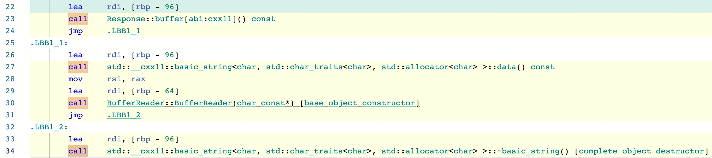

# C++ 一个偶现的内存破坏

> 2022/4/20
> 
> 不要忽视告警和潜在问题。

本文介绍了一个典型的 C++ 内存破坏问题的分析方法，主要使用了 反汇编、STL 源码分析、AddressSanitizer (Asan) 等技术手段。

[TOC]

## 问题

近期遇到一段使用 `BufferReader` 读取 `Response::buffer()` 的代码，在某些情况下会出现结果错误，甚至可能出现崩溃。

如果只看业务逻辑代码，很难发现问题 ——

下面这段代码读取 `payload` 的 **结果正确**：

``` cpp
BufferReader reader(response.buffer().data());
int32_t payload = 0;
if (reader.ReadInt32(&payload)) {
  // Use |payload|
}
```

下面这段代码读取 `payload1`/`payload2` 的 **结果错误**：

``` cpp
BufferReader reader(response.buffer().data());
int32_t payload1 = 0, payload2 = 0;
if (reader.ReadInt32(&payload1) && reader.ReadInt32(&payload2)) {
  // Use |payload1| and |payload2|
}
```

只有结合 `BufferReader` 和 `Response` 的源码，才能找到错误（[完整代码](Cpp-Memory-Occasionally-Corruption/string-buffer-crash.cc)）——

``` cpp
class BufferReader {
 public:
  explicit BufferReader(const char* data)
      : payload_(data + sizeof(uint32_t)),
        payload_size_(*reinterpret_cast<const uint32_t*>(data)) {}

  bool ReadInt32(int32_t* result) {
    if (read_index_ + sizeof(int32_t) > payload_size_) {
      return false;
    }
    *result = *reinterpret_cast<const int32_t*>(payload_ + read_index_);
    read_index_ += sizeof(int32_t);
    return true;
  }

 private:
  const char* payload_ = nullptr;
  uint32_t payload_size_ = 0;
  size_t read_index_ = 0;
};

class Response {
 public:
  std::string buffer() const { return buffer_; }

  static Response Generate(size_t count) {
    std::string buffer;
    buffer.resize(sizeof(uint32_t) + sizeof(int32_t) * count);
    *reinterpret_cast<uint32_t*>(&buffer[0]) = sizeof(int32_t) * count;
    for (size_t i = 0; i < count; ++i) {
      *reinterpret_cast<int32_t*>(
          &buffer[sizeof(uint32_t) + sizeof(int32_t) * i]) = 41 + i;
    }

    Response result;
    result.buffer_ = buffer;
    return result;
  }

 private:
  std::string buffer_;
};
```

**看到这里，你找到答案了吗？**😉

👉👉👉（**建议先思考上文的代码，再往下看**）👈👈👈

如果往 `Response` 写入从 1 到 4 个 `int32_t` 数值，再用 `BufferReader` 逐个读取并输出（**本文代码均使用 clang 编译、libc++ 的 STL 实现**，[在线运行](https://godbolt.org/z/zzjz7YKsW)）：

```
41
41, 42
0, 28098576, 0
0, 37052432, 0, 44
```

- 在包含 1 或 2 个 `int32_t` 的情况下，读取结果 **总是正确的**
- 在包含超过 3 个 `int32_t` 的情况下，读取出的前 3 个数值 **往往是错误的**（期望是 `41, 42, 43`），有时候输出结果均为 `Invalid`（认为 Buffer 读完了）

## 猜想

如果仔细阅读 `BufferReader` 和 `Response` 的源码，很容易发现：

- 由于 `response.buffer()` 的返回值类型是 `std::string` 值，而在 `reader` 构造时直接使用了该 **临时对象** 的 `.data()` 指针
- 在 `response.buffer()` 的返回值离开作用域后，该对象的 `.data()` 指针变为 **野指针**
- 而 `BufferReader::ReadInt32()` 读取了上述 **已释放的内存**，结果可能错误

类似的写法还有（从调用代码来看，问题更隐晦一些）：

``` cpp
BufferReader::BufferReader(const std::string& buffer)
    : payload_(buffer.data() + sizeof(uint32_t)),
      payload_size_(*reinterpret_cast<const uint32_t*>(buffer.data())) {}

BufferReader reader(response.buffer());
```

然而，为什么 Payload 在包含 1 或 2 个 `int32_t` 的情况下总是正确的，而只有超过 3 个时才会出现错误呢？

于是猜想：较短的 `std::string` 占用的堆内存较小，不容易出现内存破坏。🤔️

## 分析

首先，从 **反汇编代码** 可以看出：



- 一行 `BufferReader reader(response.buffer().data());` 对应了 4 个函数调用
  - `Response::buffer()` 在栈上放置返回的 `std::string` 临时对象
  - `std::string::data()` 返回临时对象内部的字符串数据指针
  - `BufferReader::BufferReader()` 构造 `reader` 对象
  - `std::string::~string()` 销毁栈上的 `std::string` 临时对象
- 由此看出，`response.buffer()` 返回值的临时对象，在 `reader` 构造结束后，立即析构

—— 这解释了上述代码 “为什么会出现错误”，但无法解释 “为什么在 Payload 只包含 1 或 2 个 `int32_t` 时总是正确”。🤔️

于是，进一步阅读 [libc++ 源码](https://github.com/llvm/llvm-project/blob/0fbe860711be2af4dc8454feb64506595e928e7f/libcxx/include/string#L776)，发现较短的 `std::string` 使用了 Small String Optimization _(SSO)_ 优化（数据存储在栈上，无需申请堆上的内存）：

``` cpp
struct __long {
  pointer __data_;
  size_type __size_;
  size_type __cap_;
};

struct __short {
  value_type __data_[__min_cap];
  struct : __padding<value_type> {
    unsigned char __size_;
  };
};

struct __rep {
  union {
    __long __l;
    __short __s;
  };
};
```

- `std::string` 对象内部使用 `__rep` 存储字符串数据，其中分为 `__long`、`__short` 两种模式，分别用于存储较长、较短的字符串（细节参考 [Stack Overflow](https://stackoverflow.com/questions/21694302/what-are-the-mechanics-of-short-string-optimization-in-libc)）
- 对于较短的字符串，`std::string` 优先采用 `__short` 模式存储；当且仅当 `__short::__data_[]` 没有足够的空间存储字符串时，才会使用 `__long` 模式存储

为了进一步确认 `std::string` 的存储方式，在之前的代码中打印 `response.buffer().data()` 指针（[在线运行](https://godbolt.org/z/3MxffvezG)）：

```
0x00007ffcdef27bd0 -- 41
0x00007ffcdef27bd0 -- 41, 42
0x00000000021c0f20 -- 0, 35315728, 0
0x00000000021c0f20 -- 0, 35315728, 0, 44
```

- 在包含 1 或 2 个 `int32_t` 的情况下
  - `response.buffer()` 返回值的临时变量 采用 `__short` 模式存储，字符串数据存放在栈上对象的内部
  - 因为 `std::string` 的析构函数 不会主动清空字符串数据，而且 该临时变量对应的栈内存 不会被其他变量覆盖
  - 所以结果 **总是正确的**
- 在包含超过 3 个 `int32_t` 的情况下
  - `response.buffer()` 返回值的临时变量 采用 `__long` 模式存储，字符串数据存放在堆内存上
  - 因为在 `std::string` 的析构函数 释放这块堆内存后，这块内存有可能被重新申请，从而使得其内容可能被修改
  - 所以结果 **往往是错误的**

## 检查

首先，使用 [AddressSanitizer](https://github.com/google/sanitizers/wiki/AddressSanitizer) _(ASan)_ 重新编译、运行上述代码（[在线运行](https://godbolt.org/z/vfnv7vnfK)）：

```
==1==ERROR: AddressSanitizer: stack-use-after-scope on address 0x7ffd7bc8d2d4 at pc 0x00000050f408 bp 0x7ffd7bc8d180 sp 0x7ffd7bc8d178
READ of size 4 at 0x7ffd7bc8d2d4 thread T0
    #0 0x50f407 in BufferReader::ReadInt32(int*) /app/example.cpp:16:15
    #1 0x50eb2e in Foo(unsigned long) /app/example.cpp:59:16
    #2 0x50edc8 in main /app/example.cpp:69:3
    #3 0x7f017a81a0b2 in __libc_start_main (/lib/x86_64-linux-gnu/libc.so.6+0x240b2) (BuildId: 9fdb74e7b217d06c93172a8243f8547f947ee6d1)
    #4 0x42049d in _start (/app/output.s+0x42049d)

Address 0x7ffd7bc8d2d4 is located in stack of thread T0 at offset 180 in frame
    #0 0x50e8ef in Foo(unsigned long) /app/example.cpp:53

  This frame has 4 object(s):
    [32, 64) 'response' (line 54)
    [96, 120) 'reader' (line 56)
    [160, 192) 'ref.tmp' (line 56) <== Memory access at offset 180 is inside this variable
    [224, 228) 'payload' (line 58)
```

- 在调用 `Foo(1)` 时，出现 **使用超出作用域的栈变量** `stack-use-after-scope` 错误
- 代码 `*reinterpret_cast<const int32_t*>(payload_ + read_index_)` 试图访问 `ref.tmp` 中的内存
- 而 `ref.tmp` 对应的是 `response.buffer()` 返回值拷贝构造的临时变量，此时已离开其作用域

接着，把 `Foo(3)` 改到最前面调用，再重新使用 Asan 编译、运行上述代码（[在线运行](https://godbolt.org/z/zsYjr13nj)）：

```
==1==ERROR: AddressSanitizer: heap-use-after-free on address 0x603000000074 at pc 0x00000050f408 bp 0x7ffef71c0360 sp 0x7ffef71c0358
READ of size 4 at 0x603000000074 thread T0
    #0 0x50f407 in BufferReader::ReadInt32(int*) /app/example.cpp:16:15
    #1 0x50eb2e in Foo(unsigned long) /app/example.cpp:59:16
    #2 0x50edc8 in main /app/example.cpp:69:3
    #3 0x7f71823a50b2 in __libc_start_main (/lib/x86_64-linux-gnu/libc.so.6+0x240b2) (BuildId: 9fdb74e7b217d06c93172a8243f8547f947ee6d1)
    #4 0x42049d in _start (/app/output.s+0x42049d)

0x603000000074 is located 4 bytes inside of 17-byte region [0x603000000070,0x603000000081)
freed by thread T0 here:
    #0 0x50baf0 in operator delete(void*) /root/llvm-project/compiler-rt/lib/asan/asan_new_delete.cpp:152
    #1 0x50ea69 in Foo(unsigned long) /app/example.cpp:56:16
    #2 0x50edc8 in main /app/example.cpp:69:3
    #3 0x7f71823a50b2 in __libc_start_main (/lib/x86_64-linux-gnu/libc.so.6+0x240b2) (BuildId: 9fdb74e7b217d06c93172a8243f8547f947ee6d1)

previously allocated by thread T0 here:
    #0 0x50b0f8 in operator new(unsigned long) /root/llvm-project/compiler-rt/lib/asan/asan_new_delete.cpp:95
    #1 0x7f718285936e in void std::__cxx11::basic_string<char, std::char_traits<char>, std::allocator<char> >::_M_construct<char*>(char*, char*, std::forward_iterator_tag) (/opt/compiler-explorer/gcc-11.2.0/lib64/libstdc++.so.6+0x14736e) (BuildId: ef355c62d82db886df570d5b383c6f4f094d40c1)
```

- 和上次不同，本次出现的是 **使用已释放的堆变量** `heap-use-after-free` 错误
- 代码 `*reinterpret_cast<const int32_t*>(payload_ + read_index_)` 试图访问 `response.buffer()` 返回值拷贝构造时申请的堆内存
- 而在 `response.buffer()` 返回值的临时变量析构时，这块堆内存已被释放

> 虽然 clang [支持在编译时检查 `std::string` 内部指针的生命周期问题](https://clang.llvm.org/docs/analyzer/checkers.html#cplusplus-innerpointer-c)（[在线运行](https://godbolt.org/z/zYsdMnava)）：
> 
> ``` cpp
> const char *return_temp(int x) {
>   // warn: inner pointer of container used after re/deallocation
>   return std::to_string(x).c_str();
> }
> ```
> 
> 但是 clang 目前仍无法检查出本文提到的问题：将字符串临时对象的内部指针作为参数传递后保存使用。😑

## 写在最后

- 代码中出现 `std::string::data/c_str()` 时，需要特别关注对象的生命周期
- 对于工具（例如 Asan、clang）检查发现的隐患，即使目前没有线上问题，但也一定要重视

感谢关注，希望本文能对你有帮助。如果有什么问题，**欢迎交流**。😄

Delivered under MIT License &copy; 2022, BOT Man
