# C++ 项目编译优化

> 2022/2/6
> 
> 只花 20% 的时间，完成 80% 的优化。—— Pareto Principle

[TOC]

## 写在前面

😈 对于一个 **几十人同时开发**、**平均每天合入上千行代码** 的仓库：

- 项目在刚开始只有 **200+ 个文件、30k+ 行代码** 时，不论代码写的多么糟糕，编译速度也不会很慢
- 但随着时间的推移，项目迅速成长为一个 **2000+ 个文件、400k+ 行代码** 的 “**十倍量级**” 大规模项目，编译速度变得越来越慢，严重影响了日常开发效率 ~~（成为了上班摸鱼的“正当”理由）~~ 🙃

[img=max-width:75%]

[align-center]

[](https://xkcd.com/303/)

为此，本文在设计方案前调研了

- [Include What You Use _(IWYU)_](https://github.com/include-what-you-use/include-what-you-use) 工具，但可用性不足 —— 修改建议过于简单粗暴、人工确认成本较高（[Chromium 曾经做过相关尝试](https://github.com/chromium/chromium/blob/22afb31800284923e9f84af6373f68ad6b241f4b/docs/include_what_you_use.md)，但没有大范围推广）
- [Unity/Jumbo Build](https://docs.google.com/document/d/19jGsZxh7DX8jkAKbL1nYBa5rcByUL2EeidnYsoXfsYQ/preview) 方案，但对增量编译不友好 —— 一旦修改了 jumbo 里的某个编译单元，整个 jumbo 需要重新编译（[Chromium 曾经做过相关尝试](https://github.com/chromium/chromium/blob/65.0.3320.0/docs/jumbo.md)，[但在后续版本移除](https://bugs.chromium.org/p/chromium/issues/detail?id=994387)）
- [Goma](https://chromium.googlesource.com/infra/goma/client/) 服务（一种替代 [distcc](https://github.com/distcc/distcc) + [ccache](https://github.com/ccache/ccache) 的分布式编译服务）—— 依赖于 Goma 服务器
- 美团技术团队的[《C++服务编译耗时优化原理及实践》](https://tech.meituan.com/2020/12/10/apache-kylin-practice-in-meituan.html)方案，但实践效果并不理想 —— 无法快速定位到问题瓶颈（使用引用次数、文件大小作为指标）、没有优化增量编译

🚀 本文设计了一种更高效的 **大规模 C++ 项目编译优化方法**，将上述项目的

- **全量编译** 实际耗时 **从 ~30min 降到 ~10min**
- **增量编译** 平均耗时 **减少 ~15%**，引起大规模重新编译的 **头文件个数明显减少**

## 编译原理 TL;DR

在分析编译耗时之前，先简单介绍 C++ 项目的编译原理，再介绍如何使用工具量化分析编译耗时，最后总结 C++ 项目编译方式的缺陷。

### 如何从 C++ 代码生成最终产物

逻辑上，C++ 项目的编译过程 主要包括以下 [三个阶段](https://icarus.cs.weber.edu/~dab/cs1410/textbook/1.Basics/compiler_op.html)：

- **预处理** _(precompile)_ 阶段主要处理 C++ 代码中的 [头文件、宏定义、条件编译](https://en.cppreference.com/w/cpp/preprocessor) 等预处理代码
  - 输入是原始的 C++ [**源文件** _(source file, `.cc`)_](https://en.wikipedia.org/wiki/Source_code) 及其依赖的 C++ [**头文件** _(header file, `.h`)_](https://en.wikipedia.org/wiki/Include_directive)
  - 输出是一个实际用于编译的 C++ 源文件，即 [**编译单元/翻译单元** _(translation unit)_](https://en.wikipedia.org/wiki/Translation_unit_%28programming%29)
- **编译** _(compile)_ 阶段主要进行实际的编译工作
  - 输入是上个环节生成的各个 **编译单元**
  - 输出是编译单元对应的 [**目标文件** _(object file)_](https://en.wikipedia.org/wiki/Object_file)
- **链接** _(link)_ 阶段生成 C++ 项目的最终产物
  - 输入是上个环节生成的所有 **目标文件** 及其依赖的其他库
  - 输出是最终的 **二进制文件** _(binary file)_（例如 [**可执行程序** _(executable program)_](https://en.wikipedia.org/wiki/Executable)）

其中，**编译** 阶段可以同时启动多个进程，**并行** 处理；而 **链接** 阶段只能在所有目标文件生成结束后，**串行** 处理。

实际上，C++ 编译过程还可以细分为 [九个阶段](https://en.cppreference.com/w/cpp/language/translation_phases)，此处不再展开。

### 如何量化各个编译阶段耗时

在使用 clang 编译时，可以添加 [`-ftime-trace` 参数](https://clang.llvm.org/docs/ClangCommandLineReference.html#cmdoption-clang-ftime-trace)，记录 “在生成一个目标文件时 各个环节的耗时细节”，并将结果输出为 [`chrome://tracing`](https://www.chromium.org/developers/how-tos/trace-event-profiling-tool/) 支持的 **火焰图** _(flamegraph)_ `.json` 格式文件。该方案由 [Aras Pranckevičius](https://aras-p.info/) 设计并实现：

- [Investigating compile times, and Clang -ftime-report · Aras' website](https://aras-p.info/blog/2019/01/12/Investigating-compile-times-and-Clang-ftime-report/) 提到了 clang/gcc 的 [`-ftime-report` 参数](https://clang.llvm.org/docs/ClangCommandLineReference.html#cmdoption-clang-ftime-report) 只统计了各个编译阶段的总耗时 —— 只能看到 “XXX 操作总共耗时 n 秒”，但不知道 “XXX 操作执行了几次”、“每次 XXX 操作分别在什么环节执行”、“为什么需要执行 XXX 操作” —— 无法用于编译优化
- [time-trace: timeline / flame chart profiler for Clang · Aras' website](https://aras-p.info/blog/2019/01/16/time-trace-timeline-flame-chart-profiler-for-Clang/) 提出了基于 tracing 的解决方案，并 [集成到了 Clang 9.0](https://releases.llvm.org/9.0.0/tools/clang/docs/ReleaseNotes.html#new-compiler-flags) 版本
- [Clang Time Trace Feature - SN Systems](https://www.snsystems.com/technology/tech-blog/clang-time-trace-feature) 将上述方案应用于编译优化分析

以开源的 [Chromium](https://github.com/chromium/chromium) 项目为例，在编译后打开 [`base/files/file_path.cc`](https://github.com/chromium/chromium/blob/93.0.4577.99/base/files/file_path.cc) 对应的 **编译耗时数据文件** [`file_path.json`](Cpp-Project-Compile-Optimization/file_path.json)，显示结果如下图：

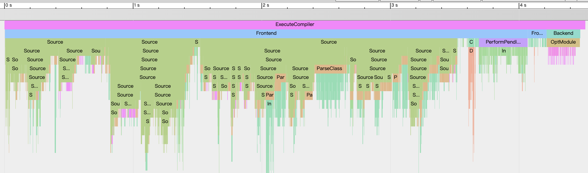

- `ExecuteCompiler` 表示编译单元 `file_path.cc` 的 **编译总耗时** (~4500ms)
- **编译器前端** `Frontend` (~4200ms) 主要执行 **处理头文件** `Source`、**解析类（包括类模版）** `ParseClass`、**解析函数模版** `ParseTemplate`、**实例化类模版** `InstantiateClass`、**实例化函数模版** `InstantiateFunction`、**代码生成** `CodeGen Function` 等操作
  - 如果一个头文件引用了其他头文件，那么它的 `Source` 操作又会包含其他头文件的 `Source` 操作
  - 由于没有实际调研，不确定 `Source` 阶段是否已经提前完成了预处理操作、是否需要进行文件 I/O 操作（欢迎指教 😄）
- **编译器后端** `Backend` (~260ms) 主要执行 `OptModule`、`OptFunction`、`RunPass` 等操作（这部分也没有详细了解过，欢迎指教 😄）

接着，随机放大其中一处，可以看到：

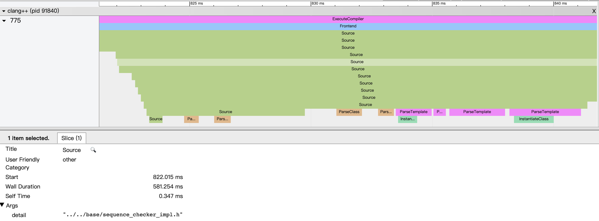

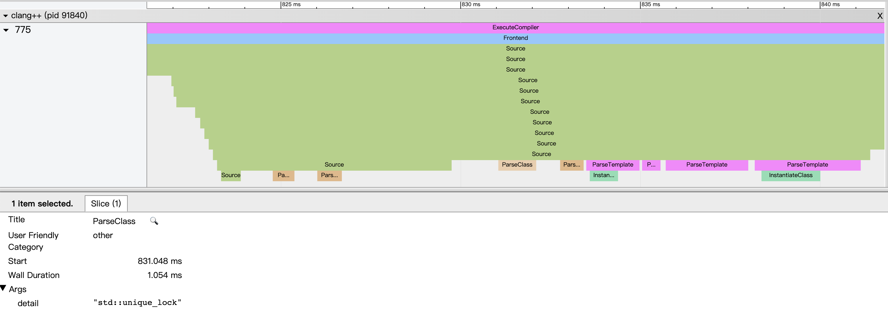
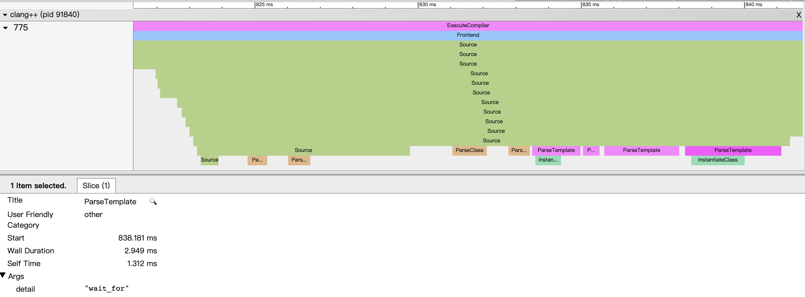
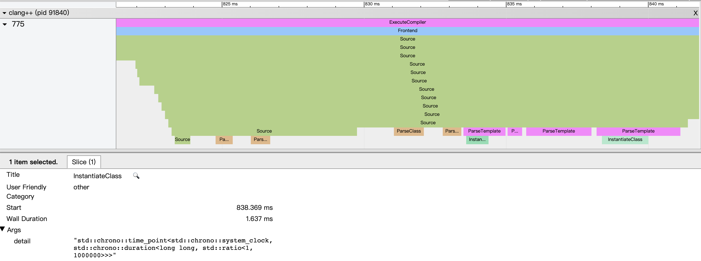

- 由于头文件 `sequence_checker_impl.h` 引用了 `lock.h`，所以处理 `sequence_checker_impl.h` 的耗时包含了处理 `lock.h` 的耗时
- 而在 `lock.h` 引用的头文件中，又需要解析 `std::unique_lock` 类、解析 `wait_for` 函数模版、实例化 `std::chrono::time_point<>` 类模版

在页面的下半部分，统计了和 `-ftime-report` 结果一致的 **各个编译阶段的总耗时**，并 **降序排列**：

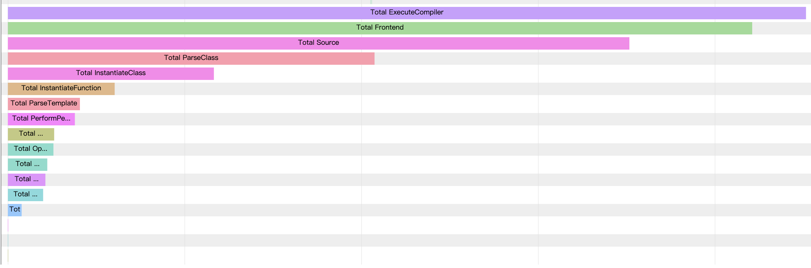

<!--
放大后，可以看到上述编译阶段的完整名称：

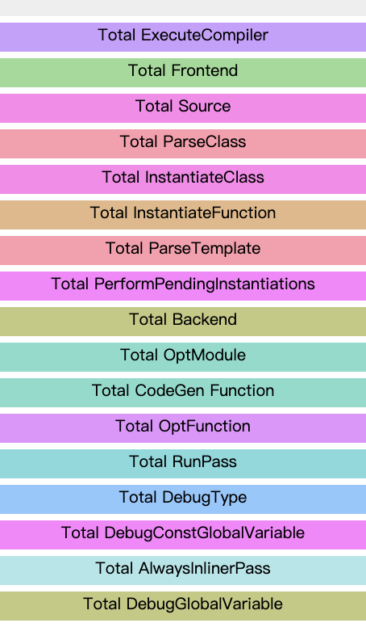
-->

### C++ 项目编译方式的缺陷

通过分析上述 `-ftime-trace` 生成的编译耗时数据文件，可以看出：

- 编译一个 `.cc` 源文件的 **主要耗时** 在于 **处理依赖的头文件**（而 `.cc` 源文件 “本身代码的处理耗时” 一般只占整个编译单元的一小部分）
  - 由于 [`#include` Guard](https://google.github.io/styleguide/cppguide.html#The__define_Guard) 的约束，在每个编译单元中，同一个头文件 仅会被展开并处理一次
  - 根据 [**单定义规则** _(One Definition Rule, ODR)_](https://en.cppreference.com/w/cpp/language/definition#One_Definition_Rule)，在每个编译单元中，同一个 变量、函数、类、枚举、模版 只能被 [**定义** _(define)_](https://en.cppreference.com/w/cpp/language/definition) 一次，所以也仅会被处理一次（但允许 [**声明** _(declare)_](https://en.cppreference.com/w/cpp/language/declarations) 多次，例如下文提到的 **前向声明**）
  - 但如果在不同代码中使用了相同的 `Template<Type>` 模版，那么需要针对不同模版参数 `Type` 多次实例化 `Template`
  - 例如，在编译 `file_path.cc` 的过程中，头文件 `base/synchronization/lock.h` 仅被处理了一次，类 `std::unique_lock` 只被解析了一次，而类模版 `std::vector` 被实例化了多次


- 每个编译单元 **独立编译**，大部分头文件都需要 **在每个编译单元中分别处理一次**（除了少部分头文件使用了 [**预编译头文件** _(precompiled header)_](https://en.wikipedia.org/wiki/Precompiled_header) 优化）
  - 理论上，如果各个编译单元串行编译，那么一个头文件 “在整个项目中的处理总耗时” 约等于 “头文件的单次处理耗时” × “头文件在所有编译单元中的出现次数”
  - 实际上，由于被引用顺序的不同，同一个 “头文件的单次处理耗时” 也往往不同 —— 如果该头文件内引入的 头文件、类、函数、模版，在前面的头文件中已被处理，那么就不需要在当前头文件中重复处理
  - 例如，在 [编译 `base/files/file.cc`](Cpp-Project-Compile-Optimization/file.json) 时，也需要处理一次 `base/synchronization/lock.h` 头文件、解析一次 `std::unique_lock` 类、实例化多次 `std::vector` 类模版（但对应耗时可能和 `file_path.cc` 的不同）

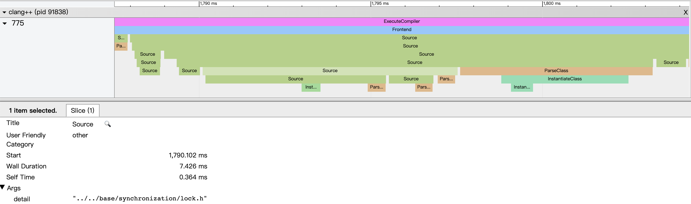
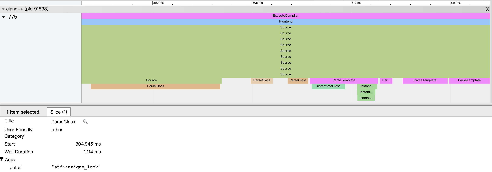

- 对于 **增量编译**（定义参考 [sec|增量编译优化]），**一旦修改** 了编译单元（直接或间接）**引用的任意一个头文件**，整个编译单元就需要 **重新编译**
  - 被修改的头文件 “本身代码的处理耗时” 可能并不长，但在受影响的编译单元中，其他未被修改的头文件 可能会拖慢增量编译的整体速度
  - 例如，虽然 `base/synchronization/lock.h` 在 `file_path.cc`/`file.cc` 中的编译耗时只有 ~237ms/7ms，但是如果这个 `.h` 头文件被修改，那么需要花费 ~4500ms/4000ms 重新编译上述两个 `.cc` 源文件（另外，还需要花费更多的时间，编译其他引用了该头文件的编译单元）

由于 C++ 语言在编译上存在上述 **天然缺陷**，C++ 20 引入了 [**模块** _(module)_](https://en.cppreference.com/w/cpp/language/modules) 用于替代 [从 C 语言继承过来的 `#include` 头文件](https://en.cppreference.com/w/c/preprocessor/include) 机制。

> 由于 clang 编译时的 `-ftime-trace` 输出结果并不包含 **链接** 阶段的耗时，本文 **暂不考虑链接** 相关的耗时和优化。

## 全量编译优化

**全量编译** _(full compilation)_ 指的是：从头开始 完全编译 所有编译单元。

### 指标：所有编译单元的编译总耗时

由于 C++ 项目通常使用并行编译，项目的 **实际编译时间** 虽然能 “直观” 体现项目的编译速度，但和 **编译的并行度** 直接相关（一般并行度越接近于 CPU 核心数，越能充分 “榨干” CPU 资源，实际编译时间就越短）。

为了减少上述误差，本文采用以下两个指标，衡量全量编译速度：

- **编译单元的编译耗时** 等于一个 clang 进程 在编译一个 `.cc` 源文件、生成一个目标文件时，`-ftime-trace` 输出的 `ExecuteCompiler` 结果
- **所有编译单元的编译总耗时** 等于项目中所有 **编译单元的编译耗时**（即 `ExecuteCompiler` 结果）之和（约等于 **实际编译时间** × 编译的并行度）

### 分析：耗时最长的编译单元

根据 [Trace Event Format - Google Docs](https://docs.google.com/document/d/1CvAClvFfyA5R-PhYUmn5OOQtYMH4h6I0nSsKchNAySU/preview)，可以方便的编写脚本解析 `-ftime-trace` 输出的 JSON 结果。

💡 遍历所有 `.json` 文件，根据 `ExecuteCompiler` **耗时降序排列**，找到编译耗时最长的编译单元。

在本文开头提到的项目中，编译耗时最长的几个编译单元 几乎都依赖了包含着 “项目核心数据类型定义” 的 `xxx_data.h` 头文件（处理时间 ~28s），而 `xxx_data.h` 又依赖了包含着 “整个项目所有 [Protobuf](https://en.wikipedia.org/wiki/Protocol_Buffers) 定义” 的 `include_pb_xxx.h` 头文件（处理时间 ~17s）：

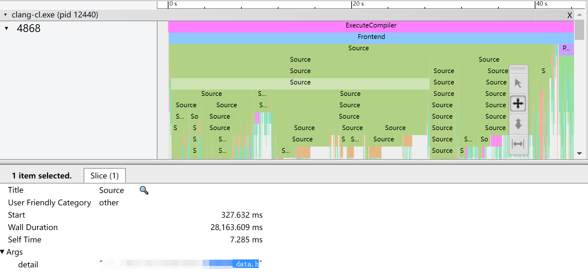
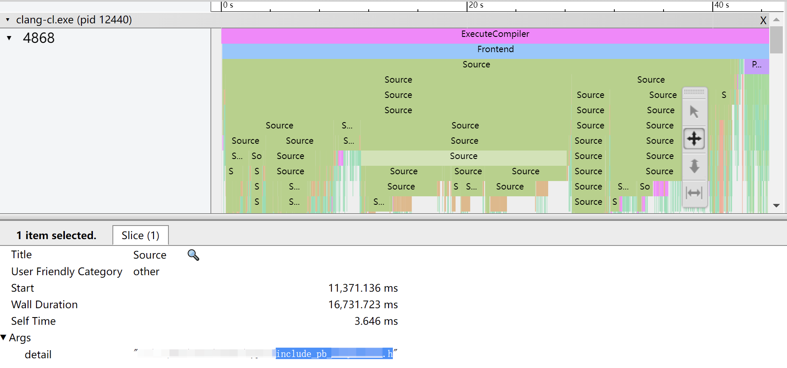

### 定位：影响耗时的核心瓶颈

然而上述分析方法，只能发现头部几个编译单元存在的问题，不能直观的从全局角度定位到项目中普遍存在的问题。为此，

💡 遍历所有 `.json` 文件内部的所有项目，按照 `Title × detail` **聚合统计** 处理次数、处理总耗时，并根据 `Wall Duration` **降序排列**，找到处理耗时最长的操作。

在本文开头提到的项目中，耗时最长的都是 **处理头文件** `Source` 操作，其中：

- 头文件 `xxx_data.h` 包含了 “项目核心数据类型定义”，被处理 337 次，总耗时 7420s，排名第一（排名第二的 `xxx_data_observer.h` 是其对应的观察者定义，直接引用了该头文件）
- 头文件 `include_pb_xxx.h` 包含了 “整个项目所有 Protobuf 定义”，被处理 349 次，总耗时 5735s，排名第三（排名第四、第六的 `aaa_pb.h`/`bbb_pb.h` 被包含于其中）
- 头文件 `xxx_base.h` 定义了一个在项目中 “被大量使用的类模版”，被处理 270 次，总耗时 2392s，排名第五

``` json
[
  {
    "count": 337,
    "duration": 7419.928,
    "path": "xxx_data.h",
    "type": "Source"
  },
  {
    "count": 344,
    "duration": 5746.707,
    "path": "xxx_data_observer.h",
    "type": "Source"
  },
  {
    "count": 349,
    "duration": 5735.324,
    "path": "include_pb_xxx.h",
    "type": "Source"
  },
  {
    "count": 349,
    "duration": 3723.796,
    "path": "aaa_pb.h",
    "type": "Source"
  },
  {
    "count": 270,
    "duration": 2391.881,
    "path": "xxx_base.h",
    "type": "Source"
  },
  {
    "count": 350,
    "duration": 1904.335,
    "path": "bbb_pb.h",
    "type": "Source"
  },
  // ...
]
```

从上述聚合统计结果中发现，**其他类型操作** 的处理总耗时并不长（主要已包含在头文件的 `Source` 操作中），虽然都 **不是瓶颈**，但仍值得关注。从耗时最长的非 `Source` 类型操作中，可以发现：

- **实例化函数模版** `InstantiateFunction` 耗时主要集中在 [`nlohmann::json`](https://github.com/nlohmann/json) 相关头文件
  - 由于实例化的函数模版不同，导致无法直接聚合，所以统计上排名靠后
  - 但聚合统计后发现，以 `nlohmann::` 开头的所有实例化操作 共处理了 ~650k 次，总耗时 ~7000s，**有待优化**
- 在 `DebugGlobalVariable` 阶段处理的全局变量 `anonymous namespace::ERROR_CODE_LIST` ，虽然耗时不长，但这种在头文件的 **匿名名字空间** _(anonymous namespace)_ 定义内部变量的写法 **极不规范**（从 `count: 221` 可以看出）😂

``` json
[
  {
    "count": 428,
    "duration": 178.193,
    "path": "nlohmann::basic_json<>::parse<const char *>",
    "type": "InstantiateFunction"
  },
  {
    "count": 461,
    "duration": 87.059,
    "path": "base::trace_event::TraceLog",
    "type": "ParseClass"
  },
  {
    "count": 22324,
    "duration": 19.953,
    "path": "get_optional",
    "type": "ParseTemplate"
  },
  {
    "count": 464,
    "duration": 12.389,
    "path": "std::unordered_map<int, std::basic_string<char>>",
    "type": "InstantiateClass"
  },
  {
    "count": 355,
    "duration": 9.651,
    "path": "std::unique_ptr<base::Value>",
    "type": "DebugType"
  },
  {
    "count": 437,
    "duration": 3.277,
    "path": "std::basic_string<char>::basic_string<nullptr_t>",
    "type": "CodeGen Function"
  },
  {
    "count": 396,
    "duration": 0.847,
    "path": "std::ios_base::adjustfield",
    "type": "DebugConstGlobalVariable"
  },
  {
    "count": 221,
    "duration": 0.262,
    "path": "`anonymous namespace'::ERROR_CODE_LIST",
    "type": "DebugGlobalVariable"
  }
]
```

😈 由此看出，项目全量编译的 **耗时瓶颈** 在于：**多数编译单元** 都依赖了 “处理耗时较长的复杂头文件”，导致这些 “单次处理耗时已经很长的头文件” 的 **处理次数、处理总耗时 激增**。

### 优化：移除复杂头文件的引用

💡 针对复杂头文件，可以通过 [**前向声明** _(forward declaration)_](https://en.wikipedia.org/wiki/Forward_declaration) 数据类型，避免直接 `#include` 类型定义的头文件（例如 下边代码移除了 `xxx_data.h` 等核心头文件包含的 `include_pb_xxx.h`）：

``` cpp
// xxx_data.h (before)
#include "include_pb_xxx.h"
...
void HandleConnection(
    sdk_pb::v1::ConnectionStatus status,
    sdk_pb::v1::ConnectionDetail detail);

// xxx_data.h (after)
namespace sdk_pb::v1 {
enum ConnectionStatus : int;
class ConnectionDetail;
}  // namespace sdk_pb::v1
...
void HandleConnection(
    sdk_pb::v1::ConnectionStatus status,
    const sdk_pb::v1::ConnectionDetail& detail);
```

💡 在本文开头提到的项目中，本次优化主要：

- 移除了两个复杂头文件的相关引用
  - 一个包含了 **整个项目所有** Protobuf 定义 🙃
  - 一个包含了 **整个项目所有** [IDL](https://en.wikipedia.org/wiki/Interface_description_language) 生成代码 🙃
- 限制了 `nlohmann::json` 的使用范围
  - 修改前 `nlohmann::json` 被上述包含着 “整个项目所有 IDL 生成代码” 的头文件直接引用
  - 修改后 `nlohmann::json` 只在上述头文件对应的 `.cc` 源文件里使用，而上述头文件只保留了 [`json_fwd.hpp`](https://github.com/nlohmann/json/blob/develop/include/nlohmann/json_fwd.hpp) 用于 **前向声明**
  - 由于项目中依赖 JSON 的编译单元并不多，如果改成 **预编译头文件** 的方式，效果也并不明显（[有人在 gcc 上也做过类似尝试](https://github.com/nlohmann/json/issues/1710#issuecomment-527656577)）

🚀 本次优化效果显著：

- **所有编译单元的编译总耗时** 从 ~17000s 减少到 ~6000s（减少 65%）
- 优化前 **编译耗时最长的几个编译单元** 编译耗时从 50-60s 减少到 19-22s

## 增量编译优化

[**增量编译** _(incremental compilation)_](https://en.wikipedia.org/wiki/Incremental_compiler) 指的是：在项目已完成 **全量编译** 的基础上，修改后编译；编译器会根据被修改内容的依赖关系，仅重新编译最少的一部分编译单元。

### 指标：修改头文件的增量编译耗时比例

在增量编译时，编译单元需要被 **重新编译** 的情况有两种：修改了编译单元本身的 `.cc` **源文件**、修改了编译单元（直接或间接）**引用的任意一个头文件** —— 前者的修改只影响对应的编译单元本身，而后者的修改会影响所有引用的编译单元。

可见，增量编译速度主要受项目的 **头文件的依赖关系** 影响 —— 如果头文件之间的依赖关系越简单，“修改头文件后需要重新编译的编译单元” 越少，增量编译速度就会越快。

为此，本文使用以下两个指标，衡量增量编译速度：

- **修改头文件的增量编译耗时** 等于 “引用该头文件” 的所有 **编译单元的编译耗时** 之和（实际意义是 “修改头文件后需要重新编译的编译单元” 串行编译的总耗时，一般大于 实际并行编译耗时）
- **修改头文件的增量编译耗时比例** 等于 **修改头文件的增量编译耗时** ÷ 全量编译 **所有编译单元的编译总耗时**（实际意义是 对编译耗时进行 **归一化**，减少每次编译因环境不一致引起的误差）
  - 0% 表示 头文件没被任何编译单元依赖，修改后不会引起任何重新编译
  - 100% 表示 头文件已被所有编译单元依赖，修改后会导致所有编译单元重新编译，耗时等于一次全量编译

> 其他文献一般使用 “修改头文件的受影响编译单元 个数、个数比例” 等指标进行衡量；但由于长尾文件过多，不能直观表示编译速度。

### 排查：引发重编的不合理依赖

💡 第一步，找出每个编译单元 **实际依赖的所有头文件**

- 在 **预处理阶段** 的不同 头文件引用顺序、宏定义值，都可能影响 条件编译的选择结果，所以往往无法通过 “纯文本” 确定实际的依赖情况，而需要借助 “编译器” 获取
  - 例如，在编译时添加 [`-MD`](https://clang.llvm.org/docs/ClangCommandLineReference.html#cmdoption-clang-md)/[`/showIncludes`](https://docs.microsoft.com/en-us/cpp/build/reference/showincludes-list-include-files) 参数，输出依赖的头文件
  - 而 [`ninja` 编译系统](https://github.com/ninja-build/ninja) 记录了该依赖关系，可以直接通过 [`-t deps` 命令](https://ninja-build.org/manual.html#ref_headers) 导出
- 以 Chromium 项目中的源文件 [`base/**/oom.cc`](https://github.com/chromium/chromium/blob/93.0.4577.99/base/allocator/partition_allocator/oom.cc) 为例，在 Windows 下的编译单元 `oom.obj` 总共依赖了 10 个 `.h` 头文件，而在 macOS 下的 `oom.o` 总共依赖了 8 个 `.h` 头文件：

```
obj/base/base/oom.obj: #deps 10, deps mtime 659535922 (VALID)
    ../../base/allocator/partition_allocator/oom.h
    ../../base/allocator/partition_allocator/oom_callback.h
    ../../base/base_export.h
    ../../base/compiler_specific.h
    ../../base/immediate_crash.h
    ../../base/process/memory.h
    ../../base/process/process_handle.h
    ../../base/win/windows_types.h
    ../../build/build_config.h
    ../../buildtools/third_party/libc++/trunk/include/stddef.h

obj/base/base/oom.o: #deps 8, deps mtime 1641549174 (VALID)
    ../../base/allocator/partition_allocator/oom.h
    ../../base/base_export.h
    ../../base/compiler_specific.h
    ../../build/build_config.h
    ../../base/allocator/partition_allocator/oom_callback.h
    ../../base/immediate_crash.h
    ../../base/process/memory.h
    ../../base/process/process_handle.h
```

💡 第二步，根据上述依赖关系，计算 **反向依赖关系**

- 针对项目内部的每个头文件，计算其对应的 “修改头文件后需要重新编译的编译单元” 集合，同时记录 “从头文件到编译单元” 的完整依赖路径，以及 “依赖路径上涉及到的编译单元” 的编译总耗时
- 以 Chromium 项目中的头文件 [`base/files/file_path.h`](https://github.com/chromium/chromium/blob/93.0.4577.99/base/files/file_path.h) 为例，修改后在 [`//base` 库](https://github.com/chromium/chromium/tree/93.0.4577.99/base) 中共有 96 个编译单元需要重新编译，对应 **修改头文件的增量编译耗时** 为 272s，其中依赖路径如下：
  - 在上述 96 个编译单元中，有 20 个编译单元是因为 [`file.h` 直接引用了头文件 `file_path.h`](https://github.com/chromium/chromium/blob/93.0.4577.99/base/files/file.h#L14) 导致的，这些编译单元的编译总耗时 49s
  - 在上述 20 个编译单元中，有 6 个编译单元是因为 [`file_util.h` 直接引用了头文件 `file.h`](https://github.com/chromium/chromium/blob/93.0.4577.99/base/files/file_util.h#L28)，而且编译单元对应的源文件 [`file_util_posix.cc`](https://github.com/chromium/chromium/blob/93.0.4577.99/base/files/file_util_posix.cc#L5)、[`file_util_mac.mm`](https://github.com/chromium/chromium/blob/93.0.4577.99/base/files/file_util_mac.mm#L5)、[`file_util.cc`](https://github.com/chromium/chromium/blob/93.0.4577.99/base/files/file_util.cc#L5)、[`sys_info_posix.cc`](https://github.com/chromium/chromium/blob/93.0.4577.99/base/system/sys_info_posix.cc#L17)、[`debugger_posix.cc`](https://github.com/chromium/chromium/blob/93.0.4577.99/base/debug/debugger_posix.cc#L51)、[`rand_util_posix.cc` 直接引用了头文件 `file_util.h`](https://github.com/chromium/chromium/blob/93.0.4577.99/base/rand_util_posix.cc#L15) 导致的，这些编译单元的编译总耗时 17s
  - 对应的（正向）依赖路径为：`file_util.cc` 等 6 个源文件 -> `file_util.h` 头文件 -> `file.h` 头文件 -> `file_path.h` 头文件

<!--
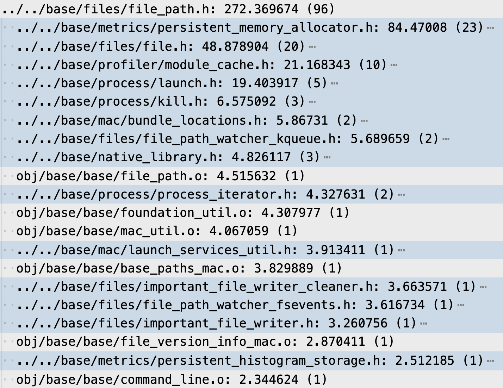
-->

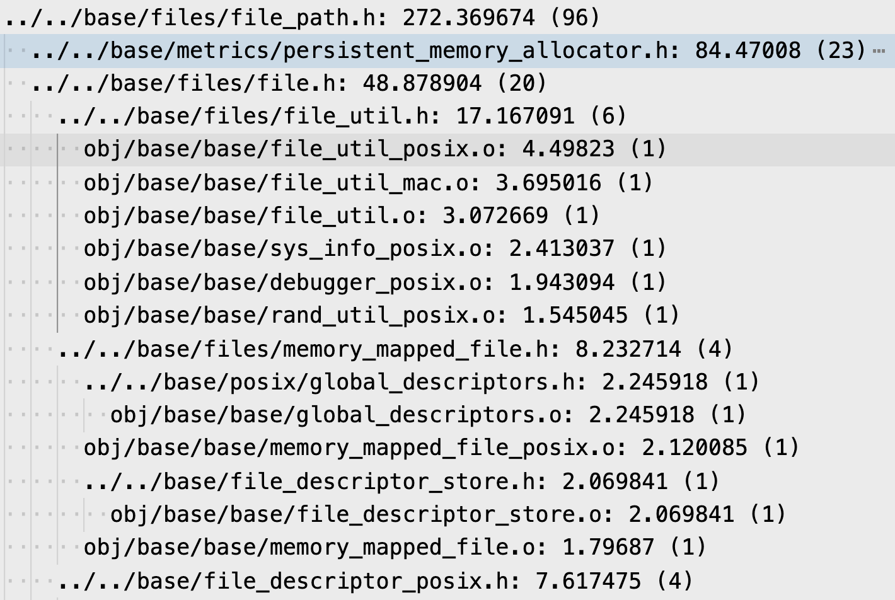

💡 第三步，基于上述反向依赖关系，根据 “依赖路径上节点” 对应的所有 **编译单元的编译耗时** 之和，**降序排列** 所有节点（结果参考上文截图）

- **方案优势** 在于：
  - 不只考虑了依赖路径，结合了编译耗时（而不仅仅考虑引用的编译单元个数）—— 能快速定位问题瓶颈
  - 不只考虑了编译耗时，结合了依赖路径 —— 能方便的确定引用来源
- **方案缺陷** 在于：
  - 由于 `#include` Guard 的约束，同一个头文件在同一编译单元中，即使被引用了多次，但只有第一次被实际处理 —— 所以，统计结果只包含 实际使用的一条路径（可能不是最直观的一条）
  - 由于 不同编译单元内部 头文件引用顺序不同，不同中间节点 “从头文件到编译单元” 的路径可能也不同 —— 所以，中间节点统计的编译单元 少于或等于 根节点的统计结果

在本文开头提到的项目中（项目源文件编译总耗时 ~6900s），使用上述方法发现了两个严重的问题：

- 多个 “观察者定义” 相关的头文件 `model/*_observer.h`（**增量编译耗时比例** ~85%）引用了几乎所有的 “数据类型定义” 相关的头文件 `types/*_[data|info].h`（**增量编译耗时比例** ~87%），而 “几乎所有的业务逻辑” 又都依赖于 “观察者定义” —— 所以，一旦修改了 “数据类型定义” 相关的头文件，就需要大规模的重新编译

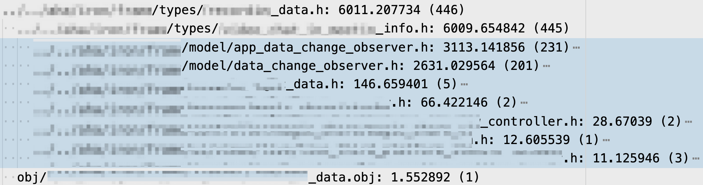

- 头文件 `xxx_base.h`（**增量编译耗时比例** ~65%）定义了一个在项目中 “被大量使用的类模版”，一方面直接引用了 `gen/*_strings.h` 等 “使用脚本自动生成” 的头文件（**增量编译耗时比例** ~73%），另一方面又被 “几乎所有的业务逻辑” 所引用 —— 所以，一旦重新 “使用脚本自动生成” 头文件，就需要大规模的重新编译


😈 由此看出，项目增量编译的 **耗时瓶颈** 在于：

- **没有遵循** Chromium C++ Style Guide [“推荐使用 **前向声明** 替代 `#include`”](https://github.com/chromium/chromium/blob/master/styleguide/c%2B%2B/c%2B%2B.md#forward-declarations-vs-includes) 的规范（相反，Google C++ Style Guide 建议 [“尽量避免使用前向声明”](https://google.github.io/styleguide/cppguide.html#Forward_Declarations)），随着项目规模越来越大，**不合理的依赖关系也越来越多**
- **没有合理的模块拆分**，所有模块允许被 **直接相互依赖**（部分代码甚至借助 [`#include` Guard](https://google.github.io/styleguide/cppguide.html#The__define_Guard)，掩盖了更严重的 循环引用缺陷；可以参考 [The Chrome Component Build](https://github.com/chromium/chromium/blob/master/docs/component_build.md) 进行模块化改造）

### 优化：化简头文件的依赖关系

💡 在本文开头提到的项目中，本次优化主要：

- 在头文件 `model/*_observer.h` 中，改用 **前向声明** `types/*_[data|info].h` 定义的数据类型，移除了 “观察者定义” 对 “数据类型定义” 的头文件依赖（方法类似 [sec|优化：移除复杂头文件的引用]）
- 将头文件 `xxx_base.h` 定义的 “被大量使用的类模版” 的实现细节，拆分到一个实现在 `.cc` 源文件的基类，从而原本 “使用脚本自动生成” 的头文件依赖 也被一起移入源文件中（方法可参考 [T.84: Use a non-template core implementation to provide an ABI-stable interface](https://isocpp.github.io/CppCoreGuidelines/CppCoreGuidelines#Rt-abi)）：

``` cpp
// before: xxx_base.h
#include "gen/*_strings.h"
...
template <typename T>
class Base { void UseStrings() { ... } };

// after: xxx_base.h
class BaseImpl { void UseStrings(); };
...
template <typename T>
class Base : public BaseImpl { ... };

// after: xxx_base.cc (new file)
#include "gen/*_strings.h"
...
void BaseImpl::UseStrings() { ... }
```

💡 小技巧：根据前文提到的 **方案缺陷**，头文件的依赖关系 **难以被一次性移除**（即使移除了当前的依赖路径，还可能存在其他依赖路径）—— 所以可以使用 `-E` 参数编译，输出编译单元的预处理结果，用于 **判断是否彻底移除** 依赖关系。

🚀 本次优化效果也很显著：

- **修改头文件的增量编译耗时比例** 均值从 ~18% 减少到 ~15.5%（减少 ~15%）
- **增量编译耗时比例** > 80% 的头文件个数从 47 减少到 7（减少 85%）

## 防止劣化

> 守成之难，方当与诸公慎之。——《资治通鉴·唐纪》

### 自动检查

💡 在增量编译 [CL _(change list)_](https://google.github.io/eng-practices/) 后，统计其编译耗时（例如 [`.ninja_log` 记录](https://ninja-build.org/manual.html#ref_log)），用于 [**代码审查** _(code review)_](https://en.wikipedia.org/wiki/Code_review)。主要关注以下指标（有待进一步实践 🙃）：

| 指标 | 关注点 | 重要度 |
|---|---|---|
| **所有编译单元的编译总耗时** | 增长值 | 高 |
| **修改头文件的增量编译耗时比例** 均值 | 增长值 | 高 |
| **存量编译单元** 编译耗时 | 增长率 | 中 |
| **存量头文件** 增量编译耗时比例 | 增长率 | 高 |
| **增量编译单元** 编译耗时 | 分位数 | 低 |
| **增量头文件** 增量编译耗时比例 | 分位数 | 中 |

### 编码建议

💡 针对编译速度问题，建议遵守以下规范：

- Chromium [C++ Style Guide](https://github.com/chromium/chromium/blob/master/styleguide/c%2B%2B/c%2B%2B.md#forward-declarations-vs-includes) 推荐使用 **前向声明** 替代 `#include`
  - 前向声明 只能用于不需要完整类型定义的语境（例如 指针、引用、不依赖于类型的值或完整定义的容器），否则会导致 [**不完整类型** _(incomplete type)_](https://en.cppreference.com/w/cpp/language/type#Incomplete_type) 错误
  - 对于需要前向声明的 `enum`（非 `enum class`）类型，必须指定 [**底层类型** _(underlying type)_](https://en.cppreference.com/w/cpp/language/enum)
  - 另外，通过 [`typedef`](https://en.cppreference.com/w/cpp/language/typedef) 生成的类型别名 不支持前向声明
- Chromium [C++ Dos and Don'ts](https://github.com/chromium/chromium/blob/master/styleguide/c%2B%2B/c%2B%2B-dos-and-donts.md#minimize-code-in-headers) 提到：
  - 尽量移除无用的 `#include`（尤其在重构时）
  - 尽量前向声明 **嵌套类** _(nested class)_，并将其定义放入 `.cc` 源文件
  - 避免 **内联** _(inline)_ 复杂函数（除了 **非虚** _(non-virtual)_ 的 getter/setter）
- Chromium [Style Checker Errors](https://www.chromium.org/developers/coding-style/chromium-style-checker-errors/) 提到：
  - [避免内联 “复杂类的构造和析构函数”](https://www.chromium.org/developers/coding-style/chromium-style-checker-errors/#constructordestructor-errors)（“简单类” 影响小，可不管）
  - [避免内联 “非空的虚函数”](https://www.chromium.org/developers/coding-style/chromium-style-checker-errors/#virtual-method-out-of-lining)（编译器会优化 “空的虚函数”，可不管）
- 在头文件中，推荐引用 其他类型前向声明的 `xxx_[forward|fwd].h` 头文件，否则容易变为 “复杂头文件”
  - 例如 [`callback_forward.h`](https://github.com/chromium/chromium/blob/93.0.4577.99/base/callback_forward.h)、[`string_piece_forward.h`](https://github.com/chromium/chromium/blob/93.0.4577.99/base/strings/string_piece_forward.h)、[`json_fwd.hpp`](https://github.com/nlohmann/json/blob/develop/include/nlohmann/json_fwd.hpp) 对应的头文件定义了复杂的模版，处理耗时较长
  - 再如 [`base_tracing_forward.h`](https://github.com/chromium/chromium/blob/93.0.4577.99/base/trace_event/base_tracing_forward.h) 对应的头文件引用了其他多个头文件，处理耗时也较长
- 尽量避免 把实现细节（和依赖的头文件）写在 `.h` 头文件里，而应该写在不会被其他代码引用的 `.cc` 源文件里
  - 对于 普通类，可以使用 [pImpl 技术](https://en.cppreference.com/w/cpp/language/pimpl) 实现（也被称为 **编译防火墙** _(compilation firewall)_，细节可参考 [Herb Sutter](https://herbsutter.com/) 的 [GotW #100](https://herbsutter.com/gotw/_100/)、[GotW #101](https://herbsutter.com/gotw/_101/)）
  - 对于 类模版，参考 [sec|优化：化简头文件的依赖关系] 的方法拆分

## 写在最后

本文是去年的一次工程实践，花费不到 10 人天，**投入产出比超出预期**。主要感触是：

1. 要做优化，一定要先 **明确目标**，再 **针对问题瓶颈 “对症下药”**，而不要 “一味盲干”（例如 参考其他文献，曾尝试过 [**显式实例化** _(explicit instantiation)_](https://en.cppreference.com/w/cpp/language/class_template#Explicit_instantiation) `xxx_base.h` 定义的复杂类模版，但效果微乎其微，投入产出不成正比 🙃）
2. 工程上需要的并不是高深的理论，而是如何 **利用理论 解决实际问题** 🙃

感谢关注，希望本文能对你有帮助。如果有什么问题，**欢迎交流**。😄

Delivered under MIT License &copy; 2022, BOT Man
