# 公路车骑行 318 川藏线

> 2023/7/23-8/9
> 
> 青春没有售价，成都骑到拉萨。

国道 318 川藏线被誉为 “中国最美的景观大道”（推荐[“长安范儿-人文地理”的视频介绍](https://www.bilibili.com/video/BV1kU4y1a71u/)），是很多人的梦想。经过的乡村城镇很多，整体安全系数较高，适合自驾、摩旅、骑行、徒步。

[TOC]

## 攻略

### 日程

虽然这次从成都到拉萨骑了 17 天（包括 1 天修整 + 2 个半天修整），但对于有 2 年以上公路车骑行经验的人（连续单日骑行 250~300km 平路的强度）来说，可以尝试把行程压缩到 14 天（路上难免会遇到意外，建议预留 2~3 天缓冲）。

> 以下距离和爬升仅供参考，也希望码表准确的朋友帮忙重新做一下数据。（参考：[行者路书](https://www.imxingzhe.com/lushu/424316/)、[igpsport 路书](https://analyse.zh.igpsport.com/routes?id=53323&title=318%E5%B7%9D%E8%97%8F%E7%BA%BF&locale=zh)）

- D1：成都-(平路)-邛崃-(缓上+下)-雅安-(缓上)-天全，约 170km，爬升约 950m。
- D2：天全-(缓上)-新沟-(上)-二郎山-(下)-泸定-(陡上)-康定，约 145km，爬升约 2950m。
- D3：康定-(上)-折多塘-(上+高反)-折多山-(下)-新都桥，约 80km，爬升约 1950m。
- D4：新都桥-(上)-高尔寺山-(下)-雅江-(陡上)-相克宗，约 80km，爬升约 1450m。
- D5：相克宗-(上)-剪子湾山-(连续翻卡子拉山等)-理塘，约 115km，爬升约 1950m。
- D6：理塘-(起伏缓上)-禾尼-(起伏缓上+上)-海子山-(下)-巴塘，约 165km，爬升约 1050m。
- D7：巴塘-(缓下)-金沙江大桥-(起伏+缓上+上)-宗拉山-(下)-芒康-(上)-拉乌山-(下烂路)-如美 ，约 145km，爬升约 2250m。
- D8：如美-(上烂路)-觉巴山-(下烂路+起伏)-登巴村-(上+高反)-东达山-(下)-左贡 ，约 105km，爬升约 2650m。
- D9：左贡-(起伏缓上)-邦达-(上)-业拉山-(下烂路)-怒江大桥-(起伏缓上)-八宿，约 200km，爬升约 2000m。
- D10：八宿-(起伏缓上)-安久拉山-(下烂路)-然乌-(起伏缓下)-波密，约 220km，爬升约 2200m。
- D11：波密-(起伏缓下)-通麦-(起伏缓下+缓上)-拉月-(起伏缓上)-鲁朗，约 155km，爬升约 2250m。
- D12：鲁朗-(上)-色季拉山-(下+缓下)-林芝镇-(起伏缓下)-林芝市-(起伏缓上)-巴河/百巴，约 150km，爬升约 1850m。
- D13：巴河/百巴-(起伏缓上)-工布江达-(起伏缓上)-松多，约 145km，爬升约 1450m。
- D14：松多-(上)-米拉山-(下+缓下)-日多-(起伏缓下+平路)-拉萨，约 180km，爬升约 850m。

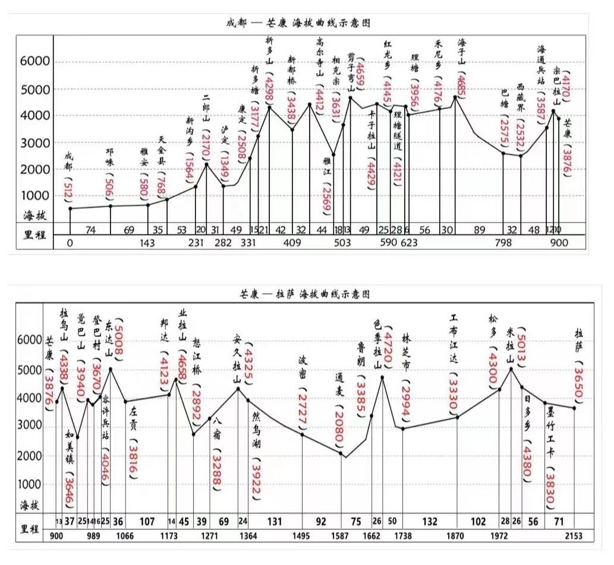

57 推荐的 [22+3 天线路](https://www.weizan.cn/t/d-43845226?typeId=5573)：

心旅推荐的 [23+3 天线路](https://mp.weixin.qq.com/s/XhAPKkWEdNv40UL9TNp6Kg)：

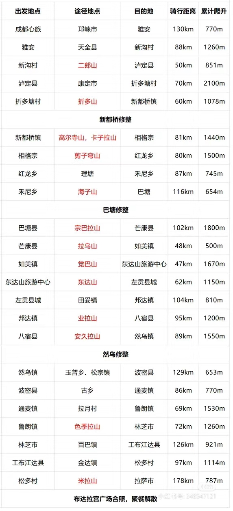

> 本行程中主要参考的公路车骑行 318 小红书博主：
> 
> - [@安静地过完余生](https://www.xiaohongshu.com/user/profile/60019aac0000000001007288) 14.5+0.5 天线路
> - [@许执与](https://www.xiaohongshu.com/user/profile/62579cda000000001000a88a) 16+1 天线路
> - [@乙戌O_o](https://www.xiaohongshu.com/user/profile/63f4b184000000001001dc62) 20+4 天线路
> - [@汉娜](https://www.xiaohongshu.com/user/profile/54812a8fd6e4a96170301f86) 21+3 天线路

### 装备

骑行川藏线最大的难点在于爬坡（虽然大部分坡不陡，但高海拔容易喘不上气），所以准备工作的核心是减重。

由于高原经常下雨下冰雹，必须以较高的防雨标准来准备（别想着躲雨，否则可能赶不完路）。

#### 人身装备

- 必须
  - 头盔
  - 冬季骑行服组合（排汗打底+抓绒外套，保暖+排汗+防风）
  - 冲锋衣（防雨+排汗+防风，推荐迪卡侬 [MH500](https://www.decathlon.com.cn/product-detail?dsm_code=340642)）
  - 雨裤（推荐迪卡侬 [旧款](https://www.decathlon.com.cn/product-detail?dsm_code=169380)/[新款](https://www.decathlon.com.cn/product-detail?dsm_code=310818)，可以包住鞋子）
  - 速干长裤（如果骑行裤是长裤则不需要，防晒+放坡防风）
  - 保暖小帽（放坡保暖，否则高反容易头疼）
  - 魔术头巾/骑行围脖（防晒+放坡保暖+挡烟尘，否则脖子可能晒伤）
  - 骑行小帽+止汗发带（止汗+防晒，否则头皮可能晒伤+晒出头盔的印子；天热时还可以打湿了降温）
  - 袜子（最好能速干）
- 建议
  - 骑行裤（一定要耐久，坐垫套容易导致血液不流通）
  - 锁鞋（很省力，放坡颠簸时防脱，但要提前习惯上锁）
  - 骑行眼镜（遮阳+防风+挡飞石）
  - 手套（防晒，雨骑后最好能速干，不建议用半指手套/薄手套）
  - 内裤（晚上洗澡后换上）
  - 运动鞋（如果骑车穿公路车锁鞋，可用于走路；如果穿平底锁鞋，例如山地车锁鞋，则不需要；如果穿运动鞋骑车，一定避免鞋带卷入牙盘）
  - 束腿带（如果长裤/雨裤的裤腿宽松，可用于避免卷入牙盘，p.s. 我的雨裤和长裤都卡过大盘，雨裤还被划破了一个口子）
  - 夏季骑行服+袖套（如果出发时成都很热可以带，但过了康定几乎用不上，可以用长袖打底代替，还省了戴袖套）
- 不建议
  - 雨衣（积汗不透气，导致里边比外边湿，容易着凉感冒；爬坡出汗不建议用，但放坡不出汗可以用）
  - 护膝/厚手套（一直零度以上，没用上；如果雨骑想用厚手套，还需要套一层防水手套）
  - 浴帽/鞋套（一体的冲锋衣/雨裤防水更好）
  - 遮阳帽（如果不兼容头盔，不要戴）

#### 车身装备

- 必须
  - 质量过关的自行车（最好是公路车，轻快/高效；看到有人骑的淘宝神车花鼓坏了，只能推车）
  - 打气筒+内胎或补胎工具（撬胎棒可选，打气筒要能打高压，气瓶不方便过安检；内胎 1-2 条够了，优先换新但别扔，换完再补，备新内胎是为了应付内胎裂开的情况）
  - 便携式内六角工具（得会点简单的修车技能）
  - 链条油（我用的是干性油，雨骑不沾泥沙，但雨骑后需要重新上油；本次消耗了 70ml 左右）
- 建议
  - 刹车皮（仅圈刹；如果出发前新换过耐磨的就不需要；两对即可，路上车店可能有卖；雨骑/堵车时建议按需使用刹车，不要一直刹车）
  - 外胎（如果出发前换新就不需要；防刺耐磨优先；如果外胎颠坏鼓包了，只能降低胎压+扛车过烂路）
  - 车头灯（万一夜骑备用+过无灯隧道）
  - 水壶架（另外推荐迪卡侬的 1L 水壶）
  - 码表、心率计、速度计、踏频计
  - 运动相机（后悔没带）
- 不建议
  - 手机支架（硬前叉震动大容易颠坏镜头里的稳定器，建议把手机放身上）
  - 车尾灯（一般亮度不够，装尾包后放不下，尾包/衣裤带有反光条即可）
  - 挡泥板（头尾车包可以挡一部分）
  - 脚撑（尾包重的话会不稳，一般可以直接靠着停）
  - 截链器+魔术扣（一般用不上，链条不稳定才需要，要是真的断了可以电话找驿站搭车）
  - 车锁（人在车在，大部分酒店可以把车放进房间，吃饭也时不时盯着）
  - 保温杯（后悔带了，容量小还很重）

#### 收纳装备

- 尾包（越大越好，本次用的是 14L，只要基本固定好不太晃就行；一定要防水，最好支持外挂）
- 如果头管低，则不建议装头包（可以用上管包、上梁包代替；或使用支架，避免车头包下垂和前轮摩擦，p.s. 我的车头包下边磨破了 3 个洞）
- 不建议背包或带太多的行李（除非找驿站驼包，压迫脊椎+不利于排汗）
- 如果坐高铁把公路车带来成都（免费/当日达），则需要装车袋
- 回程可以考虑打包寄车（但走物流比较慢），160-200 包邮

#### 其他准备

- 必须
  - 基本骑行技能（踩踏姿势、变速、放坡/过弯/避坑、公路骑行安全）
  - 基本维修技能（换胎、调变速/刹车）
  - 身份证（住店、进藏）
  - 充电器+充电线
- 建议
  - 充电宝
  - 现金（联通/电信在一些山上小卖部没信号，但移动都有网）
  - 毛巾（最好速干，部分酒店没有毛巾）
  - 电解质（2-3 份盐丸或冲剂；如果出发时成都比较热可能会用到，但后期几乎不出汗就用不上了）
- 不建议
  - 牙具/洗护用品/纸巾/拖鞋（不介意的话用酒店的，我的拖鞋掉了之后一直没买）
  - 小齿比牙盘飞轮组合（最陡的坡在瓦斯沟到康定路上，最大坡度也就 9-10%，如果平时能爬上去没必要换，我这次全程使用 36-28 组合）
  - 药品（一般用不上，可到县城按需购买，如果路上出状况可以叫救护车）
  - 氧气瓶（一般用不上，必要时折多山上有卖）
  - 帐篷/炊具（轻装上阵，住酒店、吃饭店）

### 在路上

每天骑行可以慢一些，不要用尽全力（谨记 318 不是单日赛），一定要避免肌肉受伤（最好每晚拉伸放松、每早充分热身）或膝盖受损（不要过度摇车/猛骑），同时注意不要拉爆心肺（高原恢复慢），必要时休整一天。

另外，高反会加重感冒/头疼的情况，只有吃好+睡好才能更快的从中恢复。

#### 吃

- 正餐
  - 多吃易消化的碳水（包子、馒头、面包、面条、米饭）+蛋白质（肉、豆制品）+维生素（水果、蔬菜、药片）
  - 少吃油（在邦达客栈吃过一次团餐感觉太油了，不过因人而异）
  - 路上主要有 川菜（饭店数量最多，但个人觉得比较油腻，吃的少）、藏餐（推荐 牛肉汤/牛肉包子/藏面/酥油茶/甜茶）、清真菜（推荐 牛肉拉面/手抓肉/烧烤）
  - 尽管一路上胡吃海塞，最后回到家还是瘦了几斤（腿上肌肉掉了不少）
- 补给
  - 爬长坡前记得补给（水+压缩饼干/士力架）
  - 压缩饼干（热量比士力架高，另外只有大地方才卖士力架；路上很多小商店可以买到，不必一次性买太多）
- 到了市/县一般可以买到蜜雪冰城，吃饭的选择也更丰富
- 从理塘开始，500ml 瓶装水 3 块钱，1.5L 涨到 5 块钱

#### 住

- 建议在大地方过夜（选择更多，“市>县>镇>乡>村”），合理安排行程避免露营（野外危险+休息不好）
- 旺季 318 沿途酒店/客栈一般都正常营业，如果停在村子里可以找藏民家过夜
- 选择
  - 安静（尽量选择离318或主干道/楼梯口远的房间，踩雷康定的倾城时光民宿）
  - 卫生（选择正规酒店/客栈，踩雷成都的心旅不换洗床单）
  - 位置好（最起码周围有吃饭/补给的地方，踩雷如美的云南宾馆）
  - 能放自行车（需要提前咨询）
  - 最好有 热水洗澡、独卫、WiFi（很多藏民家不提供洗澡和WiFi）
  - 很多酒店可以自己去楼上看房间后选择，当场或电话咨询可能比网上预订/门市价便宜不少
- 头几天高反会比较累（尤其是雨骑后），必要时可原地修整一天或半天（充足睡眠能更快的从高反中恢复）

#### 行

- 安全
  - 放坡时，观察路况（远离超到你前面的汽车，和他们拉开距离）+控制车速（尤其是过弯/雨骑时，雨骑放坡 2 次都能遇到被送医院的骑友）
  - 骑行时，不要太靠右（如果高反导致困乏，容易骑到路外边，如果没有护栏则会掉下去）
  - 停车时，尽量选择视野开阔（避免被撞）+安全（注意落石、别停止悬崖边）的位置
  - 被超车时，尽量靠右减速前进（大部分大车司机都会让出 50cm 左右；注意从八宿附近开始路面变窄，双向会车时没有超车条件）
  - 防御性驾驶，避让逆行超车/疲劳驾驶/强行右转不打灯的无良司机（墓碑上写着“对方全责”又有什么用呢？）
  - 避免接触野生动物（遇狗比它凶即可），别乱喝泉水（上游可能不干净），别乱吃野果（需要甄别），遇到小朋友拦车不要停（据说是找人要钱的）
  - 如果遇到意外，可以打 110/120 或驿站搭车电话
- 检查
  - 刹车（是否磨损过度、是否过松或过紧）
  - 胎压是否充足（过坑洼颠簸路时，过低内胎容易“蛇咬”，过高外胎容易鼓包；注意高低海拔之间的气压差，在低海拔充气到了高海拔会膨胀，在高海拔充气到了低海拔会收缩）
- 路况
  - 大部分路面对于公路车来说都没问题
  - 318 一直在修路，路况逐年变好（例如预计今年底开通觉巴山隧道、之前芒康附近的海通沟烂路现已修好、通麦天险也已不复存在）
  - 2023 年 8 月烂路主要在 如美/觉巴山/怒江72拐/然乌前棚洞，另外路上偶尔还会碰到一些短距离烂路（例如修路改道）
  - 对于 山体滑坡/泥石流/塌方（导致道路阻断），耐心等待部队来修路（例如本次遇到觉巴山修路，大约 1h 全部处理完成）
  - 对于 落石路/大坑，一定要躲避，踩过去很容易翻车
  - 对于 路基塌陷/路面挖开/大减速带，需要减速驶入驶出（避免像我一样把外胎撞坏鼓包），必要时借用对向车道（绕开）
  - 对于 碎石路/细沙路，需要保证有一定速度/惯性（避免侧滑），必要时扛车通过（避免划破外胎）
  - 对于 泥沙路（阻力大），需要用力踩踏+保证有一定速度通过
  - 对于 地面开裂（如果开裂过大，视为大坑）/颠簸路/小减速带（地面白色凸起），需要定期停下检查 车包是否摩擦车轮（之前车头包差点卡进前轮翻车）、装备是否掉落（我掉了拖鞋/车前灯）、线管是否松动（我的右手变头异响）
  - 对于 少量碎石路，建议稍微靠左一些，尽量避免踩到碎石（虽然会弹开，但仍会划破外胎）
  - 对于 烟尘路，建议戴上魔术头巾或口罩（除了怒江72拐，距离一般较短，我一般不戴；另外爬坡时可能影响呼吸，加重高反）
  - 对于 涉水路，建议减速通过（避免没看到中间的坑）
  - 对于 隧道/长距离明洞，光线不足时建议打开车灯（只有少数隧道无灯，但一般用 400 流明车灯照射也照不亮）、穿带有反光条的衣服（比尾灯更亮）
- 爬坡
  - 318 全程以爬坡为主，一般坡度以 5-6% 为主，最大坡度只有 9-10%，最陡的两个坡是 瓦斯沟-康定、雅江-相克宗
  - 爬山的最高处一般是垭口或隧道口（而不是山顶），海拔越高氧气越少，难度越大（缺氧时要及时休息）
  - 少推车（推车速度非常慢，消耗体力和慢慢骑差不多），避免长距离摇车（肌肉疲劳容易拉伤）
  - 爬起伏路时不能根据海拔判断还剩多少爬升，需要参考当日总爬升量计算
- 天气
  - 天气多变，预报一般不准，暴晒或下雨往往取决于头顶上的云
  - 本次骑行在 7 月底 8 月初，整体气温最高（但也很冷），风景最好（尤其是草原都绿了），但已进入雨季（存在塌方/泥石流风险）
  - 需要根据实际天气情况增减衣物，避免感冒
  - 垭口一般气温稍低一些+容易下雨，开始放坡前建议添加衣物
- 雨骑
  - 遇上下雨不一定要躲，下雪/冰雹除外（除非淋湿了，因为可能往前走几公里就停了，但要稍微慢点）
  - 雨骑后记得擦干净传动系统并给链条补油
  - 雨后如果升温，记得脱衣或敞开，避免过度出汗导致着凉感冒
- 夜骑
  - 提前根据路书规划时间并给突发状况预留缓冲，根据实际情况调整行程，避免夜骑
  - 如果不得不夜骑，一定要检查车灯电量是否充足
  - 危险不再于野生动物，但而在于出意外后不易被发现（遇到过一个摩友被汽车撞后逃逸）、看不清路面（对向来车一般都是远光灯）
- 骑友
  - 遇到骑友有困难一定要帮助（一般情况是新手不会处理扎胎）
  - 建议按照自己的节奏骑行，相遇即是缘分，不要执着于一路起走
- 驿站
  - 推荐关注 57，会提供很多有用信息（例如地质灾害、路面问题），相比之下心旅几乎没有服务（出发后几天群里就安静了，老板也不关心大家的情况）
  - 大部分驿站支持驼包（刚开始免费，后边要钱）、搭车（人车一起驼，有的是从半山腰拉到驿站，有的是从驿站拉到垭口，也有的直接送到目的地）
  - 路上一些驿站有打气筒，某些城镇也有车店（地图上可以搜到部分车店，其他隐藏车店可以咨询驿站）

## 日记

### Day0 成都

高铁晚上 7 点到达成都，在地铁上先把轮子以外的零件拼上，出站后装上轮子骑去吃饭+入住。

晚上和 [@侯宇](https://www.xiaohongshu.com/user/profile/5b8850c9902c9a00012bc195) 汇合后一起吃了翘脚牛肉，然后入住了心旅的驿站（就在 57 的旁边），单间/双人间 128 一晚（床位便宜一些），环境很差（床单不换、房间很臭，当然住酒店舒服一些，但住驿站可以认识更多的小伙伴+在驿站租车/买配件，不过驿站东西卖的比外边贵）。

非常感谢 [@Hunter3533](https://www.xiaohongshu.com/user/profile/5d0c60770000000016003f19) 借的尾包/头包/装车袋（来不及买了，后边再买新的还给他）。

### Day1 成都-邛崃-雅安-天全

天气：码表最高 44 度（据说是成都近期最热的一天，竟然和北京一样热），闷热（晚上下暴雨），随机有微风。

成都-邛崃：路况很好，公路车无障碍，没有坡；早上 7 点半和心旅的大部队一起出发（隔壁 57驿站 6 点半就出发了，会更凉快一些）；从成都出发走往新邛路方向走，建议按照驾车不走高速的导航，否则会进入很多岔路（我们绕错了几次）。

邛崃-雅安：路况还行，偶尔有一点碎石和坑洼，一路先是缓上，到了名山市区有连续下坡（坡度不大，但路上有坑洼容易脱把），进入雅安市区又是缓上；雅安车店里东西齐全而且价格还行（但技师会忽悠你买内胎/车灯/雨衣/保暖衣之类的，号称可以避免后续遭受大自然的毒打）；路上有很多村镇店铺可以买东西吃，在大塘还有一个骑行驿站（在里边遇到俩自行车哥们+好几个摩托车哥们姐们，我在里边喝了杯冰可乐）。

雅安-天全：路况不如前两段，碎石和坑洼多一些，整体上坡，也有很多起伏路；需要经过 3 个隧道，经常有大车经过，第一个是市区里很短的平路（有微弱灯光，路很好走），第二个飞仙关隧道是大下坡（灯光很暗，有碎石和大车，控车能力不足or想去打卡景区可以绕山路），第三个龙尾峡隧道是缓上（灯光足够亮，有碎石、粉尘和大车，需要煎熬 2km 左右，如果介意可以绕旁边的山路）。

骑友：昨晚和侯宇汇合后，我们早上一起从成都心旅出发，按照 20 左右的均速，在上午 11 点到达邛崃；后边由于节奏不同，我自己没吃午饭直接赶往雅安，而侯宇后续跟着另一位昨晚在驿站认识的公路车骑友走完后续的路程；在雅安中暑休息（从 2 点半休息到了 3 点半，还没完全恢复）后，又和两位骑友一起前往天全（其中有一人在波密附近又遇到了，最终和我一起走到拉萨）；由于他们刚出发就都掉了（一个在等后边的人，一个骑的山地车爬不动坡），最终我又是自己一人在傍晚 5 点半到达天全（中途我等了半小时，等不到就走了；后来听说是他们也在等自己后边的人）。

感受：由于中暑了（没有胃口，没在邛崃/雅安正经吃饭，在路边饭店随便吃了点东西，再靠着 3 冰可乐 + 1 盐丸 + 1 在饭店口服半勺盐续命），今天先骑到天全休息（本想着消耗心肺保护肌肉，结果心肺也崩了），明天继续。

住宿：晚上住在四季商务酒店，风扇内窗单人间 54 一晚（本来很闷热，后边下雨了好一些，早知道还是加钱住空调房吧），卫生状况好于昨晚的驿站（起码床单被罩会洗），但没有独卫，老板超级热情（借了剪刀透明胶还给了塑料袋包鞋子/帮忙换了现金/骑行裤破了于是告诉我裁缝铺在哪，服务不比万豪差）。

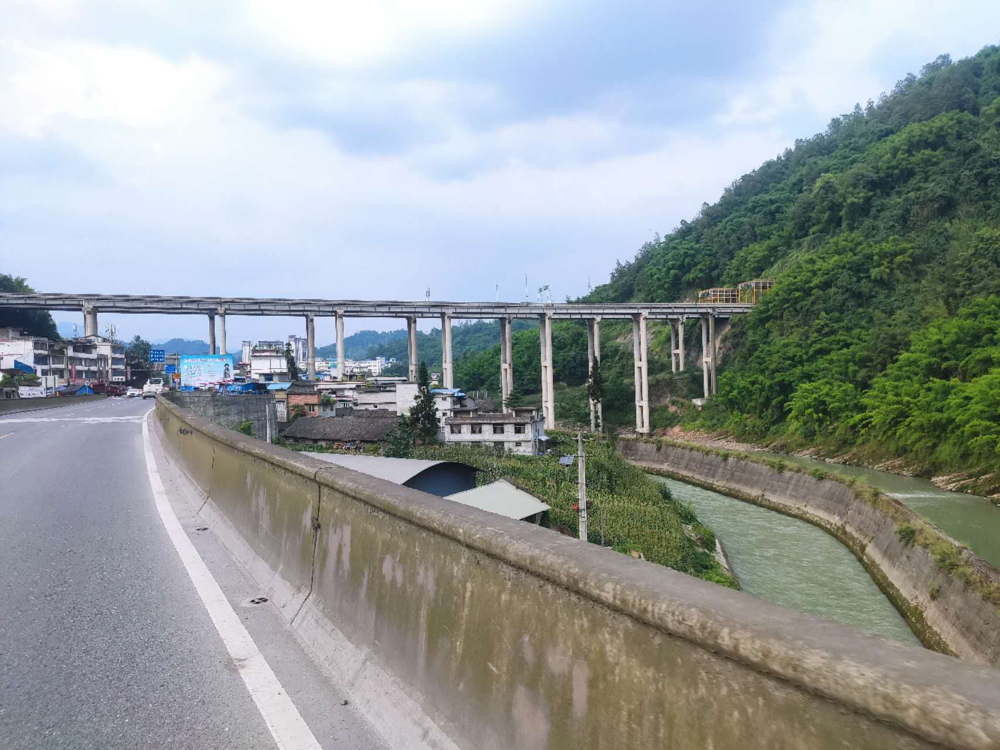

> 图：天全县入口

### Day2 天全-新沟-二郎山-泸定-康定

天气：昨晚下了暴雨，早上非常凉爽（云雾缭绕），中午海拔低稍微热一点，晚上海拔高又凉快了一些。

天全-新沟：地面是铺设的水泥石子路（略颠簸），偶尔有些坑洼和碎石，整体上坡 3-4%，偶尔也一些起伏路；由于昨天下雨，路上有许多掉落的树干、石块（我停下来挪了两次障碍物，后边大车太多就没挪了）；早上天全出口附近停了 1-2km 的大车，后边路上遇到的大车不知道是不是他们（一路上大车比例 90%+，超车的时候他们会留 50cm）；路上有 3 个隧道，第一个熊猫海隧道是稍长的缓上（灯光足），第二个海子沟隧道是很短的缓上（灯光弱），第三个前碉隧道是不太长的平路（灯光很弱）；注意近期小仁烟村出口在修路，自行车可以直行（虽然指示牌让右转，但别跟着走到下边碎石土路上）。

新沟-泸定：路况很好，二郎山隧道前全是上坡（主要坡度 5-6%，还有几段 7-8%），隧道后先爬到最高海拔 2160m，然后是连续下坡（偶尔也有上坡，下坡弯道都很好过，但减速带很多，tip：过减速带时避免踩中凸起部分从而减少颠簸）；路上无补给，需要在新沟备足；记得走二郎山隧道，不要尝试二郎山老路（已不再维护）；路上也是 3 个隧道，第一个冒水孔隧道无灯但很短（路面平整无碎石），第二个二郎山隧道是平路+长缓下（有灯光，路面平整），第三个不记得名字了在放坡路上（大概几百米，但无灯）。

泸定-康定：整体路况还凑合，但经常有碎石，最后快到康定有一段烂路；瓦斯沟之前是上短坡+下长坡+起伏路，瓦斯沟开始正式大爬坡（主要坡度 6-8%，有几段 9-10%）；路上也是 3 个隧道，第一个红军桥隧道在泸定桥旁边（想去看一眼泸定桥所以没走隧道，但人太多+要买票+远处也看不到），第二个泸桥隧道是长缓上（有灯，但碎石很多），第三个小天都隧道也是短距离缓上（路况不错，在爬坡路上，适合放松肌肉）。

骑友：刚出发时遇到了一位今天预计到达泸定的骑友（后来我在新沟休息面试 2h，他又走到我前面了，估计比我早到了泸定）；后边在爬二郎山的路上，遇到几位推车的骑友+几个徒步的人；过了二郎山隧道放坡时，看到的骑友多一些；但下午爬瓦斯沟-康定时，又没看到其他骑友了。

感受：刚开始觉得下坡很爽，后来开始祈祷别下坡（下坡意味着后边需要爬相同的海拔）；刚开始觉得 3-4% 爬坡还挺舒服的，后边开始祈祷别遇到太缓的坡（缓坡意味着后边需要爬更陡的坡才能达到对应海拔，尤其是水平距离越来越近的时候）；不过最后想开了，3-4% 甚至 4-5% 的坡是用来休息肌肉的，比起 7-8% 的坡不能算坡；今日爬升近 3000m，腿已麻了，先休息。

住宿：康定旅游旺季，住宿非常贵，挑了一个附近最便宜的倾城时光民宿，双人间 140 一晚，但临街很吵（有余力的朋友建议骑到城里住，318 沿线大车+鸣笛太吵了），也没有独卫。

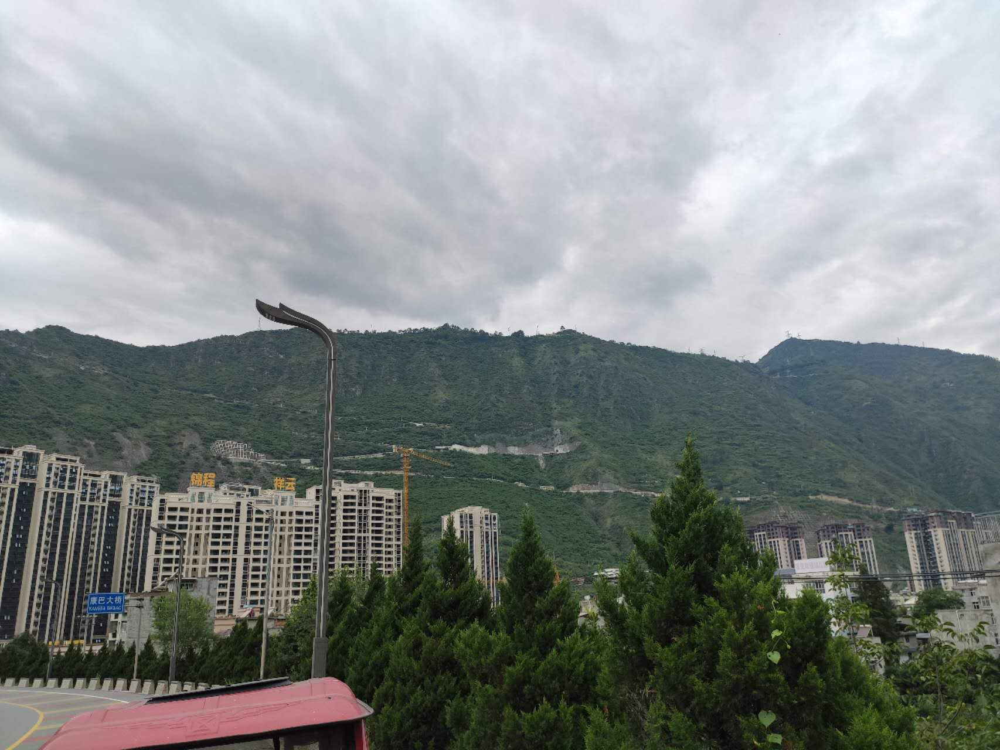

> 图：从泸定县（大渡河峡谷）仰望二郎山（刚从图上的盘山公路放坡下来）

### Day3 康定-折多塘-折多山-新都桥

天气：小雨+中雨（一路上云雾缭绕），海拔 3500m 以下的位置大概十几度（穿着冲锋衣+雨裤有点热），海拔超过 3500m 开始逐渐变冷（折多山海拔 4000m 以上气温 8 度，但体感很冷）。

康定-折多塘：路况还行，只在康定市区里有段烂路，刚开始比昨天坡陡一些（出城有段最大坡度12%），到了折多塘附近有几段起伏路（下坡可冲）。

折多塘-折多山：全程上坡，坡度以 5-6% 为主，偶尔有 7-8%（比例和二郎山接近），整体路况还行，上坡有两条车道（只遇到一两个司机很靠右边挤我），不过路边有碎石比较危险；另外一路上几乎没有补给（直到海拔 3900m+ 有个骑行驿站/小卖部，往上还有一些人在路边卖氧气瓶），建议折多塘带上热水和能量来源（在折多塘驿站吃了碗面，然后一路上吃了 4 个士力架，不然真可能失温+缺氧倒在山上）。

折多山-新都桥：全程下坡（木亚圣地前是陡下，木亚圣地后是缓下），整体路况不错（偶尔有一些大坑，过了木亚圣地后有的坑掉进去是会翻车的那种）；由于是雨骑，刹车皮磨损比较严重，计划买两对新的备用；到酒店发现拖鞋掉了一只，索性把剩下一只也扔了（本想买双新的，但附近一家商店没有，想想后边还是穿酒店的吧）。

骑友：可能因为下雨出门晚，路上遇到的骑友不多，直到折多塘附近骑友数量稍微多一些（今天在折多塘休息面试 1h）；雨骑折多山的人也不多，倒是遇到好几个徒步的人（有几个人抄了一段近道，比我骑车还快），到了垭口才看到几位骑友（放坡后又不见了）；快到折多山垭口时，走进一个小卖部取暖，里边还有位摩友，他特别好心的买了不少饼干分给我和店主姐姐（但我还是只吃了压缩饼干）。

感受：今天的重点已经不是腿酸不酸、坡陡不陡了，高原+雨骑需要注意缺氧+失温的问题（心态从能不能快点骑完，变成能不能安全骑完）；海拔上 4000m 后踏频上到 70 就会呼吸困难，加上冷冷的冰雨胡乱地拍在脸上，内心只想着早点到垭口（每爬升 50m 休息一次）；结果到垭口后放坡仍是下大雨，只想着早点找到住宿；找到后骑过去遇到堵车（两边同时逆向超车死锁），导致冻了一路，今天也早点休息（如果没下雨，计划去雅江）；晚上点了一盘牛肉和番茄鸡蛋，硬塞了好久才吃完。

住宿：新都桥也是旅游区（号称“摄影天堂”），住宿不便宜，住的是抚琴酒店的 154 一晚的独卫单人间，卫生还不错，临 318 但比昨晚安静很多；另外康定（海拔 2500m）和新都桥（海拔 3500m）都不需要风扇和空调降温（空调一般是暖风）。

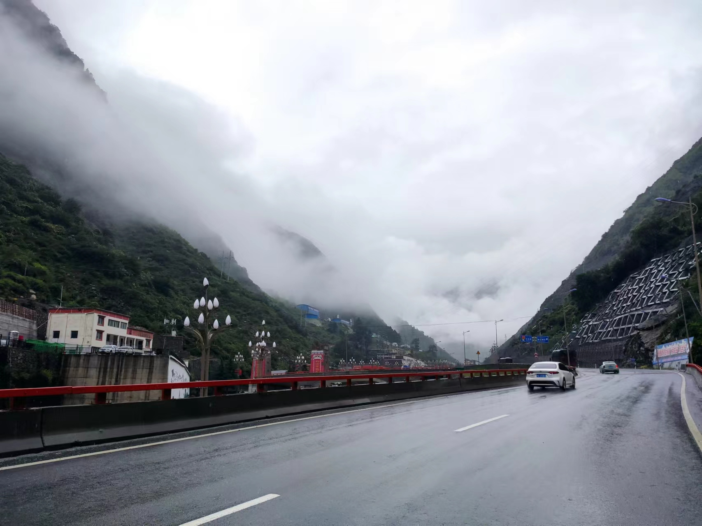

> 图：康定市内几乎全程上坡（“康定没有情歌只有坡”）

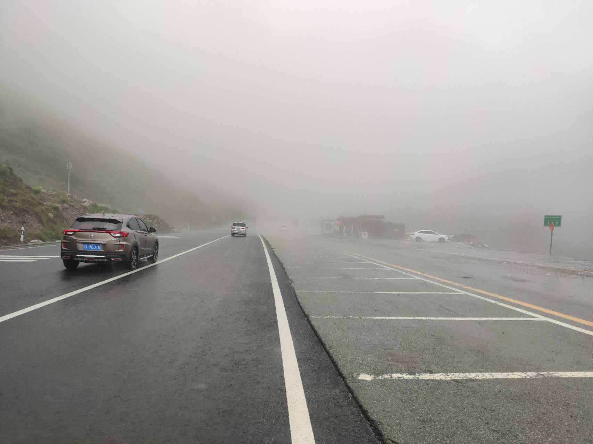

> 图：折多山上的大雨（能见度只有几百米）

### Day4 新都桥-高尔寺山-雅江-相克宗

天气：诡谲多变，出门阴天，一会开始暴晒，放坡时特别冷，到了低海拔位置又继续暴晒，直到爬相克宗到海拔 3300m 时开始下雨；码表最低 13 度，最高 42 度。

胎压：早上摸起来只剩下大概 90psi，于是去驿站打气打到 110psi（担心后边放坡出现“蛇咬”），结果气嘴自动漏气掉到 100psi 左右（可能是海拔 3500m 不适合高压）。

新都桥-高尔寺山：路况还行（刚出新都桥时有碎石和烟尘，山里好些），但新都桥省道上有几个大坑（如果直接走 318 不进镇，路况好很多）；爬坡 5-6% 为主，到高尔寺隧道结束（据说高尔寺山垭口可以远眺雪山，但老 318 都是烂路+已年久失修）；路上无补给（直到放坡半路才有村子）。

高尔寺山-雅江：高尔寺隧道是 5km 的短平路+长缓下（有灯，路况还行，偶尔有小坑），出隧道后是海拔 3900m 到 2600m 的超长下坡，到第一个村子前坡度大（不踩时速能到 50+，但弯道半径大，一般可以时速 40 左右通过，除了个别 U 型弯需要减到 30）+路况差（非常颠簸，我的手电筒在半路颠飞被汽车压碎了，尾包上挂着的鞋子也掉下来磨到后轮），过第一个村子后变成缓下（虽然需要上几个小坡，但几乎也不用踩）+路况稍好（但有很多碎石和烟尘）；隧道里有点冷，出了隧道更冷，建议提前穿好衣服，到了村子里可能稍热一些，但如果下坡不踩无需脱衣。

雅江-相克宗：路况还行（主要是雅江县城附近碎石/烟尘多，进山后好一些），爬坡前面是 8-9%，后边基本上 6-7%，难度接近爬康定（但这次有高反+暴晒+暴雨加持，对我来说更难）；路上有几个补给点可以买水；雅江市区里有个雅江隧道，200m 左右缓上（有灯路好，但里边烟尘滚滚；也选择可以绕到左边进入雅江县城再出来，但需要上下大坡）。

骑友：由于 10 点多才出门，路上骑行的人不多，在刚出城不远处遇到了穿着河海大学队服的公路车骑友，再往前走还有几个山地车的骑友；到了雅江后，一起爬相克宗的骑友很多，不过我竟然时头几个到达三姐妹客栈的（刚到不久就看到了好多搭车的骑友从面包车上下来）。

助人：爬高尔寺山的路上遇到一个车轮转不动的哥们（看起来是穷游的哥们），帮忙修复未果（应该是花鼓坏了，只能推到雅江维修，还是建议大家买好点的车骑长途）。

感受：昨天高反还没缓过来，今天 10 点才出门，另外减小强度（原计划早起去理塘），但路上遇到暴晒+暴雨，又再次把体能榨干了，到了酒店洗完澡、擦完车，倒头就睡（错过了晚餐）。

住宿：提前电话预定了和心旅合作的布珠三姐妹客栈（网红客栈），独卫单人间 160 一晚（床位 80），含晚餐早餐自助（据说晚餐还行，但早餐只有馒头稀饭），装修不错，整体还算干净，支持免费搭车服务（骑不动可以找他们拉上来），不足是自行车不让带进房间（老板担心弄脏墙、擦链条弄脏地面，所以我是先擦干净车子后才扛上去的）；山里很幽静，睡觉很踏实，但湿度很大，衣服潮乎乎的。

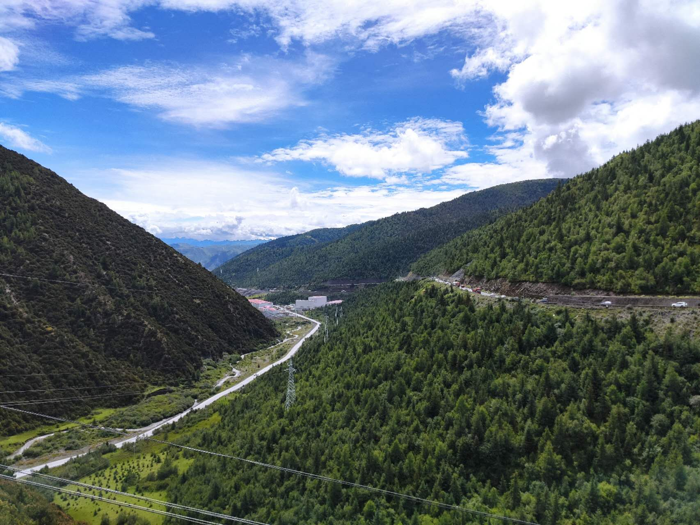

> 图：高尔寺山半路的风景

### Day5 相克宗-剪子湾山-卡子拉山-理塘

天气：多云（温差大，太阳晒时三十多度，不晒刮风时十几度），需要穿冬季行服+滑雪小帽（不然真的冻傻了）。

相克宗-剪子湾山：从海拔 3500m 爬到 4200m，坡度以 5-6% 为主，天路十八弯等观景台可补给；路过剪子湾隧道，是个 2km 缓上（光线暗，前半段漫水，一路上很多暗坑），出隧道降温到十几度。

剪子湾山-熊宗卡：起伏路，路上有观景台补给。

熊宗卡-尼玛贡：先下后上，路边偶然有小卖部。

尼玛贡-卡子拉山：先下后上，爬坡前有一两个小卖部；遇到小朋友拦车（据说是拦路要钱的），还好没停（估计对方看我气喘吁吁的就没截停了）。

卡子拉山-天空之城：先下后上，只有爬坡前（川藏第一面）可补给。

天空之城-鸡马拉山：先下后上，坡底是红龙镇（据说住宿不太行），爬坡无补给。

鸡马拉山-理塘隧道（托洛拉卡山）：先下后上，无补给。

理塘隧道（托洛拉卡山）-理塘：下坡，有很多颠簸烂路；理塘隧道是 3km 平路+缓下（光线不足，后半部分路很烂）。

路况：除了理塘下坡和剪子湾隧道路烂，其他都还好；放坡路面平整时最大时速能到 70，过弯时速一般可以 40-50（除了理塘附近）。

爬坡：总共 6 个上坡 + 1 个起伏，刚开始的剪子湾山最难，后边几个难度接近。

骑友：可能今天出发比较早，也就刚开始在爬剪子弯山的路上能遇到一些骑友，后边就很少碰到了；其中遇到一位公路车骑友，爬坡速度比我快 20%，超过我好几次（前几次是因为我们的休息时间刚好错开，所以相互超了几次；后边他帮一位山地车骑友换胎，换完后又超了我一次，之后骑太快就不见了），是本次 318 上唯一一个比我快不少的骑友（一般都是我超别人）；到了川藏第一面时，正准备买水但老板不在，还好有个热心的自驾大哥送了一瓶 500ml 续命，另外在这看到有人带着一条狗徒步；在理塘隧道前停下面试半小时，到了晚上 7 点半尽管天还没黑，但路上已经没有其他骑友了。

感受：昨晚睡眠很充足，所以早上起的也不算晚；路上景色很美（从剪子弯山到理塘是一大片云上草原/丘陵），但高反还没完全恢复（头疼），高原骑行还是有点吃力（一路上心率上不去也下不来，所以不敢太用劲，担心患上心肌炎），多休息一天试试吧；晚上在网红藏餐厅点了萝卜牛肉+牛肉包子+酥油茶，结果只吃完了萝卜牛肉，牛肉包子当作第二天早晨，酥油茶打包送给了酒店老板。

住宿：住的国际青年酒店，独卫单人间 129 一晚，很安静，卫生不错，位置也很方便，老板非常 nice，连续住了两晚。

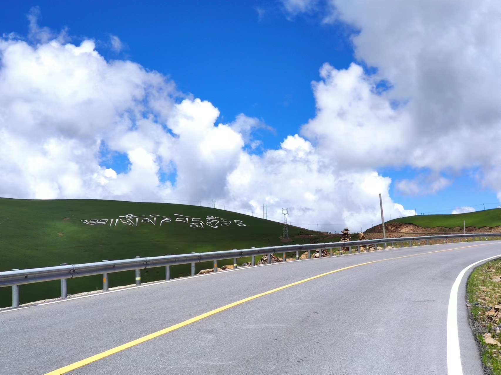

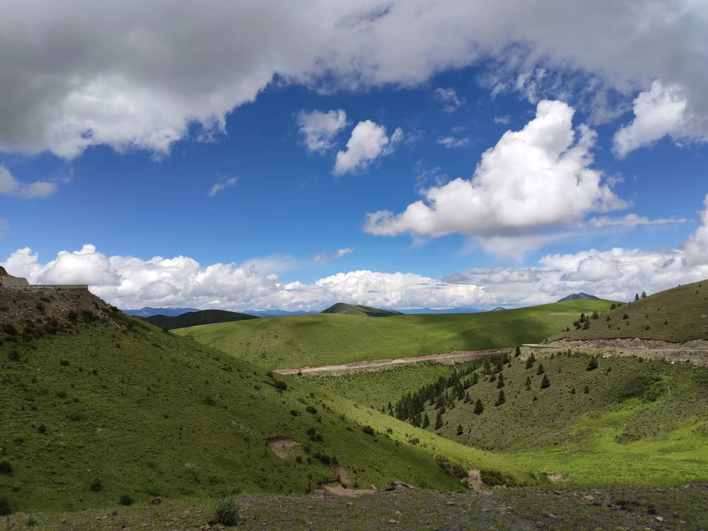

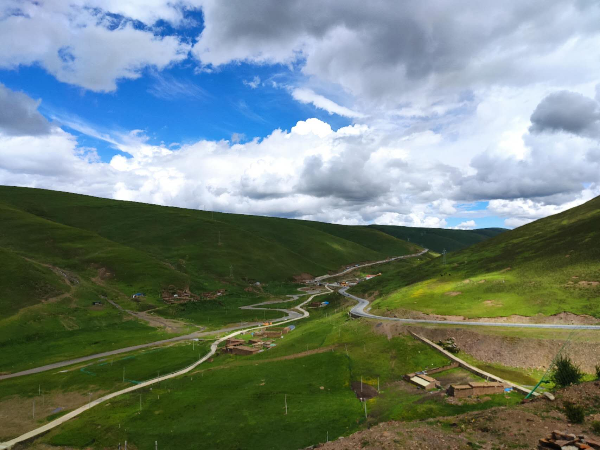

> 图：云上草原/丘陵（随手一拍都是美景）

### Day6 理塘

高反恢复 city walk：

- 东城门（就一个门，可打卡）
- 白塔公园（里边有个巨大的转经筒，值得一看）
- 仁康古街（商业街，如果不拍照不推荐）
- 千户藏寨（藏民的房子，去寺庙顺便路过）
- 长青春科尔寺/理塘寺（开放了三个大殿，里边的壁画/佛像都很震撼）
- 格萨尔王广场（就一个雕塑广场，可打卡）

骑友：走到心旅的客栈，看到一辆帅气的 elves 公路车（后边在去芒康的路上又遇到了，后来在网上也看到了他 [@理髮師-夏超](https://www.xiaohongshu.com/user/profile/5a8c303ee8ac2b2e2425b521)）。

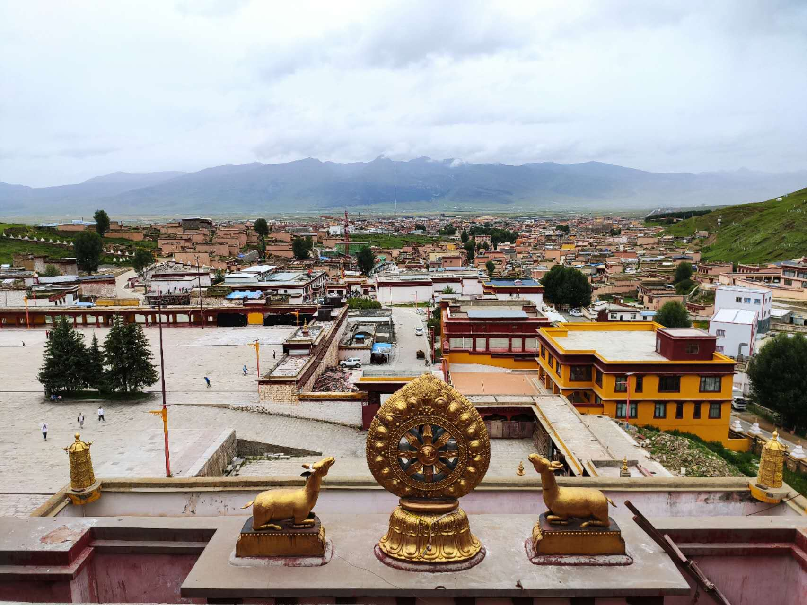

> 图：长青春科尔寺俯瞰世界高城 —— 理塘

### Day7 理塘-禾尼-海子山-巴塘

天气：早上多云转阴（一件内衬+冬季骑行服刚好），中午多云转晴（冬季骑行服有点热），下午冰雹（放陡坡的时候），傍晚晒（放缓坡的时候）。

理塘-禾尼：全程起伏路（上坡大于下坡，最大坡度只有 5%），路面稍有颠簸，县城/乡镇/工地附近有很多烟尘；路上只有个别服务区补给，禾尼吃饭的选择不多；路左边是无量河湿地/毛垭草原，风景很美，可以看到很多牦牛和土拨鼠（全 318 最多的一段，很多人停下投喂）。

禾尼-海子山：前半段起伏路（上坡大于下坡，2-3%），后半段稍陡一些（5-6%）；路上有个别小卖部补给。

海子山-巴塘：第一个村子前陡下（虽然路况整体不错，可以 40 过弯），第一个村子后缓下（修路烟尘很大）；很多烂路（地面开裂或凸起）+正在修路（地面挖开重新铺沥青，需要在下坡时频繁进出挖开的路面，建议胎压打足避免“蛇咬”，同时避免踩到高温沥青上）+修路位置堵车（需要在车流中穿梭下坡，并且在破损的路面上频繁刹车）+减速带（在陡坡末端，没注意真可以飞起来）；过了海子山垭口，可以看到冰川遗迹，再峰回路转便能看到姊妹湖，建议这段路慢点欣赏，另外半路还遇到两只猴子🐒；路上有 6 条隧道，第一个德达隧道是短缓下（光线还行，路面无坑），第二个列衣隧道是 2km 缓下（修路中，烟尘大，部分地方无灯但整体光线还行，地面有小坑），第三个波戈溪隧道是 3km 小段平路+大段缓下（修路中，部分地方无灯，沥青没铺整体很颠簸+偶尔有坑/凸起），第四个拉纳山隧道是 4.5km 平路+缓下（修路中，部分地方无灯但整体光线还行，前半段平整+后半段偶尔颠簸+出口处地面开裂），第五六个黄草坪一二号隧道都是平路+缓下（路况很好，灯光充足）。

配件：由于再次雨骑刹车磨损严重（其实还剩一半，理论上能勉强坚持到拉萨），在巴塘自行车店花了 78*2 换了两对刹车皮（老板说至少可以用到拉萨，但后边发现老板把刹车皮撞歪了，轮圈凸出来一截）。

骑友：今天遇到的骑友不多，刚出城不久遇到一个今天从红龙骑到禾尼的女生，她说要去网红的所波大叔之家吃牦牛肉自助（住宿包餐，床位好像也就 70 还是 80）；后来在放坡时遇到冰雹，在一个弯道上看到 120 接走了一位骑友（据说摔车了）；后边冰雹越来越大，于是躲进半山腰的一个藏民小卖部里，在这遇到了一个 57 的骑友，由于他的衣服湿透了（不太防水），一直用火炉烤着。

助人：快到巴塘时遇到一个小哥（大学生）瘪着后轮骑车，于是借给他打气筒，路上打了两次（每次打到 40psi，打到后边没劲了），勉强骑到车店换内外胎。

感受：早上感觉高反还没完全恢复（还有点头疼+脖子疼），下午赶上绿豆大的冰雹时只想着赶快到酒店（又在路上遇到了一个藏民小卖部救命，上一次是在折多山遭遇冰雨），结果路上都是坑，最后只想着怎么能让车子安全抵达目的地（心疼被沥青烫坏的车子/衣裤+严重磨损的轮圈）。

住宿：随便找了一家最便宜的鑫盛宾馆，无窗独卫单间 112 一晚，隔音不太好，凑合住吧。

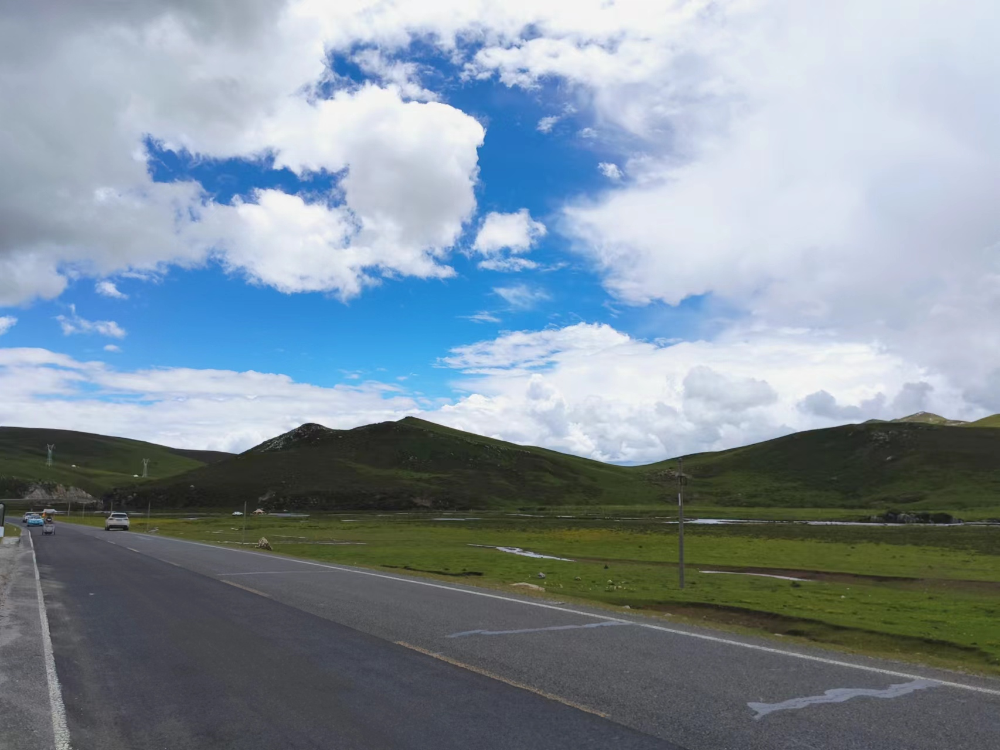

> 图：毛垭草原（318 上土拨鼠最多的地方）

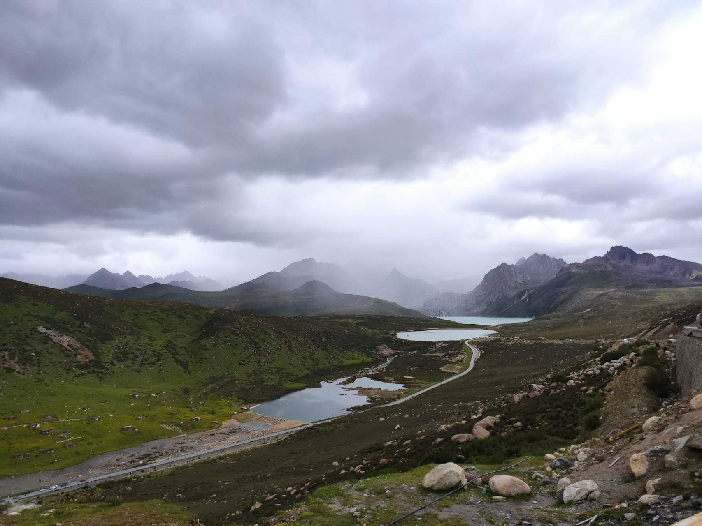

> 图：姊妹湖（过了海子山峰回路转后看到的两颗蓝宝石，但湖上下雨遮挡了对面的冰川）

### Day8 巴塘-金沙江大桥-海通兵站-宗拉山-芒康-拉乌山-如美

天气：到达金沙江前下雨，然后放晴四十多度暴晒（好在沿着河边骑比较凉爽，一件长袖内衬还有点热），到达海通兵站后转阴（一件内衬+一件冲锋衣刚好），开始放坡拉乌山时小雨（还好赶在被大雨淋湿前到达如美村），最后如美镇和巴塘一样比较热。

巴塘-金沙江大桥：一路缓下（巴塘本身下坡），到了金沙江村、竹巴龙乡可以补给，需要注意巴塘附近的减速带和烂路；路右侧是金沙江（长江上游，清水+浑水汇合非常壮观），过了金沙江大桥就进了西藏。

金沙江大桥-海通兵站：起伏+缓上（2-3% 为主，偶尔 6-7%，最大 8-9%），刚开始有几段烂路（尤其是一个明洞内部和出口）；海拔 3000m 前有几个藏民小卖部（有的联通没网），后半段没补给，但海通兵站（海拔 3500m 左右）有不少超市/饭馆（过了检查站选择更多一些）；路上有很多明洞（无灯，但多数都很短）+隧道（都无灯，前两个长一些，后边三个都很短）+凌槽（类似明洞，都很短），除了一个明洞地面开裂，其他路况还行；遇到俩疲劳驾驶司机（冲到跟前了才猛打方向），大家要小心。

海通兵站-宗拉山：刚开始是缓上（小心露营地附近的减速带），过了明洞后开始爬坡（5-6% 为主，有些 7-8%，没有传闻中那么难），没有补给点。

宗拉山-芒康：下坡，急弯为主（建议时速 30 以下通过），最后有一段地面开裂（有几个会翻车的大坑）。

芒康-拉乌山：全程上坡（5-6% 为主，有些 3-4%，难度略低于宗拉山），芒康附近和爬坡路上有地面开裂+大坑的问题（芒康附近还有几个连续减速带），乌拉山上下坡都没有车道线；路上无补给；快到垭口时有很多草原鼠。

拉乌山-如美：30km 的平均 5% 下坡（刹车的情况下最快时速 60+），路况非常差（大坑+大裂纹+路基塌陷+挖开没铺，建议打足胎压+检查刹车），如美村全下坡，如美镇先缓上再缓下，村镇附近烟尘大；如美村风景很美（但下雨+放坡，没停下来拍），如美镇（实际上是竹卡村）位于澜沧江峡谷（湄公河上游）也很壮观。

骑友：早上在金沙江附近又遇到了昨天帮助过的那位骑友，和他沿着河流骑行了一段后，按照自己的节奏先走了；在快到海通兵站时的藏民小卖部，遇到了理塘那辆 elves 公路车，骑友在洗车（估计昨天路过巴塘修路把车子弄脏了），他的朋友也在休息，我就先走了；到了海通兵站看到几个之前在相克宗爬坡时遇到过的骑友，他们今天到芒康就结束了，吃饱喝足在饭店门口打牌休息（顺便给我渲染了一下宗拉山坡陡的气氛，好在实际上没有想象中那么陡）；吃过午饭后（已是下午三点，之前路上都是吃饼干和压缩饼干），在检查站又遇到了 elves 公路车和他的朋友，但他们拍照时间比较长+今晚就停在芒康，所以我和他们聊了几句又先走了（他们最后追了上来，在芒康路上打了个招呼后就住店了）；后边由于我在 5 点 20 到的宗拉山、7 点 10 到的拉乌山，比较晚了，一路上没有遇到其他骑友。

感受：经过几天的爬坡和高反的逐步恢复，爬升 2000m+ 已经不是什么难题了；今天印象最深刻的还是 30km 的连续高速下坡，不仅需要躲坑（很多坑在弯道，有的坑把整条路拦住了），还要随时借道+躲避借道车辆和路上的牛马+和前车拉开距离以便观察路况（最讨厌一些司机超到前面但又急刹车）+和身后的大雨（赶在淋湿前到达）以及渐逝的日光（赶在天黑前到达）赛跑；如果这是游戏，我愿意再来一局，但亲自速降我不愿意再走一趟（除非红牛赞助）。

住宿：挑了一家最便宜的云南宾馆 158 一晚的独卫标间，但位置在城郊的 318 路上（周围没有商店和饭店，晚饭后夜骑了几公里才到），晚上很吵（楼下是修车店），非常不推荐。

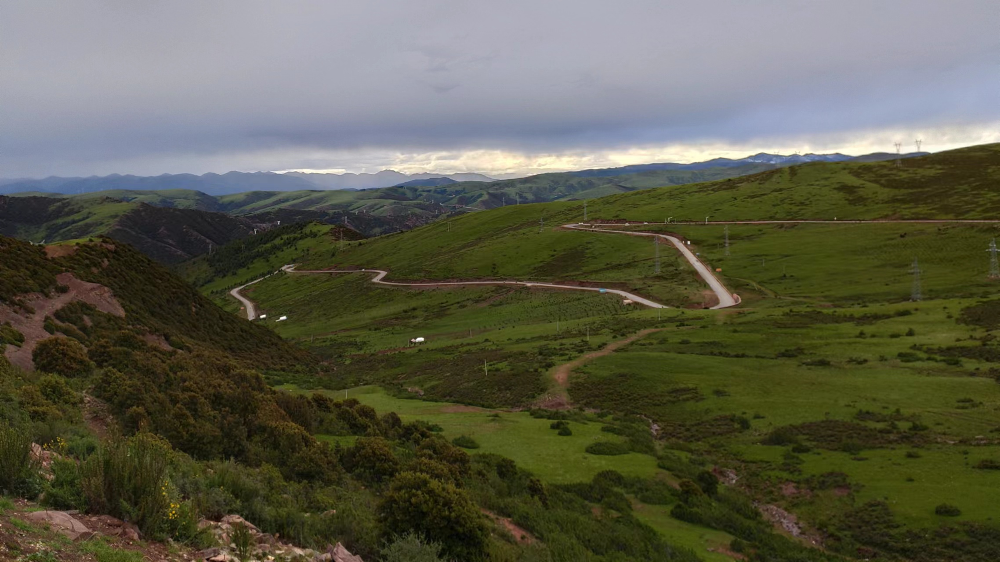

> 图：拉乌山草原（318 上唯一看到草原鼠的地方；头上的云层很厚，不一会就下雨了）

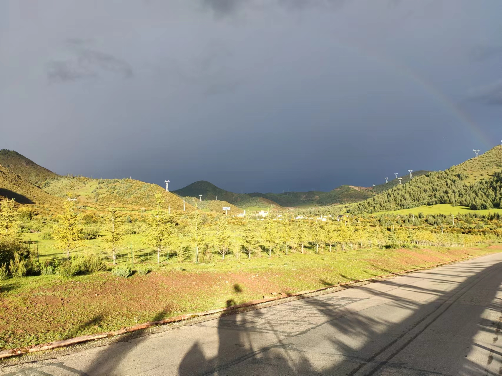

> 图：如美村（半晴半雨有彩虹🌈；更美的风景在山上，但躲雨没拍，只记录在眼里）

### Day9 如美-觉巴山-登巴村-东达山-左贡

天气：出门有点晒（只穿了一件长袖内衬），爬东达山时转阴（沿着河道的部分会比较凉爽，加了一件冲锋衣），快到东达山垭口后渐冷（最冷 5 度，可能因为落日后没有阳光直射，到垭口把冬季骑行服也加上了），放坡到左贡逐步回温到 12 度。

如美-觉巴山：如美本身下坡，但出城后立即上坡（以 6-7% 为主），路况比昨天如美差很多（很多裂缝、大坑、砂石路、落石，公路车容易打滑/侧滑）；只有觉巴村可以补给（由于昨晚住城郊，早上空腹到觉巴村找饭店，结果只有一户藏民家接客；20 一张的烙饼有点糊，于是买了压缩饼干，好在烙饼送给了偶遇的骑友，没有浪费；小卖部也只有一个）；路上遇到部队修路堵车，还好自行车排在最前面，等了 10 分钟就过去了（位置很重要，否则如果卡在大车后边，两辆大车会车时很麻烦）。

觉巴山-登巴村：下陡坡+起伏路，路况比爬坡好一点，但比昨天的如美下坡更颠簸，也很多坑洼/烂路；路上车多，需要严格控制车速。

登巴村-东达山：5-6% 为主的长上坡（偶尔有 7-8%，草原附近有缓坡起伏路），路况还行（虽然有部分破损，但不影响上坡）；出了登巴村需要到荣许的两个驿站才有藏民小卖部补给（后边就没了），另外在山上遇到了有人开车卖 5 块钱一瓶的水（买了一瓶，前面一直不舍得喝）。

东达山-左贡：主要是 5% 左右陡下（快到左贡县城时有一段起伏路），路面非常颠簸（时速 60 踩到凸起时车子飞起来了几次，右手变头震得异响了），但没什么大坑（只有左贡欢迎门牌附近有几个会翻车的坑，比如美的下坡省心很多，起码不用太担心翻车）；弯道坡度大+半径小，建议时速 20-25 过弯。

骑友：刚出如美时遇到 3 个华科的大学生，俩公路车+一gravel，每次过烂路都是扛车（告诉我骑过去容易爆胎，我没在意，结果后边外胎真的爆了）；觉巴山路上还遇到几个骑山地车的女生，精神可嘉；后边在觉巴山修路堵车时，有个好心/好看的摩友小姐姐给我和其他骑友投喂面包和水果；快爬完觉巴山时，遇到一对父子因为昨晚骑车走了觉巴山隧道（后边打听到人多时不让走，人少时每人交 100 可以私下过），所以今天反爬回去再爬一次觉巴山；后来爬东达山的骑友越往后越少，直到垭口时才看到洛克兄弟赞助的车队在不紧不慢的拍照（我趁着这个时间赶紧穿衣服+吃东西），我在 8 点拍了张照片就赶紧放坡走了（后边听说他们和一个大姐休息到了 8 点半才放坡，后边由于天完全黑后还没放完坡，不得不搭车到左贡）。

感受：觉巴山是目前走过的最烂的路，很多砂石路段容易导致公路车侧滑（同时严重磨损外胎）；低估了一天两座大山的难度（尤其是东达山最后骑的没力气了，吃了 300g 压缩饼干，花了近 6 个小时才爬完），导致最后不得不夜骑 1 小时（好在放陡坡时还能看清路面）。

住宿：找了个最便宜的为民商务宾馆，内窗独卫小单间 186 一晚，环境还凑合，位置还行（周围有超市和饭馆），晚上很安静。

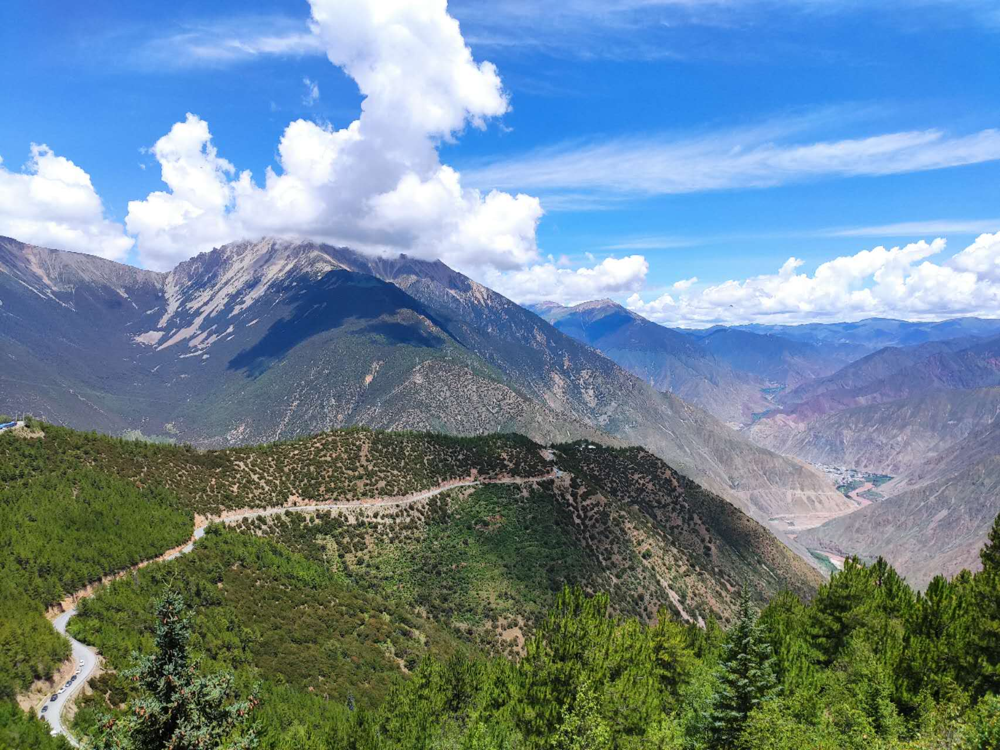

> 图：觉巴山垭口远眺如美镇（澜沧江峡谷，不过隧道开通后就看不到了）

### Day10（半天）左贡-邦达

天气：中午出发时多云转晴，后边多云转阴，快到邦达开始小雨。

左贡-邦达：起伏上坡（多数坡度 3-4%，最大坡度 7-8%），路面有一部分颠簸，有少数几个可能翻车的大坑；路上村子/镇子比较多，可以补给；路过 1 条昌格拉山隧道，缓上、有灯、路况好；刚出左贡不远处可以看到山羊，路上还遇到了两头牛犊子打闹。

骑友：路上在一个超市门口遇到 3 个休闲骑友（一个成都大学生、一个重庆高四学生、一个河北过来的哥们），送了他们维 C 泡腾片，和他们一路走一路聊，传授了他们爬坡要锁前叉的技巧，给他们体验了我的公路车，同时学会了用卫生巾缠把带和垫坐垫的技巧；路过一个卫生间时，热情的藏民一家人还送了一个花圈给河北的哥们（小女孩一直夸他帅），然后大叔试了试他们的自行车（先试了我的公路车，发现不好操控）；傍晚在路上又遇到了洛克兄弟赞助车队，他们在邦达附近的草原藏民帐篷里游戏，晚上 7 点左右他们也到了 57 驿站，饭前有个哥们听说我昨天连着翻了觉巴山和东达山，还专门拿出手机采访了一段。

感受：由于昨天连翻两座山太累了，今天休息半天，午饭后出发，一路休闲骑。

住宿：由于周围住宿太贵（网上价格 270-340），订了 57 合作的鑫源酒店，独卫单间 200 一晚，包早晚餐（但好油），干净卫生，但没有WiFi+不太安静（靠近 318 路上，不过这个镇子所有住宿好像都在路边）。

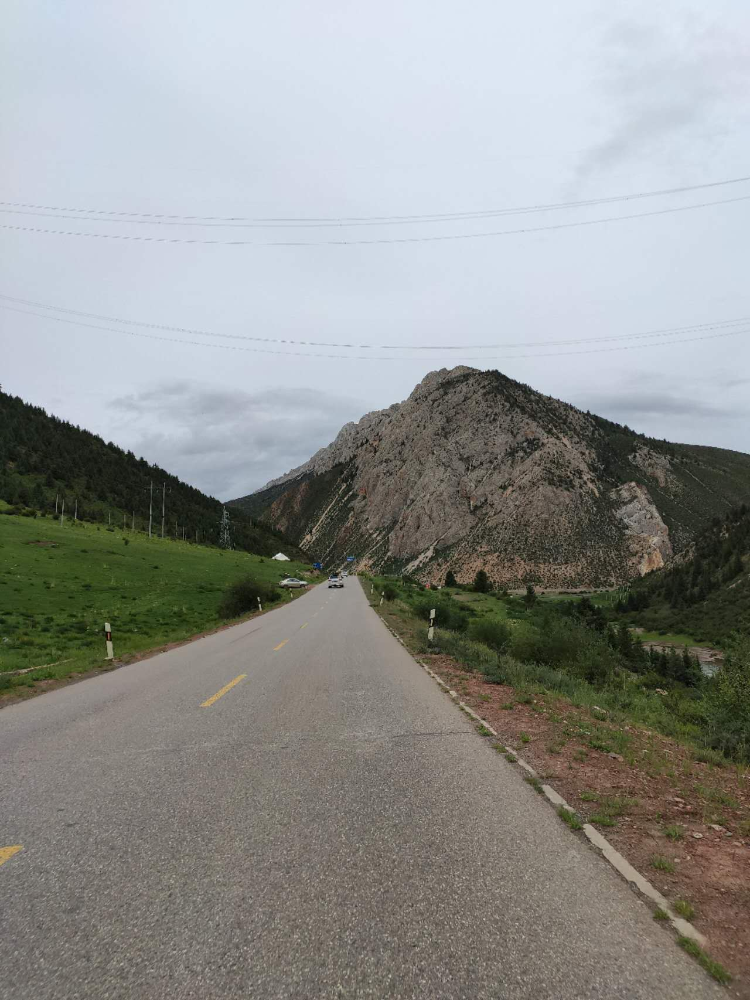

> 图：邦达镇附近的起伏路

### Day11 邦达-业拉山-怒江大桥-八宿-安久拉山-然乌

天气：邦达到业拉山垭口都是阴天+很冷，沿着怒江72拐往下越来越热（到了怒江大桥开始暴晒），快到安久拉山时开始下雨，后边雨越来越大，晚上到达然乌才停。

邦达-业拉山：整体坡度 4-5% 为主，有很多颠簸路段（早上骑完手麻了）+两段修路（单车道绕着走，全是泥/沙/石），路上无补给；遇到一个司机不打灯右转到观景台上，差点被撞翻，大家小心类似的右转车。

业拉山-怒江大桥：怒江72拐，集烂路之大成（地面开裂+路基塌陷+路面挖开+碎石细沙+落石+大坑+颠簸+烟尘滚滚），需要把速度控制在 25-30 左右（路面开裂和碎石细沙路段如果速度太低，缺少惯性，容易侧滑；但后边发现太快了撞到容易磨破外胎，导致鼓包爆胎）+不踩到大坑（需要和前车拉开距离观察）才不会翻车（控车和走线也很关键）；只路过一个怒江明洞，无灯但路面平整；持续颠簸导致右手变头拨片不回弹+里边有松动异响（之前下坡也有类似问题，用一段时间会自动恢复，波密车店老板诊断结论是变速线颠松了）；只遇到观景台堵车，其他地方比较顺畅。

怒江大桥-八宿-安久拉山：超长起伏缓上（建议关注总爬升判断剩余难度，另外后半程常年逆风），大部分路面除了颠簸还凑合（个别地方有挖开的烂路或大坑，八宿主干道修路导致全城都是土，还要注意八宿出口长下坡的减速带），从靠近八宿的位置开始车道变窄（汽车不能和自行车并排）；经过的部分村子/乡镇有补给（部分小卖部无人，部分地方联通没信号），垭口也有补给；在怒江大峡谷里遇到一个逆行超车，速度把控不好（即使大车让着他，也一直超不过大车），差点撞上；在八宿县城看到有牛吃纸箱，据说和我们吃压缩饼干是一个道理。

安久拉山-然乌：平路+缓下（如果逆风会抵消下坡）+偶尔起伏，刚开始路况还行，后边有多处砂石路，快到镇子前的棚洞路段颠簸+坑洼非常严重（路况和72拐类似，在此解锁扎胎成就）。

骑友：早上出发时我在心旅驿站打气，遇到几个骑友每人 30 直接搭车到业拉山垭口（后边在怒江72拐半路又和他们相遇了，搭车的确快）；爬业拉山一半时，遇到 3 个广东骑友，有个哥们还穿着拖鞋骑车（当时气温也就十几度+体感十度以下），虽然后边和他们同时爬完但没有什么交流；由于我是中午 2 点半到的八宿、8 点半到的安久拉山，按照这个节奏，路上几乎没有遇到什么骑友；快到然乌时下着大雨，见到一位骑友丢下自行车和行李，坐上一辆汽车走了（不知道第二天还会不会回来取）；在然乌的棚洞颠簸路段，遇到一个热心摩友帮忙打光（当时我的手电筒颠簸后朝上照射，导致地面光线不够，所以他看到后过来帮忙；另外他还在半路上帮助了一位肇事逃逸的受害者摩友），不过听说我预订的酒店比较远，就没和我一起住；刚和前一位摩友告别，就发现后轮扎胎了，当时恰好停在摩旅驿站旁边，于是来了 3 位贵州来的摩友协助我换胎（虽然他的脚踩打气筒没帮上忙，但是人很热心）。

感受：下 72 拐花了不少时间，导致后边行程比较赶（不建议大家参考今天的行程）；今天本来已经很累了，再加上夜骑+雨骑+扎胎，导致很晚才到达酒店（要是可以免费退，我就直接住在吉达乡了，第二天再爬这漫长的起伏路），明天修整半天晚点出发。

住宿：然乌整体房间比较贵，不小心选了个城郊的景区驿站（虽然偏，但不至于像如美那家没有吃的和补给），独卫标间 144 一晚，整体还算干净，老板很热心（电话和他说晚上下雨晚点到，于是他在门口等着给我做饭），但邻着 318 晚上可以听到过车的声音。

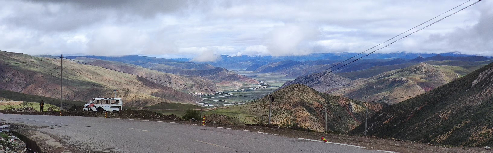

> 图：业拉山垭口远眺邦达草原

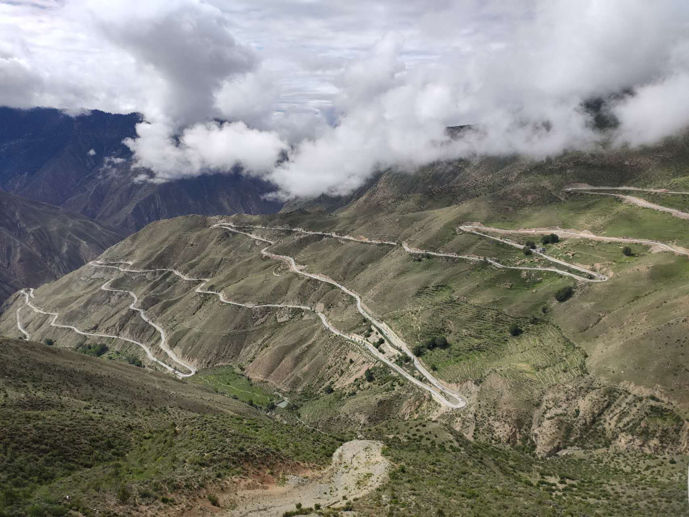

> 图：怒江72拐（观景台拍到的只是一小部分，整条路非常长）

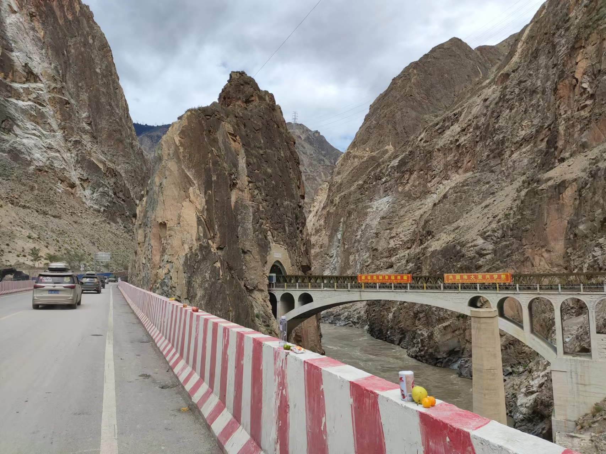

> 图：怒江大桥（旁边是老桥和一个桥墩，这里沉睡着许多烈士；周围壁立千仞，刀削斧劈一般，要注意落石）

### Day12（半天）然乌-波密

天气：中午出门时然乌附近阵雨（云雾缭绕），后边开始转阴，全程逆风（沿着河道/山谷吹）。

然乌-波密：起伏缓下（偶尔有一小段较短的上坡），路况还行（偶尔有大坑+烂路，很多颠簸路段，有一段涉水路），路过很多村子/饭店可以补给（玉普乡附近路边川菜饭店较多，松宗镇食宿选择多一点）；路上风景很棒（湖泊+河道+冰川+森林，大部分路程穿梭在帕隆藏布江峡谷之中），还会路过一段网红涉水路（虽然旁边已经修了不涉水的路，但很多汽车仍会开到水里玩），但由于今天多云没看到米堆冰川（就在 318 沿途）；晚上有很多人在波密县城广场上跳舞（p.s. 广场旁边有家蜜雪冰城）。

骑友：中午正准备出发，又遇到了昨天心旅搭车的骑友们（早上从八宿出发，中午到达然乌，的确挺快的，不知道有没有搭车），看到我后也进了店里吃午饭（不过我已吃完就先走了）；刚开始遇到的骑友比较少，后边快到波密时能零星遇到几个骑友；大家都喜欢慢慢走欣赏这一路的风景，尤其是停下拍照波密附近壮观的冰川；晚上到达民宿时，发现手电筒没电了（第二天看到头包上烫坏了一块，估计是自己打开了），于是借了隔壁摩友的充电线充电（和他们闲聊了一会，有个哥们说我一天肯定到不了鲁朗，第二天早上近 9 点才出门时他又说了一次，结果还真被他说中了）。

助人：帮助一个骑友（大学生，6 月份还专门坐巴士走过一趟 318 探路，计划了详细的攻略后父母才放心让他出门）换内胎（在换内胎前提醒他把扎破外胎的石子先取出来，再借给他打气筒打气），晚上他请客吃清真菜（烤羊排+炒牛肉+青菜）。

感受：后边开始“一强一弱”的恢复策略，今天骑半天休半天，明天再战。

住宿：挑了个最便宜的扎西康萨民宿，独卫单间 100 一晚，虽然房间大、位置还行（出门几百米有商店），但卫生状况不太好（卫生间很破+屋里苍蝇很多），而且又没有 WiFi，先将就一晚吧（半夜竟然有人聊天/唱歌，太难了）。

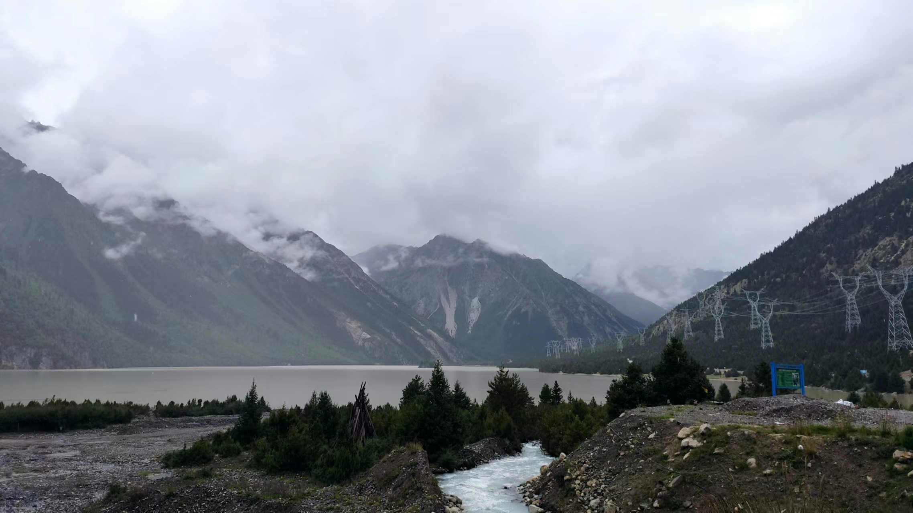

> 图：然乌湖（“天空滑下的最后一滴眼泪”，周围诸多冰川融化汇成此湖；据说夏天湖水一直很浑，到了冬天才能看到明镜一般的美景）

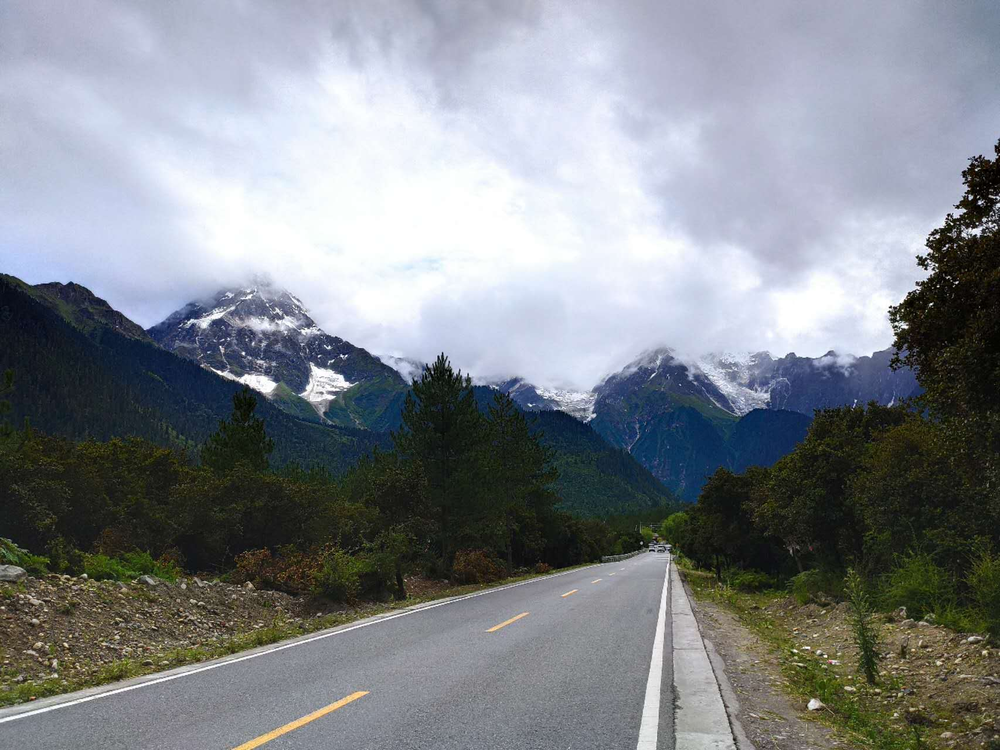

> 图：波密县附近的冰川（据骑友说 6 月份更壮观，现在融化了很多）

### Day13 波密-通麦-拉月

天气：波密附近阴冷（云雾缭绕），到通麦半程时渐热，最后快到拉月时开始小雨。

波密-通麦：起伏缓下，路况一般也有坑，路上不太需要补给（会路过乡村）；刚出波密的路上风景很好，早上云雾缭绕宛如仙境；经过 1 个 102隧道，是个短缓上（灯光充足，但里边颠簸+出口有坑）；从波密开始，路上能偶尔看到有藏民一路磕头走到拉萨。

通麦-拉月：排龙前起伏缓下，排龙后开始缓上，路况一般也有坑，路上没有补给；路上有 4 个隧道（光线充足+路况很好），飞石崖、小老虎嘴、帕隆1号、帕隆2号（有的缓上，有的缓下，记不清了）；路上会有排龙温泉、拉月温泉，经常能看到几匹马在路上走；曾经是“通麦天险”，位于亚洲第二大泥石流群，但已天堑变通途（桥+隧道）。

胎压：早上出发时发现外胎鼓包（可能是高胎压过大坑砸坏的），犹豫了一下没去车店换新外胎（刚开始以为是地面有规律的不平整导致的）；中午刚路过 318 的 4000km 不远处，就砰的一声爆胎了（白白浪费了一条在然乌新换的内胎）；现在觉得胎压还是留有余地好一些，至少掉进坑里不至于损坏外胎（有足够的形变缓冲）。

队友：刚出门遇到的骑友比较多（其中有轻装上阵的两辆公路车，问了是找驿站驼包的），但由于一路上电话/消息比较多，先超了他们再被他们超过（最后和 [@真不炫了](https://www.xiaohongshu.com/user/profile/5f9a9c96000000000101f076) 节奏比较近，聊了一段），还遇到了前天和昨天遇到的在心旅搭车的一位骑友（他昨天从八宿直接到了波密，和其他人分开了）；在藏王洞看到一辆 bianchi 公路车（锁踏+碳坐垫），应该是一路上见过最贵的车了；中午到达 318 的 4000km 打卡处，看到了 5~6 辆公路车（应该是 318 上看到公路车数量最多的一天了）；换胎时遇到了之前在雅安见过的骑友，由于节奏和我比较接近，最后 5 天和他一起吃住、一起骑到拉萨，身体素质好（当兵时跑步成绩很好，尽管平时几乎不骑车，但骑行能力也很强），动手能力也很强（骑 318 的公路车就是他亲手装的，整车只花了 3000 多，国产碳架+国产铝轮+国产手变+无前拨的双盘系统+sora 后拨+105 夹器，每次都需要手动切换大小牙盘），不过最近感冒了（好在能应付后续几天的低强度骑行）。

助人：帮助一位骑友换内胎+加固尾钩螺丝（说是要请我们吃饭，但最后到了拉萨也没请成功）；他们两人（大学生）下午还在拉月，晚上要赶到鲁朗（由于最近几天一直夜骑，导致早上出发比较晚，最后恶性循环）。

感受：计划赶不上变化（先是自己爆胎，再是帮人换胎），下午感觉到达鲁朗无望（还有很多爬升）；今天只爬了 1200m，意味着明天需要爬升 2000m+ 才能到达林芝。加油，快到拉萨了。

住宿：因为我们要洗澡洗衣服，选了入乡酒店的双人标间 160 一晚（去店里和老板讲价，如果在店里吃晚饭就给双重优惠，200 一锅的石锅鸡汤的确很鲜甜），是目前一路上住宿条件最好的酒店（卫生、安静、有WiFi、独卫、热水充足）。

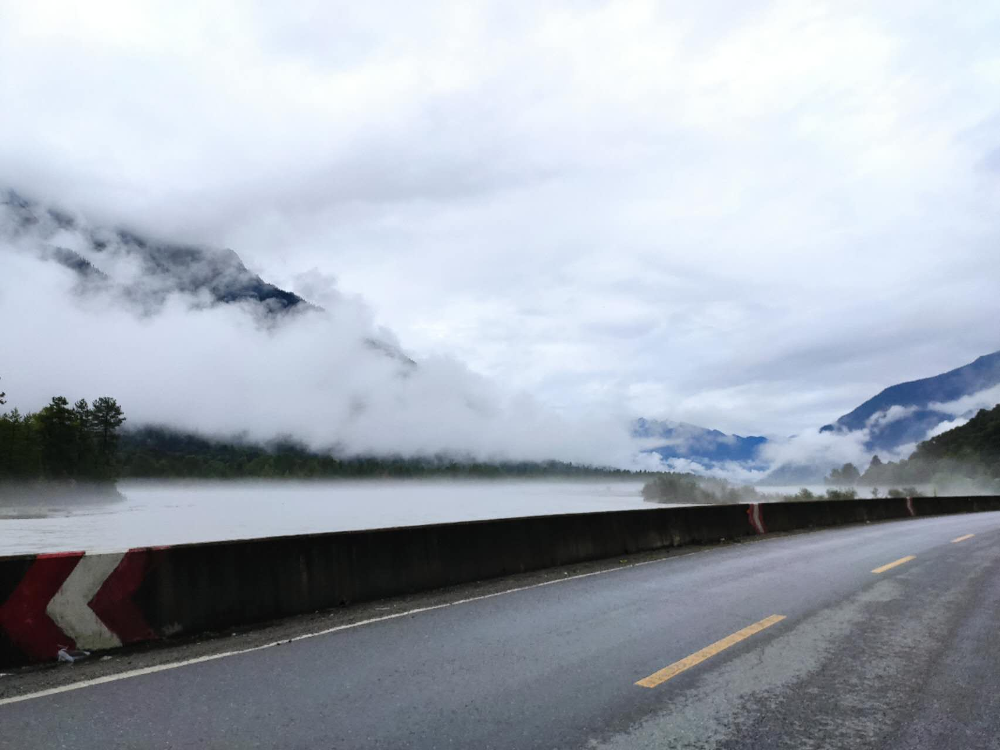

> 图：帕隆藏布江（雅鲁藏布江的最大支流）上的仙境（水汽充沛，常年云雾缭绕）

### Day14 拉月-鲁朗-色季拉山-林芝镇-林芝市

天气：出发后时阴（云雾缭绕）时晴（有点晒），从鲁朗到色季拉山路上突然下起小雨，开始放坡后暴雨+冰雹（山上最冷 7 度），到达林芝镇后变成小雨。

胎压：昨天新换的后轮外胎是 28c 的，手动打气只打到了 80psi 左右，今天早上用力打到了 90psi 就上不去了（不知道是打气筒，还是新外胎，或者旧内胎的问题）。

拉月-鲁朗：起伏缓上，路况一般偶尔有坑，快到鲁朗时才有加油站补给；鲁朗小镇被誉为“小瑞士”，虽然是个商业化旅游区，但风景的确不错，有骑马/射箭的服务；鲁朗一路上有很多石锅鸡（问了一家小炒店竟然不做炒菜），所以我们走到快离开鲁朗的地方吃午饭（在骑马/射箭区，选择多一些）。

鲁朗-色季拉山：一路上坡（坡度以 4-5% 为主，有一些 6-7%），路况一般偶尔有坑，路上无补给；如果天气好，可以看到南迦巴瓦峰。

色季拉山-林芝镇：刚开始陡下，后边大部分缓下，路况不太好（刚开始非常颠簸+偶尔有坑，后边稍好一点点）；由于路上下暴雨+冰雹，而且堵车（很多司机喜欢超车再到前面减速，而圈刹制动距离较远，需要频繁刹车保持车距，放坡很不愉快），导致刹车片又磨损了一截（晚上紧了紧刹车线，手感恢复了一些）。

林芝镇-林芝市：起伏缓下，路况稍好但也有坑，路上有补给但不太需要；林芝被群山环绕，有种云雾缭绕的感觉，风景很棒；林芝市中心实际上是八一镇，好像现在改成了巴宜区。

骑友：由于我们从拉月出发（多数人从鲁朗出发），所以一路上遇到的骑友不多，但到了驿站后发现很多骑友都已经入住了；色季拉山放坡时有辆警车停在 U 型弯旁，据说有位骑友在这里摔车（听说送到林芝医院不能很好的治疗，建议直接送到拉萨），警察在路上提醒各位骑友雨天下坡要慢点；到驿站后借了一位骑友的小米充气宝，终于把后轮胎压达到了 100psi（外胎标最高 110psi，和 25c 不一样）。

感受：刚开始今天行程比较顺利，直到放坡时下暴雨+冰雹，导致衣服袖口湿了+鞋子袜子进水（迪卡侬雨裤魔术贴附近有缝隙+被大盘划破了一个小口，顶不住暴雨的强度；不过冲锋衣还不错，透气+防水），最后湿着走到林芝找驿站住下，然后赶快洗澡换衣服，晚上又吃了烤肉自助（有很多合成肉，但我挑了不少真肉），舒服了很多；下雨放坡建议等汽车车流过了再放，不然得频繁刹车增加间距（汽车总喜欢超车然后再到自行车前面减速，而自行车容易刹不住追尾）；后续和队友开始休闲骑，暂不压缩行程了（最后几天的感触是骑一天少一天，想着放慢脚步，好好珍惜每一天）。

住宿：我们选择了 57 的 OYO渡口客栈双人间 120 一晚，位于市中心（吃饭很方便，其他驿站都很偏远），安静+干净+有WiFi，不过房间是公共卫生间（独卫的房间放不下自行车，好在房间离卫生间不远），晚上为了不弄脏房间我还把车擦了擦（队友直接拿水冲），重新上了链条油。

> 图：色季拉山远眺的南迦巴瓦峰（“中国最美山峰”，但因经常云雾缭绕而“十人九不遇”）

### Day15 林芝-工布江达

天气：开局下雨（据说林芝最近一直下雨，没晴过），后边阴、晴、小雨交替（小雨懒得拿雨衣了，一会就吹干了），好在没有下大雨。

林芝-工布江达：起伏缓上（难度比之前低很多），路况比之前好很多（除了两段弯道水泥路有点颠簸，还有一小段修路改道的烂路），虽然路窄但车少（很多汽车走的是旁边免费的林拉高速，注意自行车不能上高速）；路上很多小卖部/藏餐茶馆都可以补给，中午可以在百巴镇、巴河镇吃午饭；路上有树莓，看到有骑友在吃，我也尝了一个（味道很淡）；今天路上可以看到很多黑色小猪，不过靠近拍照会躲起来；攻略说路上有猴子，但并没有看到（本想买点东西投喂，现在庆幸没买，不让只能投喂自己了）。

骑友：可能因为今天出门有点晚+大家的骑行速度差不多，一路上遇到的骑友不多；中午看到一家藏餐厅外边停了很多自行车，我们也进去了，后来骑友直接把餐厅坐满了，结果排队好久（如果赶时间，建议去人少的餐厅）；傍晚问了很多藏餐厅只提供小吃/快餐（没有纯肉），于是挑了家清真烧烤，不知道是不是因为门口停了我们的自行车，不一会又进来了一堆骑友（p.s. 店门口停自行车看起来是个引流的好方法）。

车子：早上发现前轮外胎也有点变形（把胎压从 100psi+ 降到 80psi 左右，但愿后续路况好一些，能坚持到拉萨），中午队友还帮忙微调了一下刹车皮位置（之前巴塘技师装的偏了，导致轮圈有一小部分没有接触刹车）。

感受：今天睡到 10 点自然醒（昨晚吃烤肉自助吃太晚了），一路休闲骑（路上没车骑的很舒坦），傍晚到了工布江达于是把县城逛了个遍，喝了蜜雪冰城。

住宿：选择了心旅的鸿图宾馆，无窗独卫双人间 120 一晚（57 电话里说没房间了，但有的骑友后边还是订到了），环境还行，但离县城比较远（57 也是，需要过桥到河对岸）。

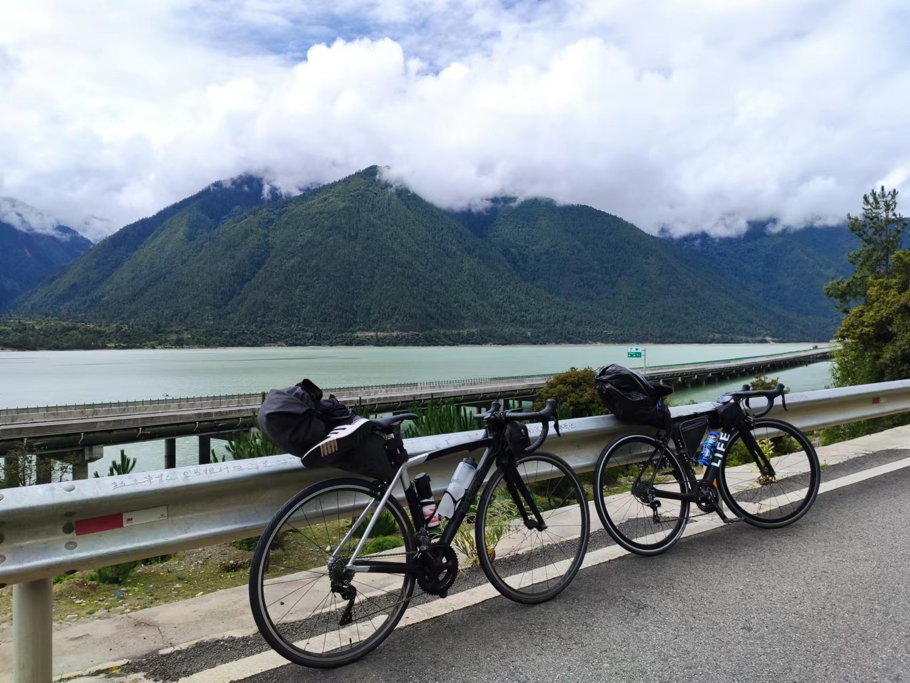

> 图：尼洋河上的林拉高速（自行车不能上高速观景，有点可惜）

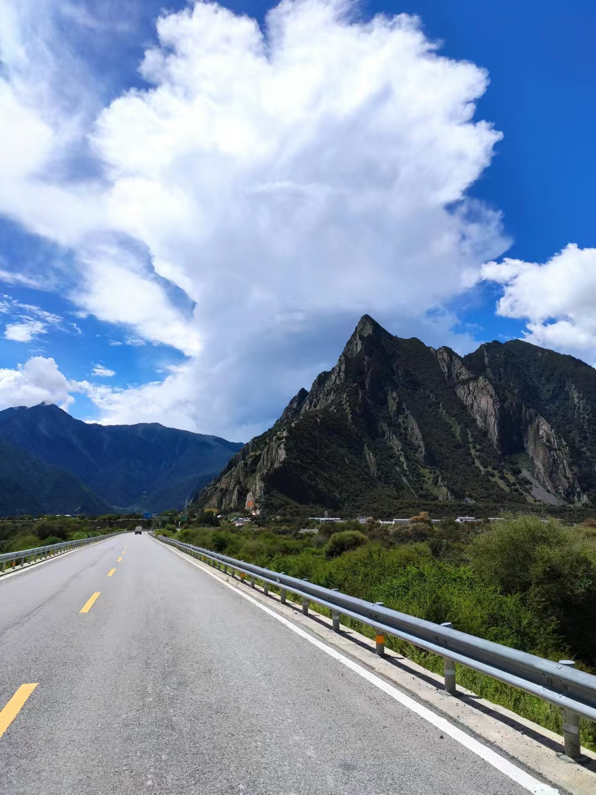

> 图：伫立在巴河镇旁的高山和天空中巨大的云朵

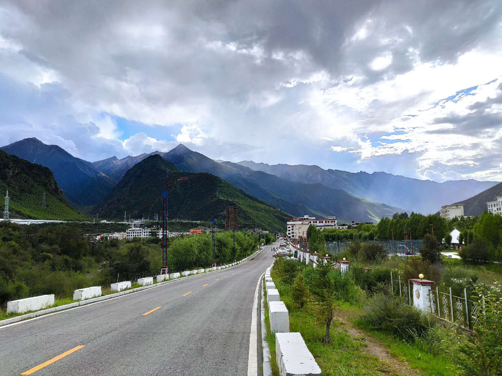

> 图：工布江达县城（阳光透过云层洒在山谷上）

### Day16 工布江达-松多

天气：多云转晴（有点晒），金达镇和松多之间有阵雨（刚拿出雨衣就停的那种）。

工布江达-松多：起伏缓上（不过有时候有 5-6% 的坡，和安久拉山类似的起伏上坡路），路窄但车少（空气好），路况还不错（除了偶尔有小坑+尼比桥修路改道+另一段修路；这回为了防止前轮爆胎，老实下来推车了）；开始路过的景区可以补给，金达镇、下巴塘村都可以吃午饭，注意很多村子没有小卖部，到了松多村更是荒凉（林拉高速开通后，走这条路的人少了很多，很多店都关门了）；路上有很多流浪狗，还有很多牛屎饼摞起来的小山。

骑友：今天又是 9 点半出门，路上偶尔能遇到一些骑友；中午在金达镇的一家清真面馆看到很多骑友，本想坐下吃午饭，有个骑友私下提醒说味道一般+分量少，于是我们转到了另一家；后来在路上遇到了小红书上交流的骑友（[@安静地过完余生](https://www.xiaohongshu.com/user/profile/60019aac0000000001007288)，今天第 14 天从巴河镇出发，骑的是 specialized 的 diverge gravel），后边他没怎么休息就先到了松多村（把条件最好的一间订了）。

感受：早上不小心把小腿拉伤了，只能靠其他肌肉代偿（膝盖周围肌肉有点酸）；昨天速度计新换了电池仍没反应，早上一看发现里边烧坏了（但愿后边没有隧道）；今天感觉和之前爬安久拉山一样漫长一样累，晚上好好休息，明天早点去拉萨。

住宿：松多除了藏民家住宿（床位 25-30，藏民建议往回走去温泉洗澡），只有一家杨门客栈酒店（57 和心旅都在这里，垄断），没有洗澡的独卫标间 180 一晚（带洗澡的 200，没厕所的 160），是目前住宿条件最差的酒店 —— 不太干净+设施破旧+隔音很差（是一路上性价比最低的一晚），公共浴室需要走下楼而且没有花洒（只有 2 个公共浴室，都非常简陋），先将就一晚明天到拉萨再好好修整吧。

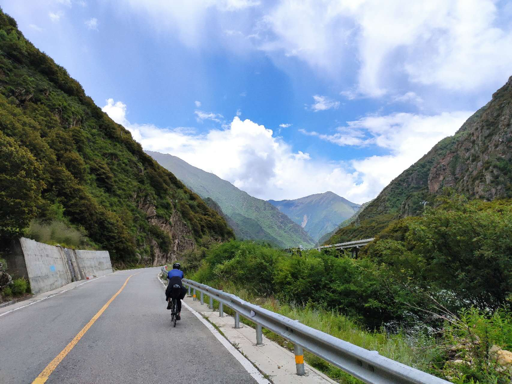

> 图：金达镇附近的风景

### Day17 松多-米拉山-日多-拉萨

天气：早上松多只有十几度（可能因为只吃了面包/牛奶，爬坡感觉很冷），爬到米拉山垭口只有 7 度，放坡到日多后稍微回温，到拉萨路上逐渐变热（拉萨今天超级热+晒，晚上却下起了雨，据说最近都是白天暴晒+晚上下雨）。

松多-米拉山：上坡（刚开始缓坡，后边有一段坡度 4-5% 为主、最大 5-6% 的陡坡），路况非常好，到垭口前无补给；如果早上爬，会比较冷。

米拉山-日多：下坡（刚开始陡下一小段，后边全是缓下，速度起不来），路况还行（稍有颠簸，但没有坑），逆风（而且是冷风），快到日多前才有村子补给，日多乡可以吃午饭（在藏民家喝了 30 一碗的牛肉汤，不过肉倒是挺多的）。

日多-拉萨：刚开始起伏缓下+平路+拉萨市区起伏缓下，路况还行（墨竹工卡前后各有一段涉水路，墨竹工卡出去不远处有几段烂路，达孜到拉萨的环城路有小石子；不足之处是离拉萨越来越近，路上的车也越来越多），刚出日多山里有一小段逆风；路上扎西岗村（离墨竹工卡很近）、墨竹工卡（318 路上就有蜜雪冰城）、往后的几个村子都有补给，从达孜往后路上都不缺补给了；晚上吃了牦牛肉火锅自助（性价比很高），结束后下雨打不到车，于是体验了人力三轮车（大腿功率起码 250w+，需要砍价否则很贵）。

骑友：本以为我们 7 点半出门算早的，结果爬坡路上遇到了不少更早出发的骑友；在坡上遇到了前两天同路程的骑友（[@汉娜](https://www.xiaohongshu.com/user/profile/54812a8fd6e4a96170301f86)），在垭口又遇到了昨天骑 diverge 的骑友（[@安静地过完余生](https://www.xiaohongshu.com/user/profile/60019aac0000000001007288)）；由于我们在日多乡的藏民家吃了午饭，往后走又遇到了一个前两天也是同路程的一米九骑友（骑的是 marin 的 four corners gravel），于是和他一起开起了 3 人小火车（时速 30 巡航，走了半个多小时，到达墨竹工卡县城和他的队友汇合后，就留下停午饭了）；后边路上还遇到了两个山地车骑友，速度和我们差不多（25-30 巡航），平路追了半天也没追上（最后还是在爬坡的地方追上）；今天遇到的骑友也比较多，直到晚上还能看到有人往布达拉宫骑。

感受：今天花两小时咬牙爬完米拉山，后边的确没什么难度了；尽管小腿拉伤还没恢复，但想着是最后一天，放开骑吧（如果平路时速 25-30 巡航，早点出发下午就可以到布达拉宫）。

住宿：拉萨住宿也不便宜，找了个差不多最便宜的星月客栈，单间 118 一晚，虽然没有独卫（热水比雨还小）+热水很小+苍蝇很多，但有窗、有 WiFi，先将就两晚吧。

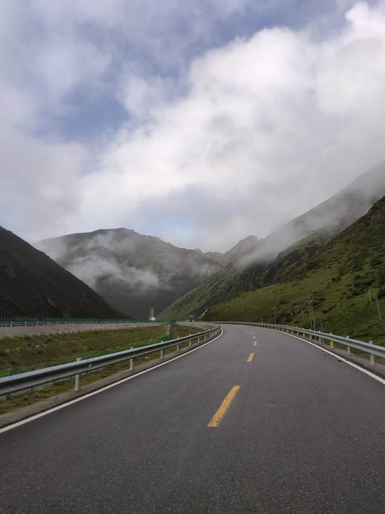

> 图：米拉山半路的风景（日出不久，云雾缭绕）

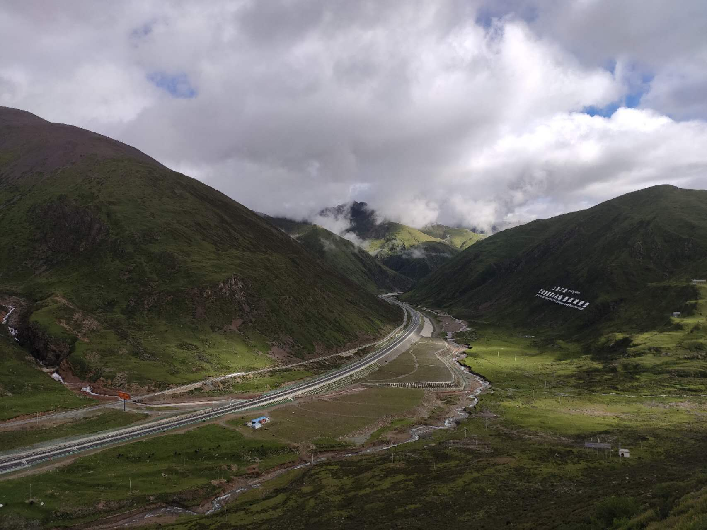

> 图：米拉山半路的风景（阳光透过云层照在河谷中）

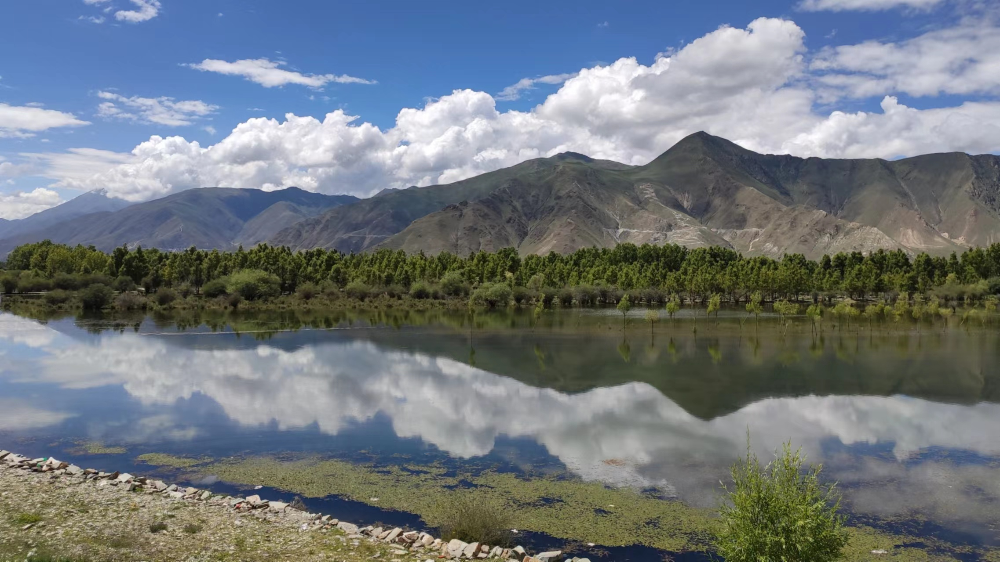

> 图：拉萨河上的湖光山色

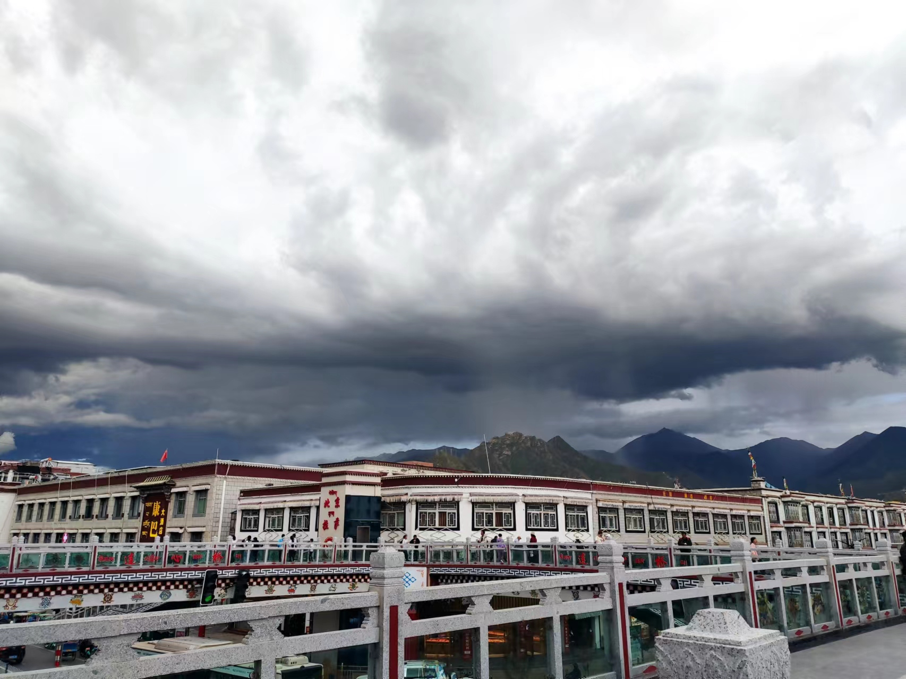

> 图：暴雨来临前的拉萨

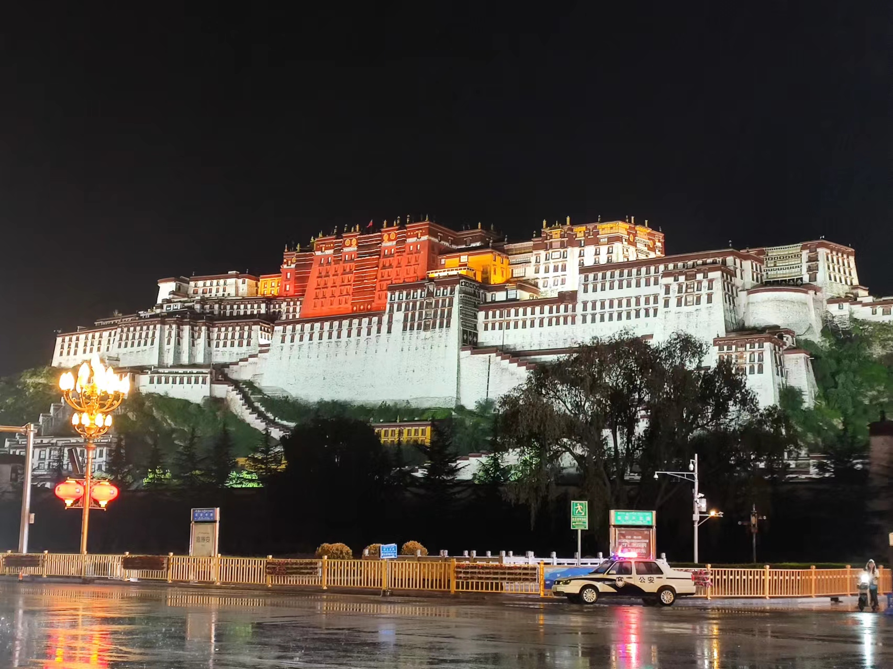

> 图：布达拉宫夜景（冒雨抓拍）

### Day18 拉萨

city walk（布达拉宫预约不上，没去）：

1. 拉萨博物馆（提前预约免费），目前有 4 个展（设计非常棒），非常值得一看（会对西藏历史和藏传佛教有了更深入的了解）。
2. 罗布林卡（一看门票 60 好贵），没进去。
3. 川藏公路纪念碑，远处打卡。
4. 千佛寺，在一座石山上有很多壁画（遇到落石，注意安全），非常震撼。
5. 功德林寺。
6. 关帝庙，在功德林寺山上。
7. 大昭寺，历史悠久的千年古寺（进入广场需要身份证、进入寺庙需要预约、现场买票 85，但管理混乱，看到几个导游插队）。
8. 策门林寺。
9. 喜德林寺（围起来了，可能在修）。
10. 小昭寺（师傅们这两天去林卡了，暂不开放）。
11. 扎基寺，供奉扎基拉姆（财神），香火很旺（尤其今天是周三）。
12. 色拉寺，拉萨三大寺之一，5 点才到所以辩经结束+都关门了（建议 2 点半过去参观，3 点到 5 点开始辩经；5 点前门票 30，5 点后只收 10 块钱），最后只参观了大殿外墙和部分僧舍。
13. 清真寺，6 点多刚好赶上礼拜。
14. 宗角禄康公园，可以看到布达拉宫背面。

感受：建议买张共享电动自行车的骑行卡，在市区里穿梭非常方便（打车堵、人力三轮车贵）；不过拉萨的交通状况和旅游管理一样混乱（北京东路常年堵车、八廓街转经筒一堆人堵着拍照），路上有很多人行乞（但很多藏民会给一些零钱），物价不便宜。

寄车：晚上在尘埃落定客栈把车子寄了（160 包邮，包装很仔细；电话咨询了最便宜的 150 包邮，但包装很马虎；其他几家仔细包装的都得 180 包邮），再骑电动车回八廓街附近吃尼泊尔餐。

返程：第二天坐机场大巴到贡嘎，然后从成都转机飞回北京（近期直飞一直原价 3260，转机只多了一两小时）；p.s. 回到北京后发现 水壶憋了、车前灯自己按开了（防水/气密性很好），需要记得放气。

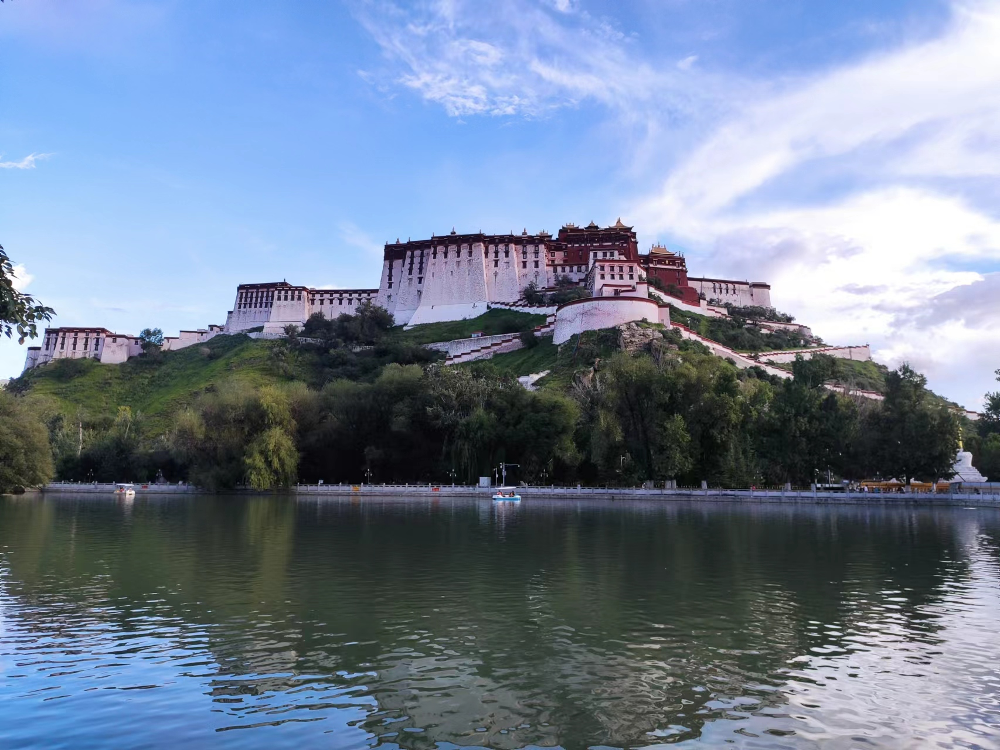

> 图：宗角禄康公园看到的布达拉宫背面

## 感悟

骑行 318 川藏线的意义是什么？

是完成一次高难度的长途骑行、磨砺身心，是一路上欣赏风景、感受自然、体验人文，还是帮助骑友、广结善缘？

也许没有答案，也许答案就在路上 ——

> 黑色的大地是我用身体量过来的，
> 
> 白色的云彩是我用手指数过来的，
> 
> 陡峭的山崖我像爬梯子一样攀上，
> 
> 平坦的草原我像读经书一样掀过。
> 
> —— 藏族民歌

已经结束的 318 之旅就像是一场长梦，醒来后回到了原本的生活里；但再次进入那梦境时，曾经用车轮丈量过的大地、路上遇到的朋友们、一切所见所闻所受所想，又是那么的熟悉、亲切。

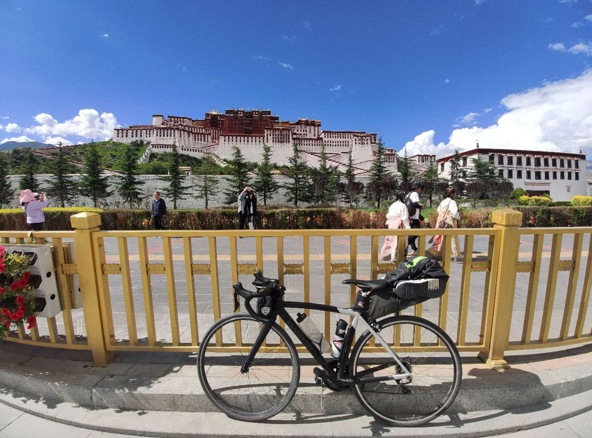
