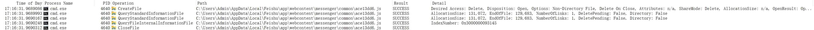
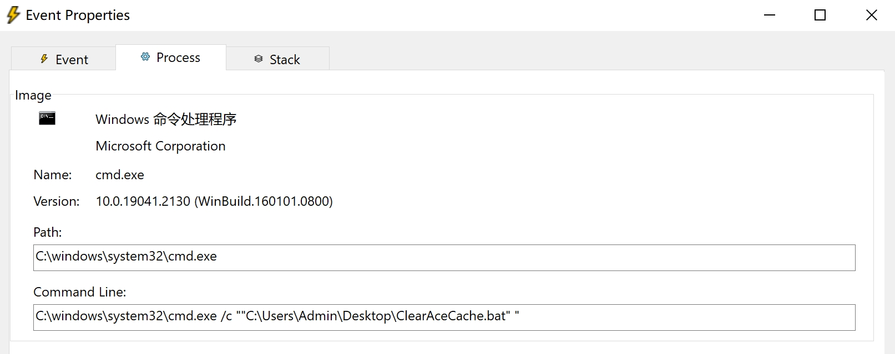
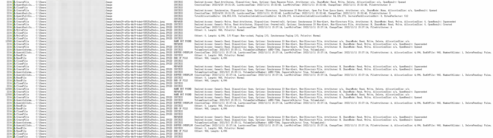
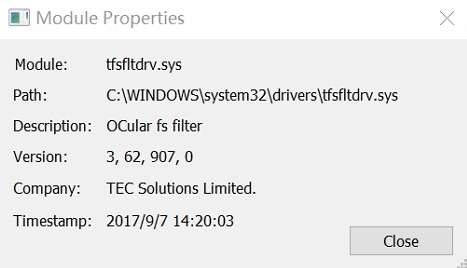
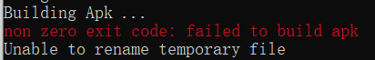
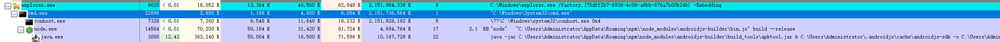
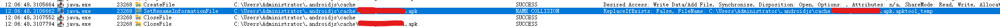
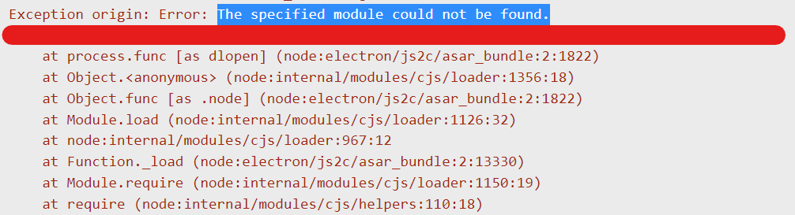
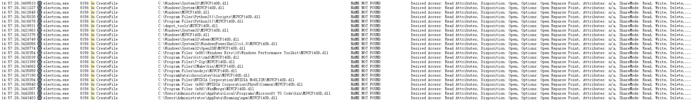
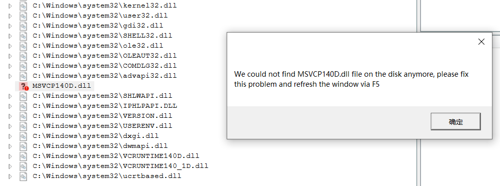

# Process Monitor 故事汇

> 2023/10/29
> 
> 汇总借助 Process Monitor 分析的典型案例（持续更新中）

## 介绍

[Process Monitor](https://en.wikipedia.org/wiki/Process_Monitor)（[下载链接](https://learn.microsoft.com/en-us/sysinternals/downloads/procmon)）是一款 Windows 平台的进程行为 **实时监控软件**，可以监控系统上所有的文件 I/O、注册表操作。借助其强大的事件筛选功能，可以快速定位出软件故障和恶意行为。


## 文件跟踪

监控特定文件、目录，定位访问的进程。

### 案例：文件被误删

**现象**

我们安装在 `%localappdata%` 目录下的程序出现功能缺失，查看安装目录后发现丢失了一个 `ace13dd6.js` 文件：


**分析**

借助 Process Monitor 监控上述文件，发现在某些情况下会有个 `cmd.exe` 进程删除这个文件：



查看进程命令行，定位到该脚本是 `ClearAceCache.bat`（用于清理 ACE 软件缓存）：



查看这个脚本，发现可疑的 `del` 命令会删除用户数据目录下 `ace` 开头的文件（且不会打印日志）：

``` bat
@echo off
...
del /f /s /q %USERPROFILE%\ace*.* >nul 2>nul
...
```

其中，`del /s` 会遍历目录删除文件（脚本缺陷），从而导致我们的 `ace13dd6.js` 文件被误删：

``` bat
C:\Windows>del /?
删除一个或多个文件。

DEL [/P] [/F] [/S] [/Q] [/A[[:]attributes]] names

  /S            删除所有子目录中的指定的文件。

如果命令扩展被启用，DEL 和 ERASE 更改如下:

/S 开关的显示句法会颠倒，即只显示已经
删除的文件，而不显示找不到的文件。
```

### 案例：文件被拦截

**现象**

放在某个特定目录下的 `.jpeg` 文件总是无法被我们的程序读取，查看目录后发现所有文件都被重命名成 `.jpeg.IPGSD` 后缀：


**分析**

借助 Process Monitor 监控上述目录，发现我们的 2216 进程调用 `CreateFile` 的结果时 `REPARSE`（参考 [](https://learn.microsoft.com/en-us/windows/win32/fileio/reparse-points)），而我们的 12588 进程调用 `CreateFile` 的结果是 `NAME NOT FOUND`：



打开调用栈，看到一个可疑的 `tfsfltdrv.sys` 驱动程序劫持了文件系统过滤器管理器的正常操作：


查看这个驱动程序的信息，发现他是 TEC Solutions Limited. 公司的杰作：



在网上搜了一下，这个模块属于 [IP-guard 安全软件](http://www.ip-guard.net/en/about.html)：


最后，通过停用上述安全软件，终于恢复正常了。

## 进程跟踪

监控特定进程，排查可疑行为。

### 案例：重命名失败

**现象**

执行某开源软件的 build 命令时提示 `Unable to rename temporary file` 从而导致失败：



反复重试后仍然无效，需要找到重命名失败的原因，才能解决问题。

**分析**

由于该软件在 build 时会启动多个子进程，我们可以借助 [Process Explorer](https://en.wikipedia.org/wiki/Process_Explorer)（[下载链接](https://learn.microsoft.com/en-us/sysinternals/downloads/process-explorer)）定位到是哪个进程出错的：



接着使用 Process Monitor 监控可疑进程 `java.exe` 的文件 I/O 行为，发现该进程结束前有一处从 `xxx.apk.apktool_tmp` 到 `xxx.apk` 的重命名失败操作：



最后，手动删除 `xxx.apk.apktool_tmp` 后重试即可恢复。

### 案例：DLL 依赖缺失

**现象**

运行某开源软件后闪退，查看报错日志发现是依赖的 DLL 模块加载失败导致的：



**分析**

使用 Process Monitor 监控对应进程的文件 I/O 行为，发现该进程加载出错前 `MSVCP140D.dll` 文件一直找不到：



在网上搜了一下，这个模块是 MSVC 调试版的一部分。最后，重新下载了软件的发行版，就可以正确运行了。

另外，可以使用 [Dependency Walker](https://www.dependencywalker.com/)（或重制版 [Dependencies](https://github.com/lucasg/Dependencies)）看到依赖的 DLL 能否正确加载：



## 写在最后

如果有什么问题，**欢迎交流**。😄

Delivered under MIT License &copy; 2023, BOT Man
