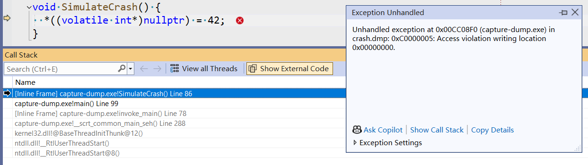
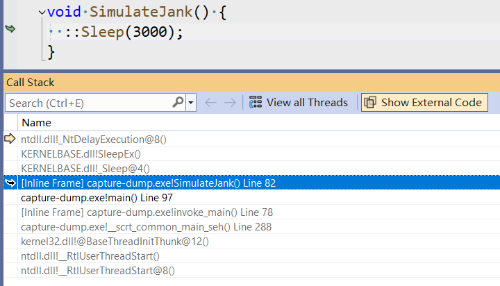

# Windows 不依赖 Dump 解析调用栈的方案

> 2025/2/4
> 
> 道阻且长，不如另辟蹊径。

本文提供了一种 Windows 平台上解析用户崩溃、卡顿现场调用栈的通用方案 —— 相对于基于解析 Dump 的传统方案：

1. 一方面，后台无需部署 Windows 环境（部署成本低）；
2. 另一方面，单次解析速度更快（近期实践中，从 ~3min 降低到 ~1s）。

[TOC]

## 背景

客户端软件往往会因为各种自身缺陷（例如空指针、死锁）或外部环境影响（例如安全软件注入、拦截），导致崩溃、卡顿/卡死等问题。

为了更好的排查此类问题，往往需要先在“案发现场”取证，然后上传到软件后台服务器，最后将问题分类聚合。

以 Windows 平台为例，最常见的方案是基于 Dump 的方案：

1. 在崩溃、卡顿现场，保存进程的 Dump（相当于是一张快照，包含问题发生时的状态）；
2. 上传 Dump 文件到后台，使用 Windbg 等工具解析 Dump 文件（此类软件一般只能在 Windows 平台上运行），提取包含的状态信息（其中，最关键的是崩溃、卡顿线程的调用栈）；
3. 对调用栈进行清洗（一般去掉系统、驱动相关模块的栈帧，只保留软件自身模块的栈帧），再进行聚合，最后找到出现次数最多的调用栈（即头部问题）。

### 捕获 Dump

[capture-dump.cc](Parse-Stack-Without-Dump-on-Windows/capture-dump.cc) 展示了如何在崩溃、卡顿时捕获 Dump：

1. 崩溃处理：
  - 通过 `SetUnhandledExceptionFilter` 设置崩溃处理回调函数（当崩溃发生时，系统会调用我们注册的回调函数）；
  - 在回调函数内使用系统传入的 `EXCEPTION_POINTERS`（崩溃现场上下文）调用 `MiniDumpWriteDump` 写入 Dump 文件。
2. 卡顿处理：
  - 当检测到卡顿发生时，先通过 `SuspendThread` 挂起发生卡顿的线程（否则关注的线程仍会继续运行，导致捕获到的线程状态错乱），待写完 Dump 文件后再通过 `ResumeThread` 恢复该线程（否则线程将被永远挂起）；
  - 类似崩溃处理的流程，再使用 `MiniDumpWriteDump` 写入 Dump 文件。
3. 注意事项：
  - 由于用到的 `DbgHelp` 系统模块内部并不是线程安全的，需要借助互斥锁，避免多线程同时调用 `MiniDumpWriteDump` 函数。

### 解析 Dump

将 [capture-dump.cc](Parse-Stack-Without-Dump-on-Windows/capture-dump.cc) 编译运行后，发现当前目录下生成了 `crash.dmp` 和 `jank.dmp` 文件，分别对应崩溃、卡顿现场 Dump。

使用 Visual Studio 打开（关联 pdb 符号后，自动匹配到代码）：





从 Dump 中的调用栈可以看出：

1. 崩溃发生在 `SimulateCrash` 函数中的空指针访问；
2. 卡顿发生在 `SimulateJank` 函数中的 `Sleep` 调用。

### 缺点

尽管 Dump 文件包含了丰富的信息（不仅是发生问题线程的调用栈，还包含了变量状态、寄存器/内存状态、其他线程调用栈等信息），但对于较大规模的软件来说，解析单个 Dump 文件往往需要花费数分钟之久 —— 如果 Dump 文件数量较多，就需要消耗大量的计算资源。

另外，对于很多缺乏 Windows 基建与经验的团队和公司来说，开发一套 Dump 文件解析系统的成本“很高”（所以，这些团队和公司往往不愿意投入人力开发 PC 基建）。

因此，如果有一个方案不依赖 Dump 就能实现崩溃、卡顿现场的捕获和解析，将能克服上述困难。

## 方案

本文提供了一个另辟蹊径的思路：

1. 客户端本地解析调用栈，得到一组【模块+偏移量】格式的栈帧（由于本地没有 pdb 符号，无法直接解析出【原始函数名】—— 当然，商业软件的 pdb 文件不能放到客户端本地，否则用户可以根据符号文件，轻松的破解软件内部逻辑！），然后上传到后台；
2. 后台根据【模块+偏移量】和软件当前版本模块的 pdb 文件（一般先过滤掉系统模块的栈帧，只关注软件本身的模块），即可计算出每个栈帧对应的【原始函数名】；
3. 最后聚合、分析仅包含当前软件模块栈帧的调用栈。

### 捕获调用栈

[capture-stack.cc](Parse-Stack-Without-Dump-on-Windows/capture-stack.cc) 展示了如何在崩溃、卡顿时捕获一组【模块+偏移量】格式的栈帧：

1. 崩溃处理：
  - 在 `SetUnhandledExceptionFilter` 的处理回调函数内，使用系统传入的 `EXCEPTION_POINTERS` 作为起始栈帧，迭代调用 `StackWalk64` 遍历整个调用栈上的所有栈帧；
  - 对于每个栈帧，调用 `EnumerateLoadedModulesW64` 遍历进程内所有的模块（注意：代码中的实现是把所有模块信息缓存了下来），找到【`PC`/`IP` 寄存器值】对应的模块（即当前栈帧对应函数所属的模块），再用【`PC`/`IP` 寄存器值】减去【模块基地址】得到【栈帧对应函数相对于与所属模块的偏移量】，于是就得到了【模块+偏移量】格式的栈帧。
2. 卡顿处理：
  - 类似捕获 Dump 的方案，先挂起关注的线程（结束后再恢复）；
  - 再通过 `GetThreadContext` 获取当前线程状态，作为起始栈帧；
  - 类似崩溃处理的流程，最后迭代调用 `StackWalk64` 遍历调用栈。
3. 注意事项：
  - 调用 `StackWalk64` 前，必须先调用 `SymInitialize` 初始 DbgHelp 内部状态（否则会拿到完全错误的调用栈），程序退出前再调用 `SymCleanup` 清理；
  - 类似捕获 Dump 的方案，避免多线程同时调用 `StackWalk64`、`EnumerateLoadedModulesW64` 函数。

### 解析调用栈

将 [capture-stack.cc](Parse-Stack-Without-Dump-on-Windows/capture-stack.cc) 编译运行后，得到崩溃、卡顿现场对应的两组【模块+偏移量】格式的栈帧：

```
> Crash

capture-stack.exe!0xc155a
capture-stack.exe!0x51723
KERNEL32.DLL!0x200f9
ntdll.dll!0x67bbe
ntdll.dll!0x67b8e

> Jank

ntdll.dll!0x72e3c
KERNELBASE.dll!0x12791f
capture-stack.exe!0xc152d
capture-stack.exe!0x51723
KERNEL32.DLL!0x200f9
ntdll.dll!0x67bbe
ntdll.dll!0x67b8e
```

接下来，利用 pdbdump.exe（编译自 [pdbdump.c](https://gist.github.com/BOT-Man-JL/9206a62b067f4c3a84da57bd3ba04a97)，[备份](Parse-Stack-Without-Dump-on-Windows/pdbdump.c)；核心原理是通过 `SymEnumSymbols` 遍历所有符号）导出 pdb 包含的所有符号信息。

例如，下边的命令导出了 `capture-stack.exe` 对应的所有符号及起止位置（[capture-stack-symbols-inline.txt](Parse-Stack-Without-Dump-on-Windows/capture-stack-symbols-inline.txt)）：

```
pdbdump.exe -sa -csv capture-stack.pdb > capture-stack-symbols-inline.txt
```

从 [capture-stack-symbols-inline.txt](Parse-Stack-Without-Dump-on-Windows/capture-stack-symbols-inline.txt) 中，查找 `0x51723`、`0xc155a`、`0xc152d` 对应的符号信息（注意：pdbdump.exe 会在 0x400000 地址上导入所有模块，所以所有偏移量都需要减去 0x400000 才能得到相对于模块的实际偏移量）：

```
"451629",386,"SymTagFunction","__scrt_common_main_seh","D:\a\_work\1\s\src\vctools\crt\vcstartup\src\startup\exe_common.inl",236
"4c1440",364,"SymTagFunction","main","C:\Users\Administrator\Desktop\capture-stack.cc",155
```

由此得出，解析后的崩溃、卡顿调用栈中 `capture-stack.exe` 部分的【原始函数名】格式的栈帧均为：

```
capture-stack.exe!main
capture-stack.exe!__scrt_common_main_seh
```

不同于上文基于 Dump 解析出的调用栈，此处无法看到 `SimulateCrash`、`SimulateJank` 函数 —— 这便是此方案的局限性之一。

## 局限性

本文提出的预解析符号方案，虽然能解决大部分问题，但仍存在两个明显的局限性。

### 无法解析内联函数

问题原因：

- 对于内联函数 _(inline function)_ 而言，由于被调用的函数代码直接展开到了调用的位置上，不会形成一个单独的栈帧；
- 而 `StackWalk64` 在回溯栈帧时（客户端本地没有 pdb 符号的情况下），也无法直接根据当前【`PC`/`IP` 寄存器值】推断出是否正在执行被内联的函数代码，导致获取到的调用栈不包含内联函数。

针对上述例子，如果我们禁用内联（添加 `/Ob0` 编译参数）再编译运行，崩溃、卡顿的调用栈会多出一条 `0x11500`、`0x114fb`：

```
> Crash

capture-stack.exe!0x11500
capture-stack.exe!0x115d1
capture-stack.exe!0x4c113
KERNEL32.DLL!0x200f9
ntdll.dll!0x67bbe
ntdll.dll!0x67b8e

> Jank

ntdll.dll!0x72e3c
KERNELBASE.dll!0x12791f
capture-stack.exe!0x114fb
capture-stack.exe!0x115c4
capture-stack.exe!0x4c113
KERNEL32.DLL!0x200f9
ntdll.dll!0x67bbe
ntdll.dll!0x67b8e
```

使用 pdbdump 工具导出的 [capture-stack-symbols-noinline.txt](Parse-Stack-Without-Dump-on-Windows/capture-stack-symbols-noinline.txt) 也能找到对应的符号信息：

```
"4114f0",12,"SymTagFunction","SimulateJank","C:\Users\Administrator\Desktop\capture-stack.cc",148
"411500",11,"SymTagFunction","SimulateCrash","C:\Users\Administrator\Desktop\capture-stack.cc",152
"411510",226,"SymTagFunction","main","C:\Users\Administrator\Desktop\capture-stack.cc",156
"44c019",386,"SymTagFunction","__scrt_common_main_seh","D:\a\_work\1\s\src\vctools\crt\vcstartup\src\startup\exe_common.inl",236
```

对应的，解析后的崩溃、卡顿调用栈中 `capture-stack.exe` 部分的栈帧也变得更直观了：

```
> Crash

capture-stack.exe!SimulateCrash
capture-stack.exe!main
capture-stack.exe!__scrt_common_main_seh

> Jank

capture-stack.exe!SimulateJank
capture-stack.exe!main
capture-stack.exe!__scrt_common_main_seh
```

解决方案：

1. 禁用内联编译（例如添加 `/Ob0` 编译参数）—— 但会严重影响程序性能，一般不建议这么做；
2. pdbdump 工具改用 `SymEnumSymbolsEx` + `SYMENUM_OPTIONS_INLINE` 导出包含所有内联函数的符号信息，用于推导原始的调用栈 —— 本文未实践，**如果尝试可行，欢迎与我交流**。

### 无法解析所有模块

问题原因：

- 系统模块（例如上文调用栈中的 `KERNEL32.DLL`、`ntdll.dll`）的符号往往和用户实际使用的系统版本有关，另外有些模块（例如显卡驱动）的符号经常缺失，一般解析起来比较麻烦；
- 所以，本文的方案会过滤这些模块的栈帧，只关注软件本身的模块（但一般情况下也够用了）。

解决方案：

- 提前下载所有版本的系统、驱动模块的 pdb 文件，并导出所有符号信息；
- 再根据用户上报调用栈对应的系统、驱动版本，关联对应的符号。

## 写在最后

虽然本文提到的方案存在一定的局限性，但计算速度提升带来的收益非常明显。

另外，基于 Dump 的传统方案和本文基于栈帧的方案并不冲突，两者同时使用能更好的互补各自缺陷。

如果有什么问题，**欢迎交流**。😄

Delivered under MIT License &copy; 2025, BOT Man
