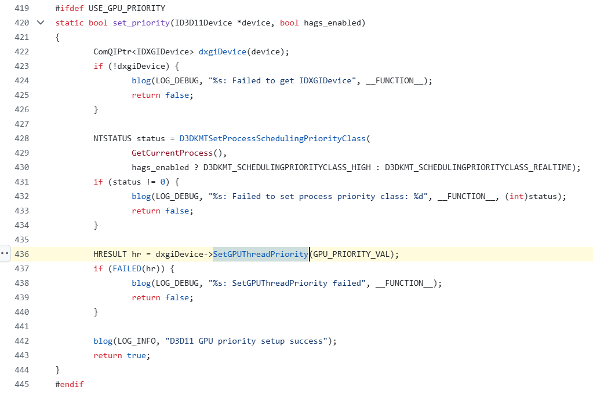
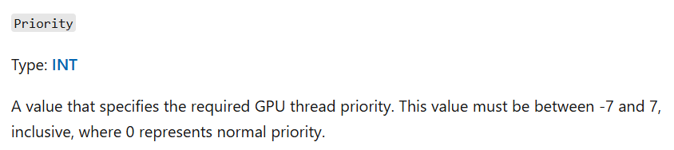

# 逆向小故事之“破解 OBS”

> 2025/01/11
> 
> 记录一则“一切皆可调试”的小故事

## 背景

一位朋友问我，能否帮忙破解一款“开源”软件。我很疑惑，开源软件不是已经公开了源码吗？为什么还需要破解？于是，他讲述了事情的来龙去脉：

- [OBS](https://obsproject.com/) 是一款开源直播软件，国内很多直播软件都会“借鉴” OBS 的代码；
- 然而他发现自己编译的 OBS 运行效果和官方编译的版本不一致 —— 直播某款新出的游戏时，官方的不会卡顿，而自己的直播画面会很卡；
- 通过分析日志，发现官方编译的版本在启动时多了一行可疑日志：

```
D3D11 GPU priority setup success
```

- 通过分析源码，发现官方编译的版本多了[这段代码](https://github.com/obsproject/obs-studio/blob/31.0.0/libobs-d3d11/d3d11-subsystem.cpp#L436)：



- 尝试照着写了这段代码，并根据微软官方文档设置 [`SetGPUThreadPriority`](https://learn.microsoft.com/en-us/windows/win32/api/dxgi/nf-dxgi-idxgidevice-setgputhreadpriority) 的参数，从 `-7` 到 `7` 都试了一遍，还是达不到 OBS 官方编译的效果：



- 无独有偶，[Github 上也有类似的反馈](https://github.com/obsproject/obs-studio/issues/5775#issuecomment-1352170152)，而 OBS 官方答复是“故意隐藏了具体传入的参数值”：


- 最终，他找到了我，希望找到这个“神秘参数”。

## 过程

准备工作：

- 下载并解压 [OBS 官方编译的 31.0.0 版本](https://github.com/obsproject/obs-studio/releases/download/31.0.0/OBS-Studio-31.0.0-Windows.zip)；
- 然后使用 Windbg 调试运行。

出师不利：

- 根据微软官方文档，这个需要调试的 `SetGPUThreadPriority` 函数属于 `dxgi.dll` 模块，所以我们可以找到他的入口，直接下断点调试即可（微软模块一般都有符号）；
- 然而事与愿违 —— 通过模糊匹配搜索，没有找到这个函数 —— 直接下断点的这条路走不通（后来发现实际执行的函数在另一个模块里，即使我们在 `dxgi.dll` 里的函数下断点，也不会走到，仍会无功而返）。

```
0:000> x dxgi!*SetGPUThreadPriority*
```

另辟蹊径：

- 好在我们有 OBS 的源码，将 `D3D11 GPU priority setup success` 这条关键日志作为突破口，使用内存搜索大法，找到这个日志字符串所在位置；

```
0:000> s -a 0 L?8000000000000000 "D3D11 GPU priority setup success"
00007ffd`6a682b48  44 33 44 31 31 20 47 50-55 20 70 72 69 6f 72 69  D3D11 GPU priori
```

- 由于这个字符串不属于程序入口的 `obs64.exe` 模块，而属于一个 `libobs-d3d11.dll` 模块，且该模块在启动后才会异步加载、加载后立即调用一次  `SetGPUThreadPriority` 函数、后续不会再次调用，
- 所以我们必须在 `libobs-d3d11.dll` 模块加载时设置断点 A，然后定位到日志字符串所在内存位置（内存位置每次可能不同），再设置内存断点 B；
- 当然，也可以通过字符串相对模块的偏移量设置内存断点，这样更通用；

```
0:000> bu libobs_d3d11!DllMain

... (break A) ...

0:000> s -a 0 L?8000000000000000 "D3D11 GPU priority setup success"
00007ffd`6a6e2b48  44 33 44 31 31 20 47 50-55 20 70 72 69 6f 72 69  D3D11 GPU priori

0:000> ba r1 00007ffd`6a6e2b48

... (break B) ...
```

- 命中断点后，逐个回溯调用栈上的函数，寻找 `d3d11-subsystem.cpp` 代码里对应的实际位置（这里比较简单，因为 `obs!blog` 明显对应源码中的 `blog` 调用），找到 `00007ffd6a6d108c` 对应着源码里的 `set_priority` 函数。

```
0:000> k
 # Child-SP          RetAddr               Call Site
00 00000001`6872c630 00007ffd`963c0bfb     ucrtbase!__crt_stdio_output::output_processor<char,__crt_stdio_output::string_output_adapter<char>,__crt_stdio_output::standard_base<char,__crt_stdio_output::string_output_adapter<char> > >::process+0x5f
01 00000001`6872c690 00007ff6`a855d584     ucrtbase!common_vsprintf<__crt_stdio_output::standard_base,char>+0xfb
02 00000001`6872cbc0 00007ffd`54036875     obs64+0x22d584
03 00000001`6872ec80 00007ffd`6a6d108c     obs!blog+0x25
04 00000001`6872ecb0 00007ffd`6a6d23c3     libobs_d3d11!gs_shader_set_next_sampler+0x805c
05 00000001`6872ef00 00007ffd`6a6d3b05     libobs_d3d11!gs_shader_set_next_sampler+0x9393
06 00000001`6872ef50 00007ffd`540677f7     libobs_d3d11!device_create+0x95
07 00000001`6872efa0 00007ffd`5402ace4     obs!gs_create+0xd7
08 00000001`6872efd0 00007ffd`5402e1bc     obs!obs_view_enum_video_info+0x1754
09 00000001`6872f080 00007ff6`a83ebc8e     obs!obs_reset_video+0xcc
0a 00000001`6872f120 00007ff6`a83de898     obs64+0xbbc8e
0b 00000001`6872f1d0 00007ff6`a8562719     obs64+0xae898
0c 00000001`6872f430 00007ff6`a8566116     obs64+0x232719
0d 00000001`6872f710 00007ff6`a856784c     obs64+0x236116
0e 00000001`6872fb20 00007ff6`a85da97d     obs64+0x23784c
0f 00000001`6872fd00 00007ff6`a85d9eea     obs64+0x2aa97d
10 00000001`6872fd90 00007ffd`96bd7614     obs64+0x2a9eea
11 00000001`6872fdd0 00007ffd`988a26a1     KERNEL32!BaseThreadInitThunk+0x14
12 00000001`6872fe00 00000000`00000000     ntdll!RtlUserThreadStart+0x21
```

分析代码：

- 在反汇编代码中，可以看到 `00007ffd6a6d107a` 正是获取字符串地址 `00007ffd6a6e2b48` 的代码，
- 对应分支 `libobs_d3d11!gs_shader_set_next_sampler+0x804a` 的跳转指令在 `00007ffd6a6d1039`，
- 再往前的代码 `00007ffd6a6d1027` ~ `00007ffd6a6d1034` 是一个虚函数调用，
- 传入的参数是一个立即数 `4000001Eh` —— 大概率就是我们要找的“神秘参数”。

```
0:000> uf 00007ffd`6a6d108c
Flow analysis was incomplete, some code may be missing

libobs_d3d11!gs_shader_set_next_sampler+0x7ff7:
00007ffd`6a6d1027 488b4c2450      mov     rcx,qword ptr [rsp+50h]
00007ffd`6a6d102c 488b01          mov     rax,qword ptr [rcx]
00007ffd`6a6d102f ba1e000040      mov     edx,4000001Eh
00007ffd`6a6d1034 ff5050          call    qword ptr [rax+50h]
00007ffd`6a6d1037 85c0            test    eax,eax
00007ffd`6a6d1039 793f            jns     libobs_d3d11!gs_shader_set_next_sampler+0x804a (00007ffd`6a6d107a)  Branch

libobs_d3d11!gs_shader_set_next_sampler+0x800b:
00007ffd`6a6d103b 4c8d05861a0100  lea     r8,[libobs_d3d11!device_can_adapter_fast_clear+0xb548 (00007ffd`6a6e2ac8)]
00007ffd`6a6d1042 488d15df1a0100  lea     rdx,[libobs_d3d11!device_can_adapter_fast_clear+0xb5a8 (00007ffd`6a6e2b28)]
00007ffd`6a6d1049 b990010000      mov     ecx,190h
00007ffd`6a6d104e ff15b4050100    call    qword ptr [libobs_d3d11!device_can_adapter_fast_clear+0xa088 (00007ffd`6a6e1608)]
00007ffd`6a6d1054 90              nop

libobs_d3d11!gs_shader_set_next_sampler+0x8025:
00007ffd`6a6d1055 488b4c2450      mov     rcx,qword ptr [rsp+50h]
00007ffd`6a6d105a 4885c9          test    rcx,rcx
00007ffd`6a6d105d 7407            je      libobs_d3d11!gs_shader_set_next_sampler+0x8036 (00007ffd`6a6d1066)  Branch

libobs_d3d11!gs_shader_set_next_sampler+0x802f:
00007ffd`6a6d105f 488b01          mov     rax,qword ptr [rcx]
00007ffd`6a6d1062 ff5010          call    qword ptr [rax+10h]
00007ffd`6a6d1065 90              nop

libobs_d3d11!gs_shader_set_next_sampler+0x8036:
00007ffd`6a6d1066 488d15eb1c0100  lea     rdx,[libobs_d3d11!device_can_adapter_fast_clear+0xb7d8 (00007ffd`6a6e2d58)]
00007ffd`6a6d106d b92c010000      mov     ecx,12Ch
00007ffd`6a6d1072 ff1590050100    call    qword ptr [libobs_d3d11!device_can_adapter_fast_clear+0xa088 (00007ffd`6a6e1608)]
00007ffd`6a6d1078 eb24            jmp     libobs_d3d11!gs_shader_set_next_sampler+0x806e (00007ffd`6a6d109e)  Branch

libobs_d3d11!gs_shader_set_next_sampler+0x804a:
00007ffd`6a6d107a 488d15c71a0100  lea     rdx,[libobs_d3d11!device_can_adapter_fast_clear+0xb5c8 (00007ffd`6a6e2b48)]
00007ffd`6a6d1081 b92c010000      mov     ecx,12Ch
00007ffd`6a6d1086 ff157c050100    call    qword ptr [libobs_d3d11!device_can_adapter_fast_clear+0xa088 (00007ffd`6a6e1608)]
00007ffd`6a6d108c 90              nop
00007ffd`6a6d108d 488b4c2450      mov     rcx,qword ptr [rsp+50h]
00007ffd`6a6d1092 4885c9          test    rcx,rcx
00007ffd`6a6d1095 7407            je      libobs_d3d11!gs_shader_set_next_sampler+0x806e (00007ffd`6a6d109e)  Branch
```

验证猜想：

- 重新运行并调试这段代码，发现这个虚函数就是 `SetGPUThreadPriority`（实际执行的是 `d3d11!NDXGI::CDevice::SetGPUThreadPriority`，而不在 `dxgi.dll` 模块里）；
- 这位朋友拿着 `0x4000001E` 调用 `SetGPUThreadPriority`，终于实现了和 OBS 官方版本相同的效果（文档里没有提及这个值，估计是微软留下的什么后门）。

## 写在最后

任务圆满完成！

如果有什么问题，**欢迎交流**。😄

Delivered under MIT License &copy; 2025, BOT Man
