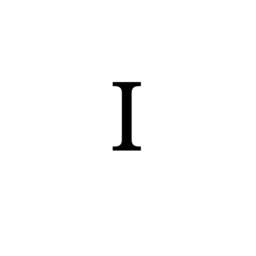

# 浏览器 GPU 渲染卡顿的小故事

> 2025/3/13
> 
> 揪出那条藏在 “沙丁鱼群里的鲶鱼”。

## 背景

最近用手机浏览一个经常访问的页面时，发现

 👉 点我预览：卡顿的效果 👈 

  

## 试验

 👉 点我预览：只有 SVG 的效果 👈 

 👉 点我预览：只有 WebP 的效果 👈 

  

 👉 点我预览：优化后的效果 👈 

  

## 写在最后

如果有什么问题，**欢迎交流**。😄

Delivered under MIT License &copy; 2025, BOT Man
